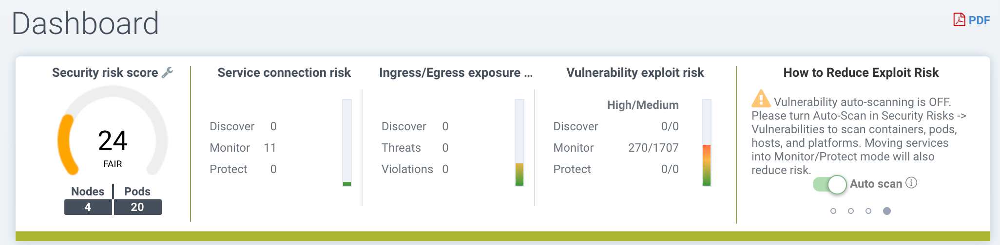
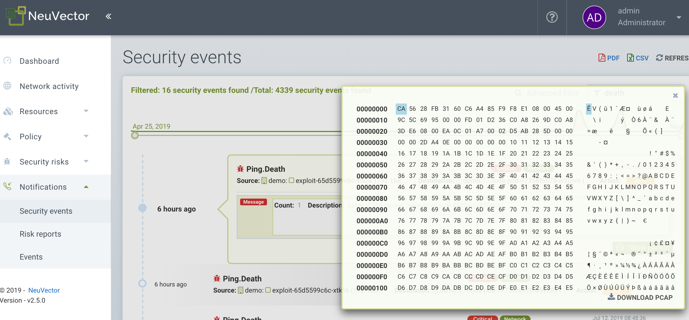

### Console Access
The console requires HTTPS access on default port 8443. The default user and password are admin.

Please see the first section Basics -> Connect to Manager for configuration options such as turning off https, accessing the console through a corporate firewall which does not allow port 8443, or replacing the self-signed certificate.

### Menus and Navigation
Use the left side menu to navigate in your NeuVector console. Note that there are additional settings in upper right for User Profile and Multi-Cluster configuration.

#### Dashboard
The Dashboard shows a summary of risk scores, security events, and application protocols detected by NeuVector. It also shows details for some of these security events. PDF reports can be generated from the Dashboard which contain detailed charts and explanations.

At the top of the dashboard there is a summary of the security risks in the cluster. The wrench tool next to the overall risk score can be clicked to open a wizard which will guide you through recommended steps to reduce/improve the risk score. Mousing over each risk gauge will provide a description of it to the right and how to improve the risk score. Also see the separate documentation section Improving Security Risk Score.

+ Overall Security Risk Score. This is a weighted summary of the individual risk areas summarized to the right, including Service exposure, Ingress/Egress exposure, and Vulnerability exploit risks. Click on the wrench to improve the score.
+ Service Exposure Risk Score. This is an indicator of how many services are protected by whitelist rules and running in the Monitor or Protect mode, where risk is lowest. A high ratio of services in Discover mode means these services are not segmented or isolated by whitelist rules.
+ Ingress/Egress Risk Score. This is a weighted summary of actual threats or network violations detected on ingress or egress (out of the cluster) connections, combined with allowed ingress/egress connections. External connections which are protected by whitelist rules have lower risk but can still be attacked by embedded network attacks. Note: A list of ingress and egress IPs can be downloaded from the Ingress/Egress details section as an Exposure Report.
+ Vulnerability Exploit Risk Score. This is the risk of exploits of vulnerabilities in running containers. Services in Discover mode with High criticality vulnerabilities will have the highest impact on the score, as they are highest risk. If services are in Monitor or Protect but still have High vulnerabilities, they are protected by network and process rules to identify (and block) suspicious activity, so will have a lower weighting on the score. A warning will be shown if the Auto-Scan button is not enabled for automatic run-time scanning.

Some of the charts are interactive, as shown below with the green arrows.

Some of the event data shown in the dashboard have limits, as described in the Reporting section.

Application Protocols Detected
This chart summarizes the application protocols detected in live connections in the cluster. The category ‘Other’ means any unrecognized HTTP protocols or raw TCP connections. You can toggle between the Application Coverage and the Application Volume levels.
+ Application Coverage is the number of unique pod to pod conversations detected between application services. For example if service pod A connects to service pod B using HTTP that is one unique HTTP ‘conversation’, but all connections between A and B count as one conversation.
+ Application Volume is the network activity measured in Gbytes for all services using that protocol.

#### Network Activity
This provides a graphical map of your containers and the conversations between containers. It also shows connections with other local and external resources. In Monitor and Protect modes, violations are displayed with red or yellow lines to indicate that a violation has been detected.

NOTE1: If a large number of containers or services are present, the view will automatically default to a namespace view (collapsed). Double click on a namespace icon to expand it.

NOTE2: This display uses a local GPU if available to speed loading times. Some Windows GPUs have known issues, and the use of the GPU can be turned off in Advanced Filter window (see below for Tools).

Some of the actions possible are:
+ Move objects around to better view services and conversations
+ Click on any line (arrow) to see more detail such as protocol/port, latest time stamp, and to add or edit a rule (NOTE: both connection endpoints must be fully expanded by double clicking on each in order to see the connection details)
+ Click on any container to see details, and the ‘i’ for real-time connections. You can also quarantine a node from here. Right click on a container to perform actions.
+ Filter view by protocol, or search by namespace, group, container (upper right). You can add multiple filters to the selection box.
+ Refresh the map to show latest conversations
+ Zoom in/out to switch between a logical view (all containers collapsed into a service group) or physical view (all containers for the same service displayed)
+ Toggle on/off the display of orchestration components such as load balancers (e.g. built in for Kubernetes or Swarm)
+ (Service Mesh Icon) Double click to expand a pod in a service mesh such as Istio/Linkerd2 to show the sidecar and workload containers within the pod.

The Tools menu in the upper left has these functions, from left to right:
+ Zoom in/out
+ Reset the icon displays (if you've moved them around)
+ Open the Advanced Filter window (filters remain for the user login session)
+ Display/Hide the Legend
+ Take a screen shot
+ Refresh the Network Activity Display

Right clicking on a container displays the following actions:

You can view active sessions, start packet capture recordings, and quarantine from here. You can also change the overall protection mode for the service (all containers for that service) here. The expand/collapse options enable you to simplify or expand the objects.

The data in the map may take a few seconds after network activity to be displayed.

See the explanation of the Legend icons at the bottom of this page.

#### Assets
Assets displays information about Platforms, Nodes, Containers, Registries, Sigstore Verifiers (used in Admission Control rules), and System Components (NeuVector Controllers, Scanners, and Enforcers).

NeuVector includes an end-to-end vulnerability management platform which can be integrated into your automated CI/CD process. Scan registries, images, and running containers and host nodes for vulnerabilities. Results for individual registries, nodes, and containers can be found here, while combined results and advanced reporting can be found in the Security Risks menu.

NeuVector also automatically runs the Docker Bench security report and Kubernetes CIS Benchmark (if applicable) on each host and running containers.

Note that the Status of all containers is shown in Assets -> Containers, which indicates the NeuVector protection mode (Discover, Monitor, Protect). If the container is shown in an 'Exit' state, it is still on the host but is stopped. Removing the container will remove it from an Exit state.

Please see the section Scanning & Compliance for additional details, including how to use the Jenkins plug-in NeuVector Vulnerability Scanner.

#### Policy
This displays and manages the run-time Security Policy which determines what container networking, process, and file system application behavior is ALLOWED and DENIED. Any conversations and activities  which are not explicitly allowed are logged as violations by NeuVector. This is also where Admission Control rules can be created.

Please see the Security Policy section of these docs for a detailed explanation of the behavior of the rules and how to edit or create rules.

#### Security Risks
This enables customizable Vulnerability and Compliance management investigation, triage, and reporting. Easily research image vulnerabilities and find out which nodes or containers contain those vulnerabilities. Advanced filtering makes reviewing scan and compliance check results and provides customized reporting.

These menu's combine results from registry (image), node, and container vulnerability scans and compliance checks to enable end-to-end vulnerability management and reporting.

#### Notifications
This is where you can see the logs for Security Events, Risk Reports (e.g. Scanning) and general Events. NeuVector also supports SYSLOG for integration with tools such as SPLUNK as well as webhook notifications.

<strong>Security Events</strong>

Use the search or Advanced Filter to locate specific events. The timeline widget at the top can also be adjusted using the left and right circles to change the time window. You can also easily add rules (Security Policy) to allow or deny the detected event by selecting the Review Rule button and deploying a new rule.

NeuVector continuously monitors all containers for know attacks such as DNS, DDoS, HTTP-smuggling, tunneling etc. When an attack is detected it is logged here and blocked (if container/service is set to protect), and the packet is automatically captured. You can view the packet details, for example:

<strong>Implicit Deny Rule is Violated</strong>

Violations are connections that violate the whitelist Rules or match a blacklist Rule. Violations detailed are captured and source IPs can be investigated further.

Other security events include privilege escalations, suspicious processes, or abnormal file system activity detected on containers or hosts.

<strong>Risk Reports</strong>

Registry scanning, run-time scanning, admission control events will be shown here. Also, CIS benchmarks and compliance checks results will be shown.

Please see the Reporting section for additional details and limits of the event displays in the console.

#### Settings

##### Settings -> Users & Roles
Add other users here. Users can be assigned an Admin role, a Read-only role, or custom role. In Kubernetes, users can be assigned one or more namespaces to access. Custom roles can also be configured here for users and Groups (e.g. LDAP/AD) to be mapped to the roles. See the [users](/configuration/users) section for configuration details.

##### Settings -> Configuration
Configure a unique cluster name, new services mode, and other settings here.

If deploying on a Rancher or OpenShift cluster, authentication can be enabled such that Rancher users or OpenShift users can log into the NeuVector console with the associated RBACs. For Rancher users, a connecting button/link from the Rancher console allows Rancher admin's to open and access the NeuVector console directly.

The [New Service Mode](/policy/modes#new-service-mode) sets which protection mode any new services (applications) previously unknown or undefined in NeuVector will by default be set to. For production environments, it is not recommended to set this to Discover. 

The [Network Service Policy Mode](/policy/modes#network-service-policy-mode), if enabled, applies the selected policy mode globally to the network rules for all groups, and each Group’s individual policy mode will only apply to process and file rules.

The [Automated Promotion of Group Modes](/policy/modes#automated-promotion-of-group-modes) promotes a Group’s protection Mode automatically (from Discover to Monitor to Protect) based on elapsed time and criteria.

The Auto-Deletion of Unused Groups is useful for automated 'clean-up' of the discovered (and auto-created rules for) groups which are no longer in use, especially high-churn development environments. See Policy -> Groups for the list of groups in NeuVector. Removing unused Groups will clean up the Groups list and all associated rules for those groups.

The XFF-FORWARDED-FOR enables/disables use of these headers in enforcing NeuVector network rules. This is useful to retain the original source IP of an ingress connection so it can be used for network rules enforcement. Enable means the source IP will be retained. See below for a detailed explanation. 

Multiple webhooks can be configured to be used in [Response Rules](/policy/responserules) for customized notifications. Webhook format choices include Slack, JSON, and key-value pairs.

A Registry Proxy can be configured if your registry scanning connection between the controller and the registry must go through a proxy.

Configure SIEM integration through [SYSLOG](/reporting/reporting#siem-and-syslog), including types of events, port etc.

An integration with [IBM Security Advisor](/integration/ibmsa) and [QRadar](/integration/ibmqr) can be established.

Import/Export the Security Policy file. You can configure SSO for SAML and LDAP/AD here as well. See the Enterprise Integration section for configuration details. ***Important!*** Be careful when importing the configuration file. Importing will overwrite the existing settings. If you import a ‘policy only’ file, the Groups and Rules of the Policy will be overwritten. If you import a file with ‘all’ settings, then the Policy, Users, and Configurations will be overwritten. Note that the original ‘admin’ user’s password of your current Controller will also be overwritten with the original admin’s password in the imported file.

The Usage Report and Collect Log exports may be requested by your NeuVector support team.

######<strong>XFF-FORWARDED-FOR Behavior Details</strong>

In a Kubernetes cluster, an application can be exposed to the outside of the cluster by a NodePort, LoadBalancer or Ingress services. These services typically replace the source IP while doing the Source NAT (SNAT) on the packets. As the original source IP is masqueraded, this prevents NeuVector from recognizing the connection is actually from the 'external'.

In order to preserve the original source IP address, the user needs to add the following line to the exposed services, in the 'spec' section of the external facing load balancer or ingress controller. (Ref: https://kubernetes.io/docs/tutorials/services/source-ip/)

"externalTrafficPolicy":"Local"
 
Many implementations of LoadBalancer services and Ingress controllers will add the X-FORWARDED-FOR line to the HTTP request header to communicate the real source IP to the backend applications. This product can recognize this set of HTTP headers, identify the original source IP and enforce the policy according to that.

This improvement created some unexpected issues in some setup. If the above line has been added to the exposed services and NeuVector network policies have been created in a way that expect the network connections are coming from internal proxy/ingress services, because we now identify the connections are from "external" to the cluster, normal application traffic might trigger alerts or get blocked if the applications are put in "Protect" mode.

A switch is available to disable this feature. Disabling it tells NeuVector not to identify that the connection is from "external" using X-FORWARDED-FOR headers. By default this is enabled, and the X-FORWARDED-FOR header is used in policy enforcement. To disable it, go to Settings -> Configuration, and disable the "X-Forwarded-For based policy match" setting.

##### Settings -> LDAP/AD, SAML, and OpenID Connect
NeuVector supports integration with LDAP/AD, SAML, and OpenID Connect for SSO and user group mapping. See the [Enterprise Integration](/integration/integration) section for configuration details.

##### Multiple Cluster Management
You can manage [multiple NeuVector clusters](/navigation/multicluster) (e.g. multiple Kubernetes clusters running NeuVector on different clouds or on premise) by selecting a Master cluster, and joining remote clusters to them. Each remote cluster can also be individually managed. Security rules can be propagated to multiple clusters through use of Federated Policy settings.

#####  My Profile
You can increase the browser timeout setting, change your password and do other administrative profile edits.

#### Icon Descriptions in Legend > Network Activity

You can toggle the Legend on/off in the tools box of the Network Activity map.

Here is what the icons mean:

##### External network
This is any network outside the NeuVector cluster. This could include internet public access or other internal networks.

##### Namespace
Namespace in Kubernetes or Project in OpenShift

##### Group/Container/Service Mesh in discovery
This container is in Discover mode, where connections to/from it are learned and whitelist rules will automatically be created.

##### Group/Container/Service Mesh being monitored
This container is in Monitor mode, where violations will be logged but not blocked.

##### Group/Container/Service Mesh being protected
This container is in Protect mode, where violations will be blocked.

##### Container Group
This represent a group of containers in a service. Use this to provide a more abstract view if there are many container instances for a service/application (i.e. from the same image).

##### Un-managed node
This node has been detected but does not have a NeuVector enforcer on it.

##### Un-managed container
This container has been detected but is not on a node with a NeuVector enforcer on it. This could also represent some system services.

##### Exited Container
This container is not running but in an 'exited' state.

##### IP group
This is a group of IP Addresses.

##### Normal Conversation
Allowed, whitelisted connections are displayed in blue.

##### Internal Conversation
A connection within a service is shown in light gray.

##### Conversation with warning
A connection which has generated a violation alert is shown in lighter red.

##### Conversation being blocked
If a connection is a violation, as shown in red, and has been blocked by NeuVector, the arrow will have an ‘x’ in it.

##### Quarantined container
Containers with a red circle around them have been quarantined. To un-quarantine, right-click on the container and select the un-quarantine button.

