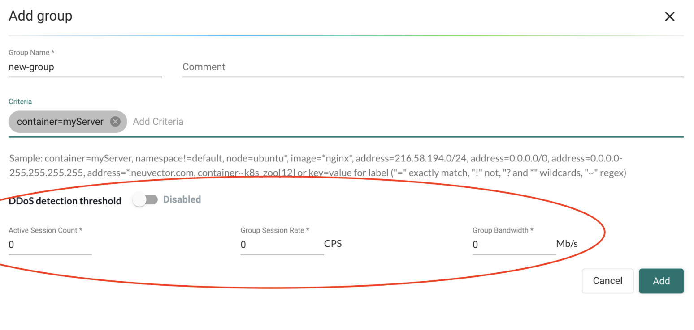
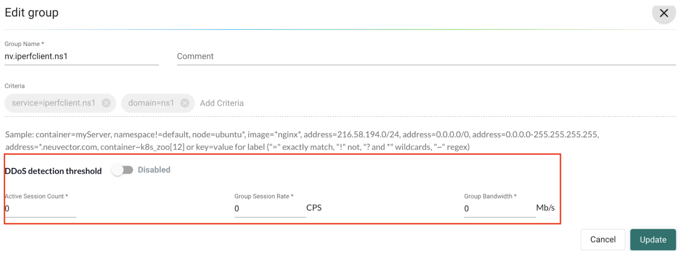
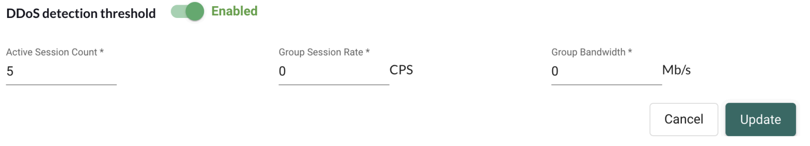
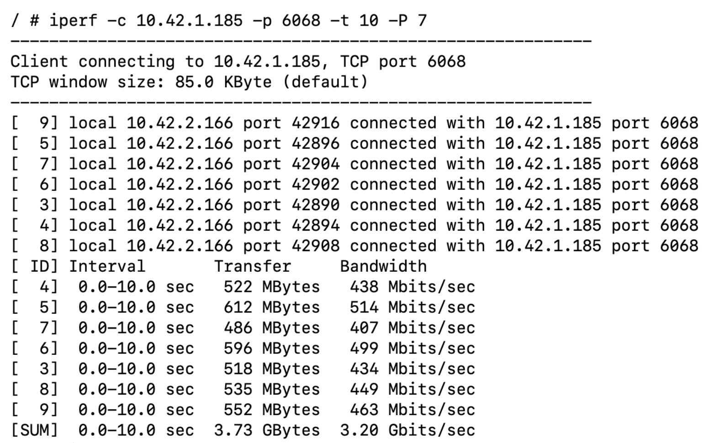
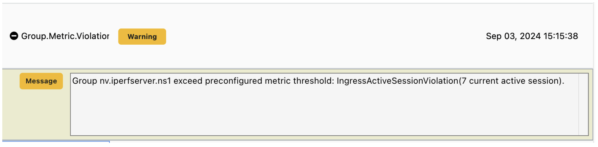

NeuVector users can set Group level bandwidth or session-rate violation detection based on preconfigured threshold settings. These settings work for Learned or user-created Groups, but not for Reserved Groups.
A one minute timer is created to periodically check the Group metric threshold for violations. Once a violation is detected, a `Group.Metric.Violation` event is generated and a message is printed out to describe the event.

Currently, there are 4 settings a user can configure per Group:

+ `Mon_metric`: Enable or disable metric monitoring.
+ `Grp_sess_rate`: The units are cps, connections per second. This value is used to control session ramp up rate; default value=0 which means no detection.
+ `Grp_band_width`: The units are mbps, mega bits per second. This value controls throughput; default value=0 which means no detection.
+ `Grp_sess_cur`: Active session count.

## Example Set Up of Group Threshold

The Group threshold settings can be set via CLI or UI:

Using the CLI for Group threshold settings:

```shell
admin#neuvector-svc-controller.neuvector > set group nv.iperfclient.ns1 setting -h

Options:
--monitor_metric [enable|disable] monitor metric status
--cur_sess INTEGER group current active session number threshold
--sess_rate INTEGER group session rate threshold in cps
--bandwidth INTEGER group throughput threshold in mbps
```

Using the UI from the **Add Group** or **Edit Group** view to enable or disable threshold settings:





### Example Setting

Below are example steps which add a Group threshold setting to a new or existing Group:

1. Add a Group threshold setting to a new or existing Learned/user_created Group.



2. Send traffic to the Group, session number is 7.



3. After traffic is sent the `Group.Metric.Violation` event is generated.



:::note

+ We sample the past 60 seconds of traffic on average to see whether the metric breaks the threshold or not for the DDoS detection feature. Measurement in Protect mode is the most meaningful because the enforcer becomes inline at the data-path.
+ For multiple clusters, the primary and managed clusters should be in the 5.4 build so that federated groups with the DDoS detection threshold settings configured on the primary cluster are deployed to managed clusters. If a Primary cluster uses a 5.4 build but managed clusters use pre-5.4 builds, new federated settings(including attributes in federated groups) are deployed to those pre-5.4 managed clusters but are dropped because they are not recognized by pre-5.4 managed clusters. After pre-5.4 managed clusters upgrade to 5.4, users need to manually sync managed clusters for DDoS monitoring on federated groups.

:::
