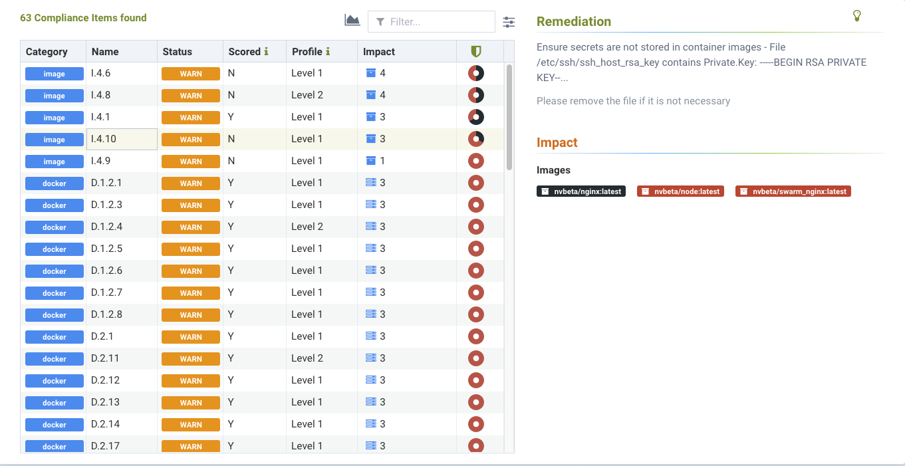

### Managing Compliance and CIS Benchmarks

Compliance auditing with NeuVector includes CIS Benchmarks, custom checks, secrets auditing, and industry standard templates for PCI, GDPR and other regulations.

CIS Benchmarks automatically run by NeuVector include:
+ Kubernetes
+ Docker
+ Red Hat OpenShift draft 'Inspired by CIS' benchmarks
+ Google GKE

Compliance scan results can be seen for individual Assets in the Registries (for Images), Nodes, and Containers menus by selecting the relevant asset and clicking the Compliance tab.

The Security Risks -> Compliance menu enables consolidated compliance reporting, similar to how the Vulnerabilities menu works.

#### Security Risks - Compliance and Compliance Profile
Compliance results are show in the list by Category and Name. Categories include Docker, Kubernetes, OpenShift, and Custom. The names of each item correspond to the CIS benchmark. For example, K.4.2.3 corresponds to the Kubernetes CIS benchmark 4.2.3. Docker benchmarks are preceded with 'D' with the exception of Image related benchmarks, which are preceded by 'I'.

Use the Advanced filter to select compliance checks based on platform, host, namespace or industry standard, as shown below.

After applying the filter, only the relevant CIS benchmarks and custom checks will be shown, and a report can be generated and downloaded. This is how reports for standards such as PCI, HIPAA, GDPR and other standards can be generated.

The following screenshot shows an example of a secret found in an image scan.

##### Customizing Compliance Templates for PCI, GDPR, HIPAA, NIST and others
The Compliance profile menu enables customization of the built-in templates for industry standards such as PCI and GDPR. These reports can be generated from the Security Risks -> Compliance menu by selecting one of the standards to filter, then exporting. The NIST profile is for [NIST SP 800-190](https://nvlpubs.nist.gov/nistpubs/SpecialPublications/NIST.SP.800-190.pdf).

To customize any compliance profile, select the industry standard (e.g. PCI), then enable or disable specific checks for that standard. Think of these as compliance 'tags' that are applied to each check in order to generate a compliance report for that industry standard.

Use the Action button to add or remove any compliance tag from that check.

In addition, you can select which 'Assets' are considered to be part of the compliance reports by clicking on the Assets tab. By default, all compliance templates are applied to Images, Nodes and Containers.

Use the Action button to add or remove compliance templates for assets.
+ Images. Select the standard(s) to be reported for Images.
+ Nodes. Select the standard(s) to be reported for Nodes (hosts).
+ Containers. Select the stadard(s) to be reported for Containers.

Alternatively, instead of restricting by the above criteria, compliance templates can be restricted to certain Namespaces. If this box is checked and namespace(s) added, reports will be generated for all assets which apply to these namespaces. This can be useful if, for example, the PCI template should only report on assets for namespaces which container PCI in-scope (applicable) workloads.

After the templates and assets are customized (if desired) in the Security Risks -> Compliance Profiles menu, reports can be generated in the Security Risks -> Compliance menu by opening the advanced filter and selecting the compliance template desired. For example, selecting GDPR will filter the display and reports for only the GDPR profile.

#### Secrets Auditing 
NeuVector checks for over 40 common types of secrets as part of the image compliance scans and run-time scans. In addition, [custom compliance scripts](/policy/customcompliance) can be configured for containers or hosts, and the [DLP packet inspection](/policy/dlp) feature can be used to check for secrets in network payloads.

The results for secrets auditing can be found in the Compliance section of image scans (Assets -> Registries), containers (Assets -> Containers), nodes (Assets -> Nodes), and the compliance management menu (Security Risks -> Compliance).

The following is an example of how secrets detected in an image scan will be displayed. 

Here is a list of the types of secrets being detected.
+ General Private Keys
+ General detection of credentials including 'apikey', 'api_key', 'password', 'secret', 'passwd' etc.
+ General passwords in yaml files including 'password', 'passwd', 'api_token' etc.
+ General secrets keys in key/value pairs
+ Putty Private key
+ XML Private key
+ AWS [credentials / IAM](https://docs.aws.amazon.com/general/latest/gr/aws-sec-cred-types.html)
+ Facebook client secret
+ Facebook endpoint secret
+ Facebook app secret
+ Twitter client Id
+ Twitter secret key
+ Github secret
+ Square product Id
+ Stripe access key
+ Slack API token
+ Slack web hooks
+ LinkedIn client Id
+ LinkedIn secret key
+ Google API key
+ SendGrid API key
+ Twilio API key
+ Heroku API key
+ MailChimp API key
+ MailGun API key

