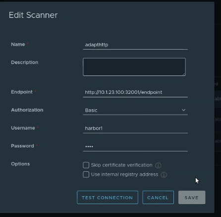
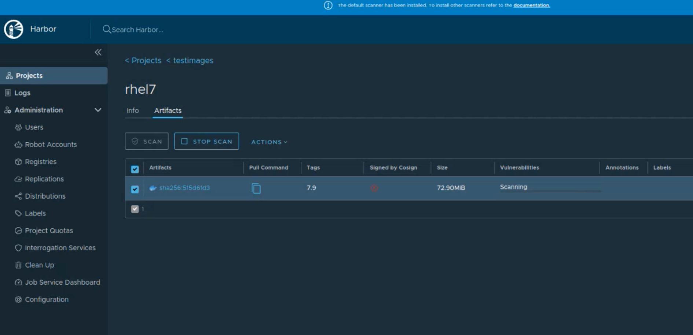
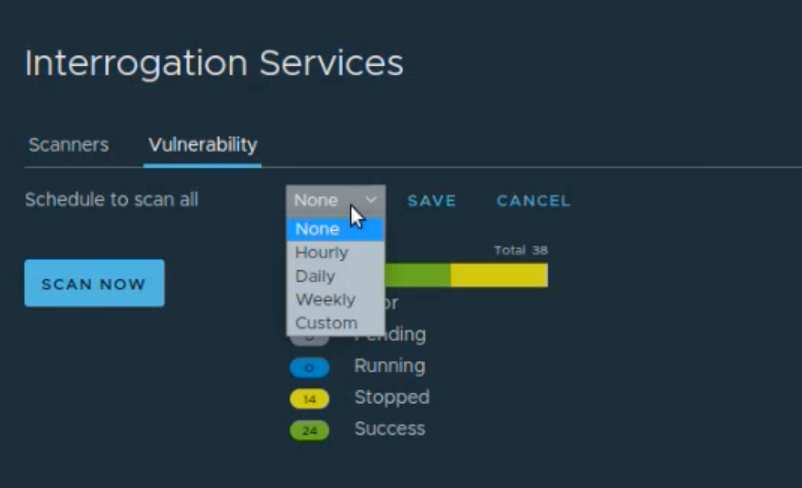
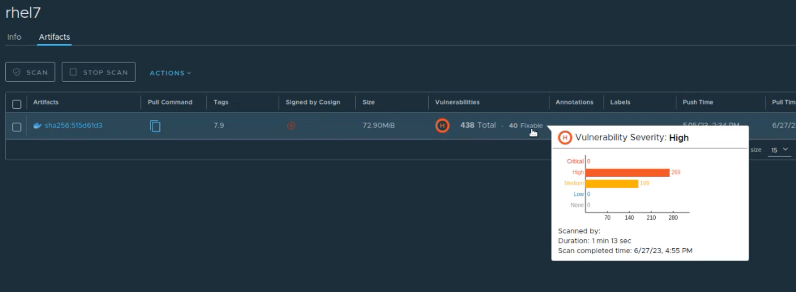

### Scanning Harbor Registries Using the Pluggable Scanner

NeuVector supports invoking the NeuVector scanner from Harbor registries through the [pluggable scanner](https://github.com/goharbor/pluggable-scanner-spec) interface. This requires configuration of the connection to the controller (exposed API). The Harbor adapter calls controller endpoint to trigger a scan, which can scan automatically on push. Interrogation services can be used for periodic scans. Scan results from Federation Primary controllers ARE propagated to remote clusters.  

:::note
There is an issue with the HTTPS based adapter endpoint error: please ignore Test Connection error, it does work even though an error is shown (skip certificate validation).
:::

#### Deploying the NeuVector Registry Adapter

The 5.2 Helm chart contains options to deploy the [registry adapter](https://github.com/neuvector/neuvector-helm/blob/master/charts/core/templates/registry-adapter.yaml) for Harbor. It can also be pulled manually from the neuvector/registry-adapter repo on Docker Hub. Options also include setting the Harbor registry request protocol and the basic authentication secret name.

After deployment of the adapter, it is necessary to configure this in Harbor.

Enter the adapter endpoint to connect it to the controller, which is typically exposed as an external service. Authentication credentials can optionally be configured using `cve.adapter.harbor.secretName` in your Helm values. If you set `cve.adapter.harbor.secretName` in your Helm values:

* This automatically populates `HARBOR_BASIC_AUTH_USERNAME` and `HARBOR_BASIC_AUTH_PASSWORD` environment variables inside the adapter pod.
* Enables the adapter to validate all incoming requests from Harbor against the specified secret credentials before granting access.

#### Scanning Images from a Harbor Registry

After successful deployment and connection to a controller, an image scan can be manually or automatically triggered from Harbor. 

Periodic scans (scheduled) can be configured through Interrogation Services in Harbor, to make sure the latest CVE database is used to rescan images in registries.

Scan results can be viewed directly in Harbor.

#### Sample Deployment Yaml

Samples for [Kubernetes](https://raw.githubusercontent.com/neuvector/manifests/main/kubernetes/5.3.0/neuvector-registry-adapter-k8s.yaml) and [OpenShift](https://raw.githubusercontent.com/neuvector/manifests/main/kubernetes/5.3.0/neuvector-registry-adapter-oc.yaml)
