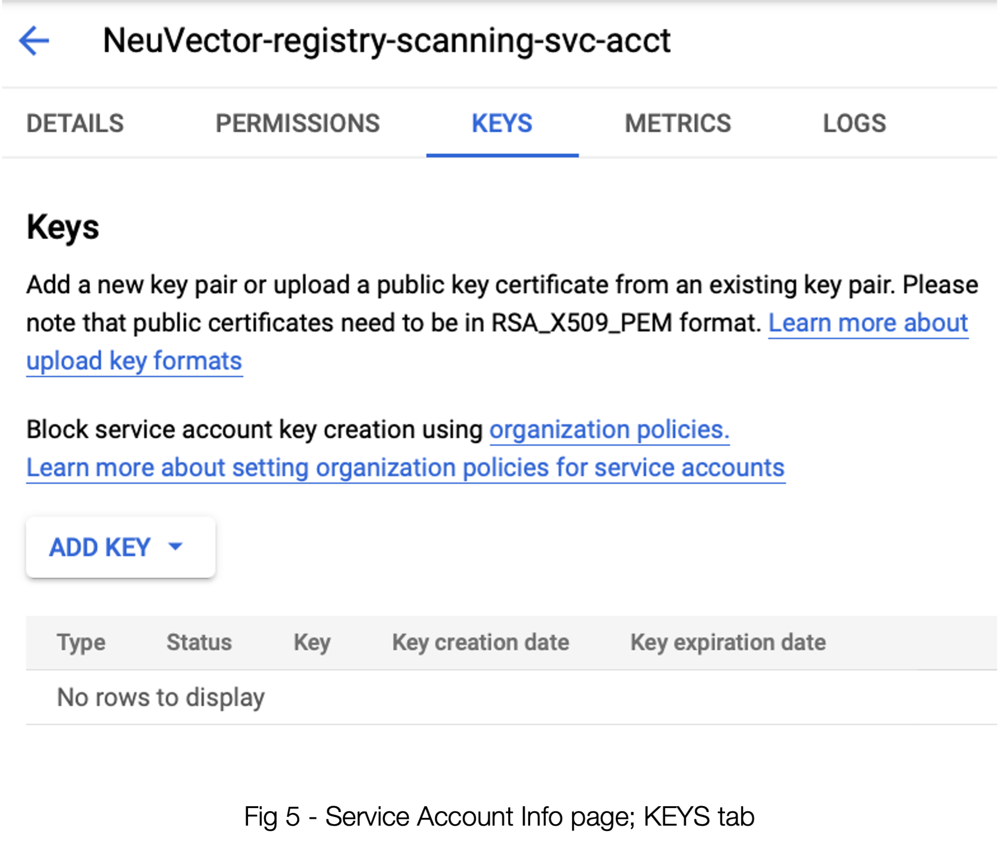

### Google GCR - Authentication/Scanning with GCP Service Accounts


It is a best practice to not depend on user attributed accounts for integrations.  GCP supports using a service account to access GCR.  Here are the steps to enable a service account for GCR and use it to trigger repository scans from NeuVector. 
Start in NeuVector, where one first sets up a new registry:


By selecting Google Container Registry as the repo type, this panel is customized to accept the input required to use your GCR. 

1. Name - Here’s where you give this particular repo entry a name of your choosing. It’s merely to identify it in the NeuVector interface later on.
2. Registry - This is the first place where you’ll want to be sure the correct data is collected from your GCR instance. While the example of https://gcr.io is the most common, we will want to be sure it accurately reflects how your GCR was set up in GCP. It might be https://us.gcr.io for example. We’ll go check it in the next section.
3. JSON Key - As is pretty self-evident, this will be a JSON-formatted key. And, as you’re probably seeing a pattern set up for, we’ll be finding that via GCP. 
4. Filter - Be mindful that you will likely need to replace any filters here with the actual name of the repo. Again, that’s in the GCR interface.
 


Now let’s head on over to that GCR screen in GCP. Much of what we need is right here on this page. 

A. See the “gcr.io” under Hostname? That’s what belongs in item #2, Registry in the NeuVector interface. (Don’t forget the https:// part)
B. The ID of the repo is actually under the top level project. This is what you will be using in #3, Filter. See example of env-demo below.


The JSON Key leads us to explore another very important step, and that takes us to the IAM & Admin section of GCP where we will create (or confirm the setting of) a Service Account. See below:


Once you enter the data for the first step of creating a service account, you need to press the “CREATE” button to get step 2 to be willing to accept input.


Be sure to select Basic —> Viewer for the access. If you have an existing service account, ensure that the access is set this way. (Hint: Even access permissions that appear to be more powerful don’t seem to allow for proper access. Don't skip this step.

Once you’ve done this step, you can breeze past Step 3 and proceed with creating the Service Account.

If you don’t immediately land on the info panel for your new service account, be sure to go there on the Service Accounts list. See figure 5 below.



Click “ADD KEY” —> “Create New Key”


As you have already concluded, JSON is the go-to here. Selecting “CREATE” will result in a file that you can download in your browser. The contents of this file should be pasted into the 3, JSON Key field in NeuVector; see figure 1.

Before you get too excited there’s one more thing to ensure. In order for the scanner in NeuVector to use the API to scan and protect your images, said API must be enabled in your GCP account. You can either enable it via the command line via

```
$ gcloud services enable artifactregistry.googleapis.com
```

Or you can use the GCP gui. Head to “API Library” and search for “Artifact Registry API” and ensure it is turned on for your project. See figure 7.


You should be set! See figure 8 below for a properly-configured registry using the data from our example:


#### Obtain the Access Token Using the REST API

The NeuVector REST API may be used to authenticate using the service account. The below example uses gcloud to obtain the access token.  The username is “oauth2accesstoken”.

```
$ gcloud auth print-access-token
ya29.a0AfH6SMAvyZ2zkD3MZD_K8Lqr7qkIsRkGNqhAGthJ_A7lp8OGRe7xh5KmuQY-VJfqu83C9e1gi7A_m1InNm8QIoTGf9WHXnOeAr1gT_O6b6K667NUz1_YDunjdW09jt0XvcBGQaxjJ3c4aHlxdehBFiE_9PMk13JDt_T6f0_6vzS7
```

#### Use the Token with NeuVector Repository Scanning

The below example script incorporates the access token to trigger GCR repository scan.

```
_curCase_=`echo $0 | awk -F"." '{print $(NF-1)}' | awk -F"/" '{print $NF}'`
_DESC_="able to scan ubuntu:16.04 image"
_ERRCODE_=0
_ERRTYPE_=1
_RESULT_="pass"

# please remember to specify the controller ip address here
_controllerIP_="10.1.24.252"
_controllerRESTAPIPort_="10443"
_neuvectorUsername_="admin"
_neuvectorPassword_="admin"
_registryURL_="https://us.gcr.io/"
# registry urls could also be gcr.io, eu.gcr.io, asia.gcr.io etc
_registryUsername_="oauth2accesstoken"
_registryPassword_=$(gcloud auth print-access-token)
_repository_="bionic-union-271100/alpine"
_tag_="latest"

curl -k -H "Content-Type: application/json" -d '{"password": {"username": "'$_neuvectorUsername_'", "password": "'$_neuvectorPassword_'"}}' "https://$_controllerIP_:$_controllerRESTAPIPort_/v1/auth" > /dev/null 2>&1 > token.json
_TOKEN_=`cat token.json | jq -r '.token.token'`
echo `date +%Y%m%d_%H%M%S` scanning an image ...
curl -k -H "Content-Type: application/json" -H "X-Auth-Token: $_TOKEN_" -d '{"request": {"registry": "'$_registryURL_'", "username": "'$_registryUsername_'", "password": "'$_registryPassword_'", "repository": "'$_repository_'", "tag": "'$_tag_'"}}' "https://$_controllerIP_:$_controllerRESTAPIPort_/v1/scan/repository" > /dev/null 2>&1 > scan_repository.json

while [ `wc -c < scan_repository.json` = "0" ]; do
 echo `date +%Y%m%d_%H%M%S` scanning is still in progress ...
    sleep 5
    curl -k -H "Content-Type: application/json" -H "X-Auth-Token: $_TOKEN_" -d '{"request": {"registry": "'$_registryURL_'", "username": "'$_registryUsername_'", "password": "'$_registryPassword_'", "repository": "'$_repository_'", "tag": "'$_tag_'"}}' "https://$_controllerIP_:$_controllerRESTAPIPort_/v1/scan/repository" > /dev/null 2>&1 > scan_repository.json
done
echo `date +%Y%m%d_%H%M%S` log out
curl -k -X 'DELETE' -H "Content-Type: application/json" -H "X-Auth-Token: $_TOKEN_" "https://$_controllerIP_:$_controllerRESTAPIPort_/v1/auth" > /dev/null 2>&1
cat scan_repository.json | jq .

rm *.json
echo `date +%Y%m%d_%H%M%S` [$_curCase_] $_DESC_: $_RESULT_-$_ERRCODE_
```
