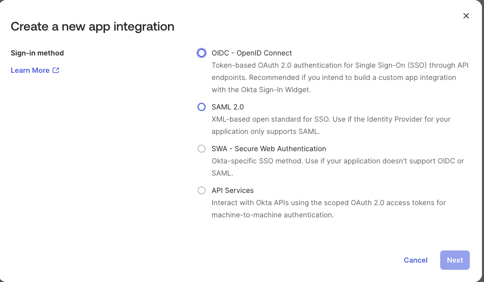
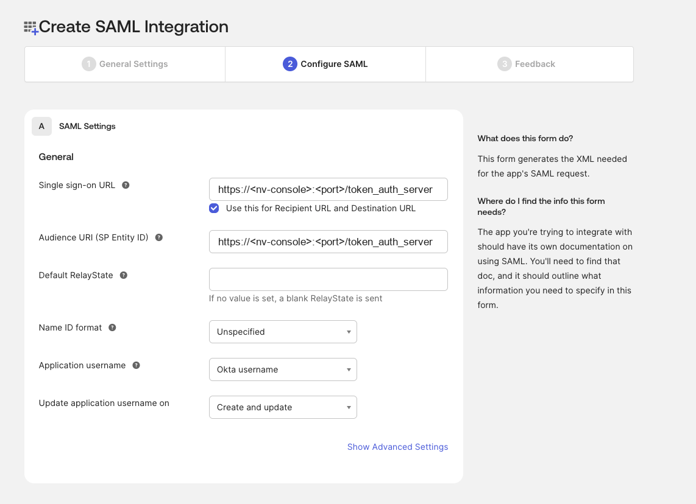
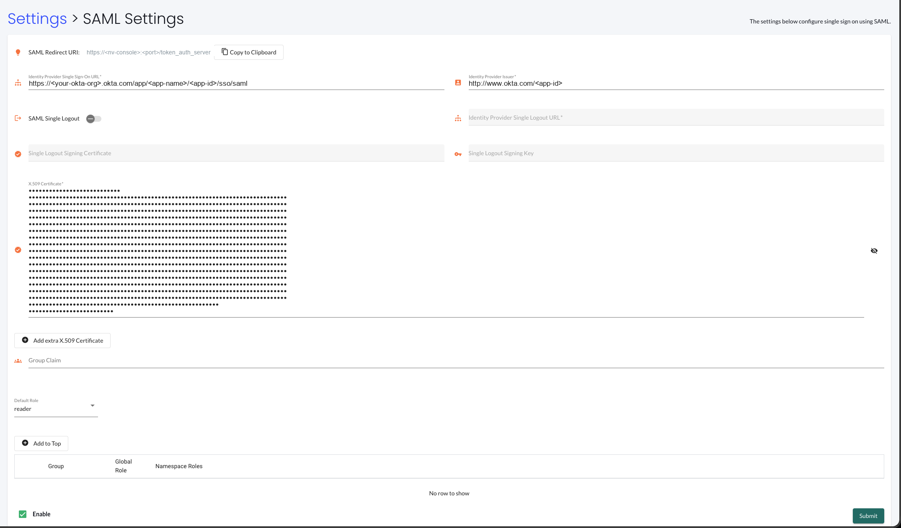

## Setting Up Okta and NeuVector Integration

This section describes how to configure Okta as a SAML 2.0 identity provider (IDP) for NeuVector. The setup steps are performed in Okta first, then in the NeuVector console.

### Prerequisites

- An Okta Developer or Enterprise account with administrative privileges.
- Administrator access to the NeuVector console.
- The NeuVector SAML Redirect URI. Log in to NeuVector as an administrator, go to **Settings > SAML Settings** and copy the **SAML Redirect URI** shown at the top of the page.
  - It has the form `https://<nv-console>:<port>/token_auth_server`, where `<nv-console>` and `<port>` are the address and port of your NeuVector console.

### Okta Setup

1. Log in to the Okta Admin Console.

2. In the left-hand navigation, expand **Applications** and click **Applications**, then click **Create App Integration**.

3. Select **SAML 2.0** as the sign-in method and click **Next**.

4. On the **General Settings** step, enter a recognizable **App name**, for example `NeuVector SSO`, and click **Next**.

5. On the **Configure SAML** step, map the Okta application to your NeuVector instance:

- **Single sign-on URL**: the NeuVector SAML Redirect URI copied in the prerequisites, `https://<nv-console>:<port>/token_auth_server`. Keep the setting **Use this for Recipient URL and Destination URL** checked.
- **Audience URI (SP Entity ID)**: the same SAML Redirect URI, `https://<nv-console>:<port>/token_auth_server`.
- **Name ID format**: `Unspecified`.

:::note

- NeuVector uses its SAML Redirect URI as both the assertion consumer service URL and the audience URI (SP entity ID); it is not configurable in the NeuVector console. Enter that same value in both Okta fields so the audience of the assertion matches what NeuVector expects.
- Click **Show Advanced Settings** and confirm that **Assertion Encryption** is `Unencrypted`; NeuVector does not accept encrypted assertions. Leave **Response** and **Assertion Signature** set to `Signed`.

:::

6. On the **Feedback** step, select **This is an internal app that we have created** and click **Finish**.

7. Configure the attribute statements so the SAML response carries the user's attributes back to NeuVector. On the application's **Sign On** tab, scroll to **Attribute Statements**, click **Show legacy configuration** and edit the statements below it:

| Statement | Name | Name format | Value / Filter |
| --------- | ---- | ----------- | -------------- |
| Attribute Statements | `Email` | Unspecified | `user.email` |
| Attribute Statements | `Username` | Unspecified | `user.firstName` |
| Group Attribute Statements | `NVRoleGroup` | Unspecified | Matches regex `.*` |

The group attribute statement is only required if group-based role mapping is used. `NVRoleGroup` is the attribute name NeuVector looks for by default. If you use a different attribute name for the user's group membership, enter that name in the **Group Claim** field of NeuVector's SAML Settings page.

8. Open the **Assignments** tab, click **Assign > Assign to People**, and assign the users who should be able to log in to NeuVector.

9. Return to the **Sign On** tab, scroll to the **SAML 2.0** section and open **Metadata details**. Collect the values needed by NeuVector:

- **Sign on URL**: click **Copy** and save it.
- **Issuer**: click **Copy** and save it.
- **Signing Certificate**: click **Download** to save the certificate file, or click **Copy**.

### NeuVector Setup

1. Log in to the NeuVector console as an administrator and go to **Settings > SAML Settings**.

2. Fill in the fields with the information collected from Okta:

- **Identity Provider Single Sign-On URL**: the Okta *Sign on URL*.
- **Identity Provider Issuer**: the Okta *Issuer*.
- **X.509 Certificate**: the complete text of the Okta *Signing Certificate*.
- **Group Claim**: leave it empty to use the default `NVRoleGroup` attribute name, or enter the group attribute name configured in Okta.
- **Default Role**: the role assigned to an authenticated user when group-based role mapping is not configured or no group matches. Set it to `None` to allow only users whose groups are mapped to a role.

Every user needs a role, assigned either by the Default Role or by group-based role mapping. A user who ends up without a role cannot log in, even with the correct credentials.

3. Optionally add group-based role mapping. Click **Add to Top** and enter a group name together with the **Global Role** and **Namespace Roles** to assign to its members.

4. Check **Enable** at the bottom left of the page and click **Submit**.

5. To test the integration, log out of NeuVector. The login screen shows a **Login with SAML** button that redirects to Okta for authentication.

:::note
**SAML Single Logout** is optional. Enable it only if your IDP supports SLO, and provide the **Identity Provider Single Logout URL** together with the single logout signing certificate and key.
:::

### Role Mapping

After a user is authenticated, the role is derived from the group-based role mapping configuration:

1. If group-based role mapping is not configured or the matched groups cannot be located, the authenticated user is assigned the Default role. If the Default role is set to None, the user is not able to log in when group-based role mapping fails.
2. Specify the groups to map in the role map. The user's group attribute is piggybacked in the response after the user is authenticated. If a matched group is located, the corresponding role is assigned to the user.

### Mapping Groups to Roles and Namespaces

Please see the [Users and Roles](/configuration/users#mapping-groups-to-roles-and-namespaces) section for how to map groups to preset and custom roles as well as namespaces in NeuVector.
