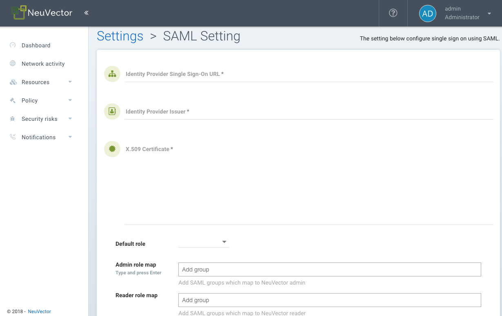

### SAML IDP Configuration
To configure NeuVector to use Okta SAML IDP server, first, configure the SAML IDP server on the Okta site.

1. Copy "SAML Redirect URI" from NeuVector SAML Setting page, paste it to Okta's single sign on url, recipient url and destination url fields.
2. Assertion encryption: This field must be <strong>unencrypted.</strong>
3. Attribute statements: Enter the email and username attributes.
4. Group attribute statements: Enable this if group-based role mapping is required. The default attribute name that NeuVector looks for is NVRoleGroup. If other attribute name is used for the user's group membership, it can be customized in NeuVector's SAML Setting page.

Configure SAML settings in NeuVector UI console.

Use "View Setup Instructions" button as shown in the following screenshot to locate following information, and copy them into NeuVector's SAML page. 
1. Identity Provider Single Sign-On URL
2. Identity Provider Issuer
3. X.509 Certificate
4. Specify group attribute name if non-default value is used.

After the user is authenticated, the proper role can be derived with group-based role mapping configuration. To setup group-based role mapping,

1. If group-based role mapping is not configured or the matched groups cannot be located, the authenticated user will be assigned with the Default role. If the Default role is set to None, when group-based role mapping fails, the user is not able to login.
2. Specify a list of groups respectively in Admin and Reader role map. The user's group attribute is piggybacked in the response after the user is authenticated. If the matched group is located, the corresponding role will be assigned to the user.

#### Mapping Groups to Roles and Namespaces
Please see the [Users and Roles](/configuration/users#mapping-groups-to-roles-and-namespaces) section for how to map groups to preset and custom roles as well as namespaces in NeuVector.
