### Integrate with Azure AD SAML authentication

1. In the Azure management console, select the ”Enterprise applications" menu item in Azure Active Directory 

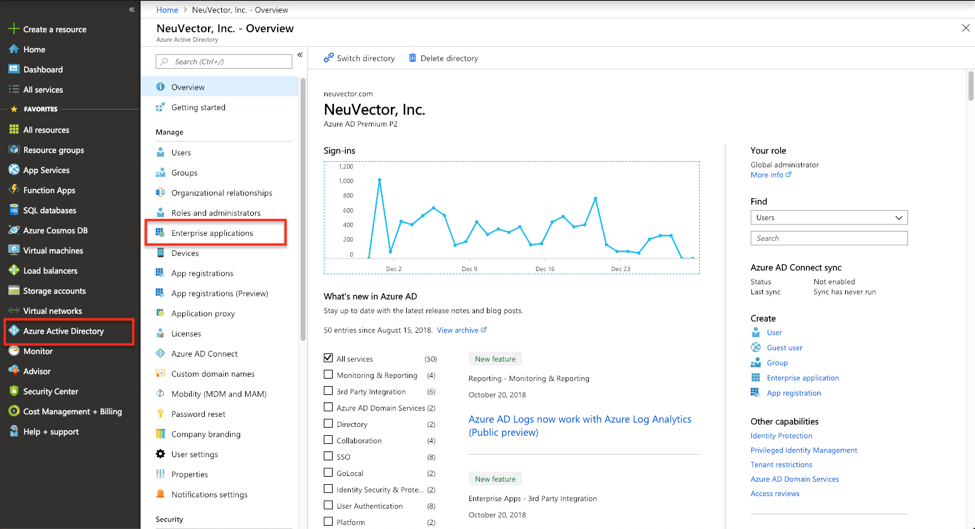

2. Select “New Application”

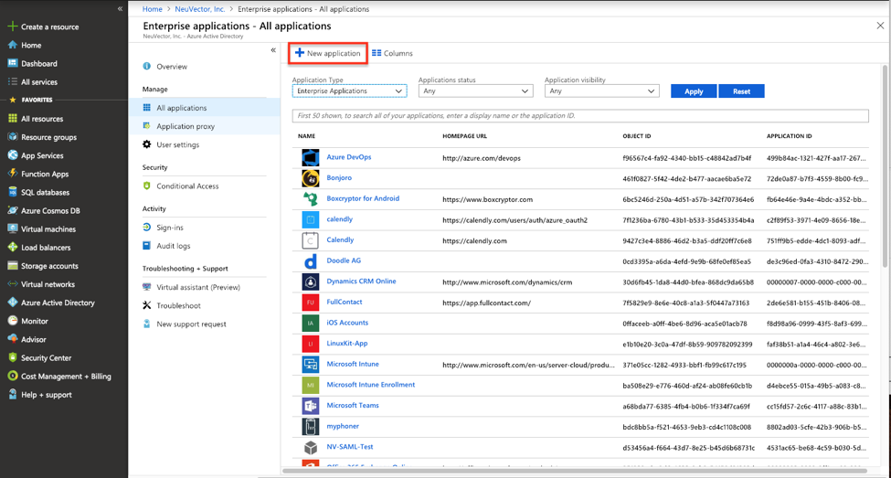

3. Create a Non-gallery application and give it a unique name

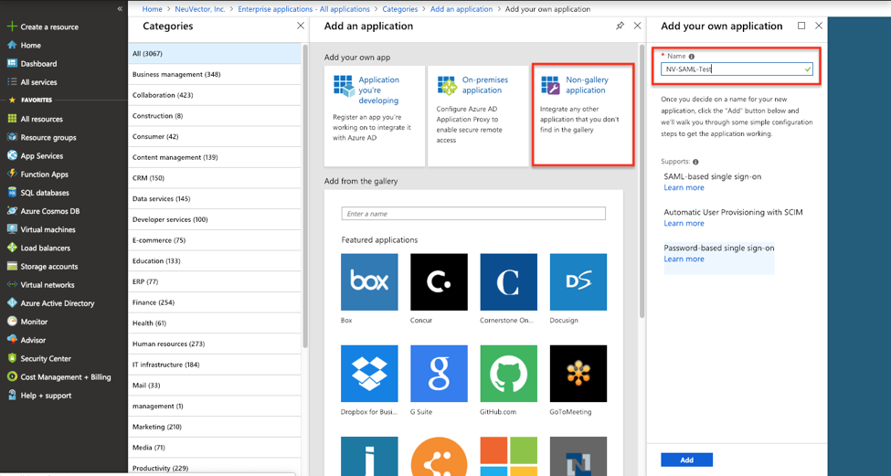

4. In the application's configuration page, select "Single sign-on" in the left-side panel and choose the SAML-based sign-on

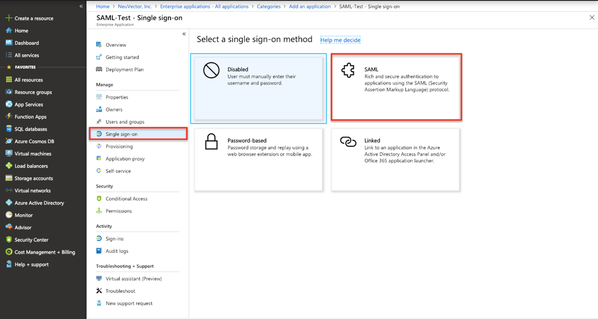

5. Download the certificate in the base64 format and note the application's Login URL and Azure AD Identifier 

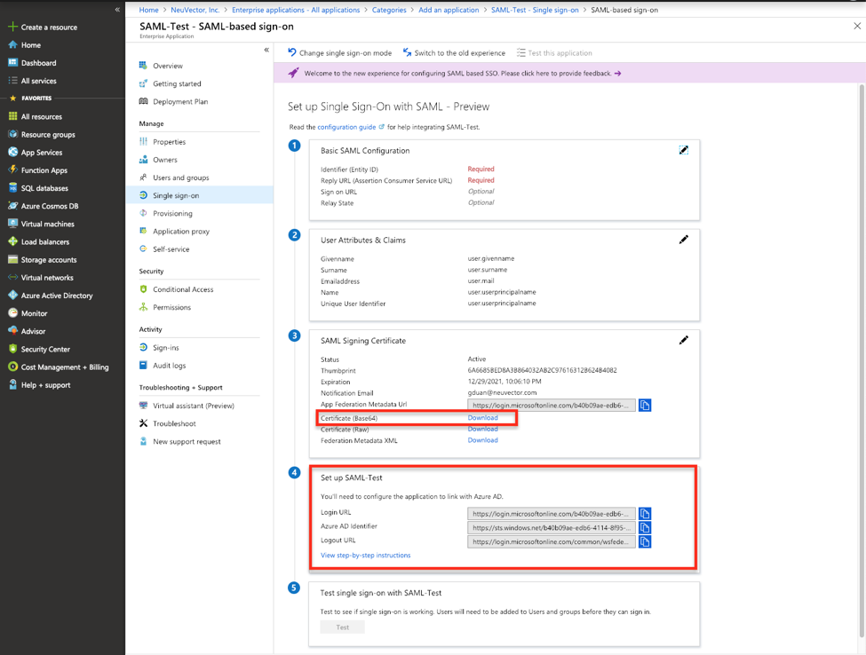

6. In the NeuVector management console, login as an administrator and go to **Settings > SAML Settings**

7. Configure the SAML server as follows:

- Copy application's "Login URL" as the Single Sign-On URL.
- Copy "Azure AD Identifier" as the Issuer.
- Open downloaded the certificate and copy the text to X.509 Certificate box.
- Set a default role. This is the role assigned to an authenticated user when no group matches the role map.
- Add the group-based role mapping. Click "Add to Top" and enter the group together with the Global Role and Namespace Roles to assign to its members. The group claim returned by Azure are identified by the "Object ID" instead of the name. The group's object ID can be located in **Azure Active Directory > Groups > Group name Page**. You should use this value to configure group-based role mapping in NeuVector.

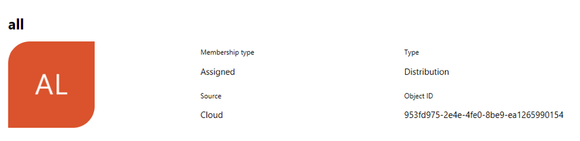

Every user needs a role, assigned either by the default role or by group-based role mapping. A user who ends up without a role cannot log in, even with the correct credentials.

Then check "Enable" at the bottom left of the page and click "Submit" to enable the SAML server.

8. Copy the SAML Redirect URI shown at the top of the SAML Settings page with the "Copy to Clipboard" button. It has the form `https://<nv-console>:<port>/token_auth_server`, where `<nv-console>` and `<port>` are the address and port of your NeuVector console.

9. Return to the Azure management console to setup "Basic SAML Configuration". Paste the NeuVector SAML Redirect URI into both boxes:

- **Identifier (Entity ID)**: the audience URI of the NeuVector service provider.
- **Reply URL (Assertion Consumer Service URL)**: the endpoint Azure AD posts the SAML response to.

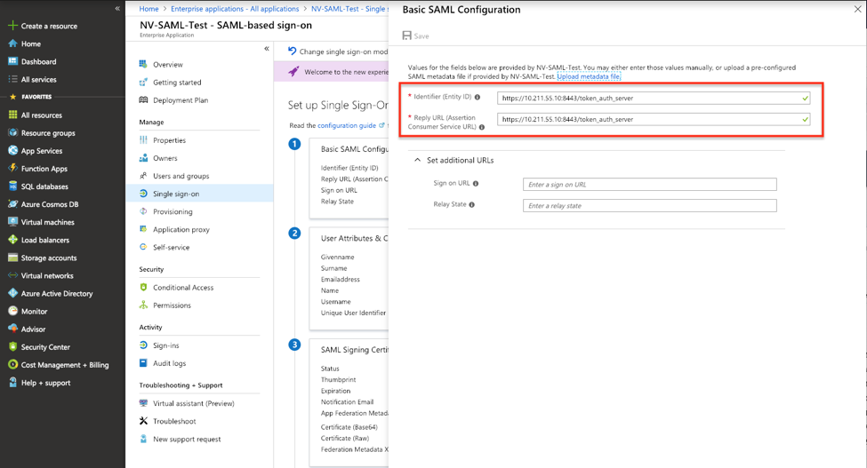

:::note
NeuVector uses its SAML Redirect URI as both the assertion consumer service URL and the audience URI (SP entity ID); it is not configurable in the NeuVector console. Enter that same value in both Azure fields so the audience of the assertion matches what NeuVector expects.
:::

10. Edit "SAML Signing Certificate", changing the Signing Option to "Sign SAML response"

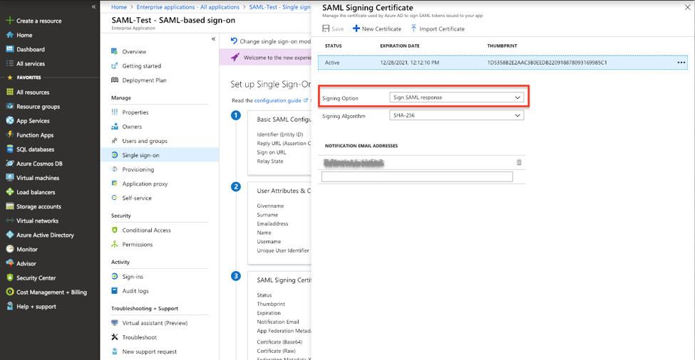

11. Edit "User Attributes & Claims" so the response can carry the login user's attributes back to NeuVector. Click "Add new claim" to add "Username" and "Email" claims with "user.userprincipalname" and "user.mail" respectively.

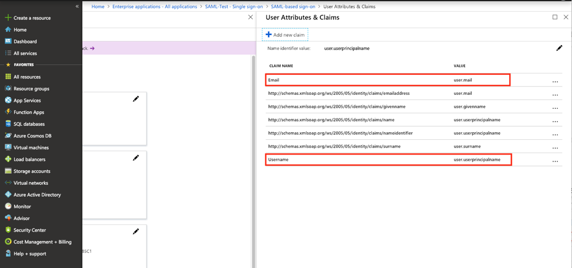

12. If the users are assigned to the groups in the active directory, their group membership can be added to the claim. Find the application in "App registrations" and edit the manifest. Modify the value of "groupMembershipClaims" to "All".

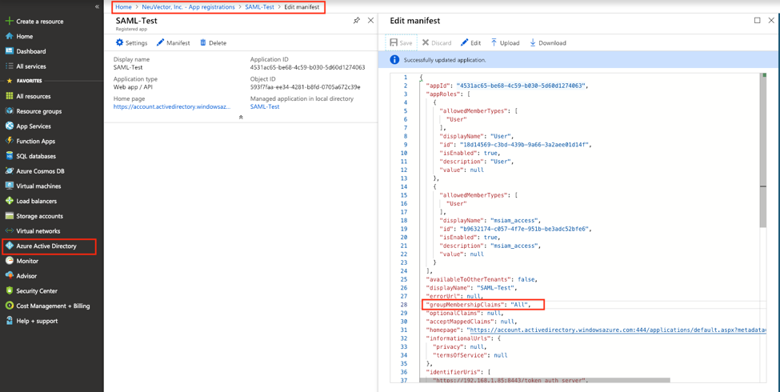

13. Authorize users and groups to access the application so they can login NeuVector console with Azure AD SAML SSO

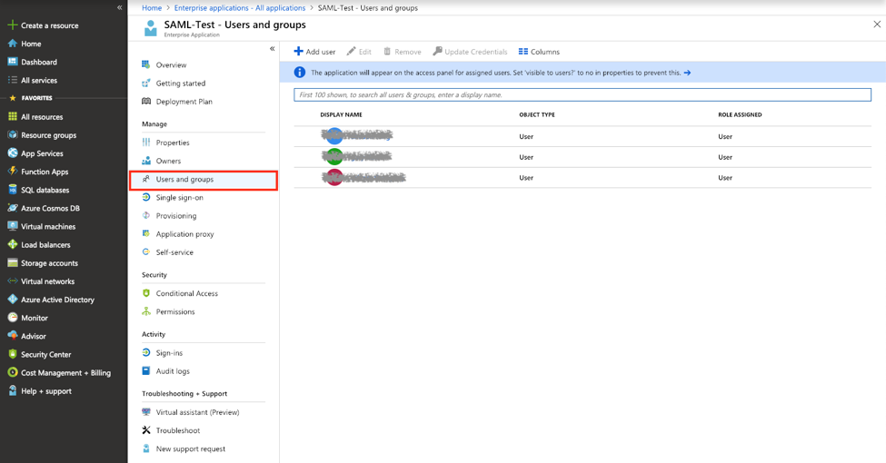

#### Mapping Groups to Roles and Namespaces

Please see the [Users and Roles](/configuration/users#mapping-groups-to-roles-and-namespaces) section for how to map groups to preset and custom roles as well as namespaces in NeuVector.
