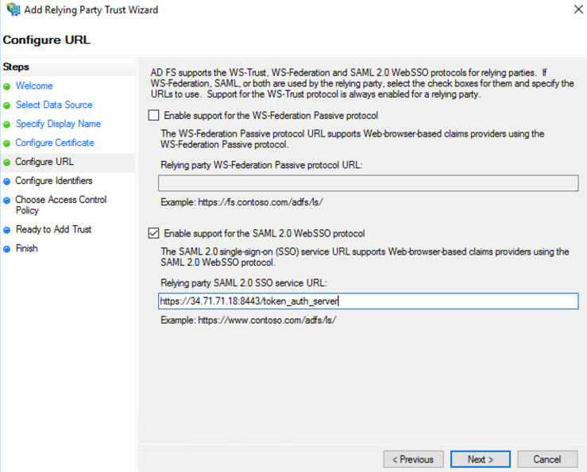
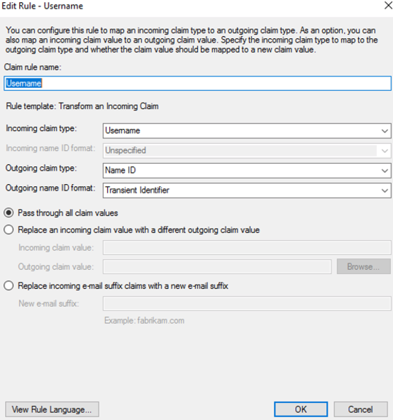
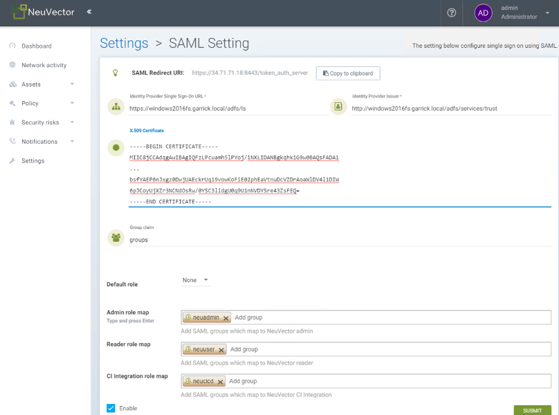
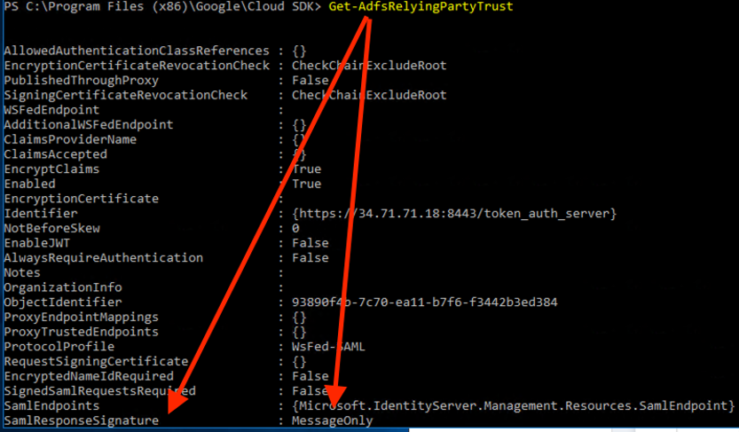

### Setting Up ADFS and NeuVector Integration
This section describes the setup steps in ADFS first, then in the NeuVector console.

#### ADFS Setup

1. From AD FS Management, right click on “Relying Party Trusts” and select “Add Relying Party Trust…”.

2. Select “Start” button from Welcome step.

 
3. Select “Enter data about the relying party manually” and select “Next”.

4. Enter a unique name for Display name field and select “Next”.

5. Select “Next” to skip token encryption.

6. Check “Enable support for the SAML 2.0 WebSSO protocol” and enter  the SAML Redirect URI from NeuVector Settings>SAML Setting page into the “Relying party SAML 2.0 SSO service URL” field.  Select “Next” to continue.

7. Enter the same SAML Redirect URI into the “Relying party trust identifier” field and click “Add”; then select “Next” to continue.

8. Customize Access Control; then select “Next” to continue.

9. Select “Next” to continue.

10. Select “Close” to finish.

11. Select Edit Claim Issuance Policy…

12. Select “Add Rule…” and choose “Send LDAP Attributes as Claims”; then select “Next”.  Name the rule and choose Active Directory as the Attribute store. Only Username outgoing claim is required for authentication if default role is set; else groups is needed for role mapping.  Email is optional.

+ SAM-Account-Name -> Username
+ E-Mail-Address -> Email
+ Token-Groups – Unqalified Names -> groups

13. Select “Add Rule…” and choose “Transform an Incoming Claim”; then select “Next”.  Name the rule and set the field as captured in the screenshot below.  The Outgoing name ID format needs to be Transient Identifier.

#### NeuVector Setup

1. Identify Provider Single Sign-On URL

+ View Endpoints from AD FS Management > Service and use “SAML 2.0/WS-Federation” endpoint URL.
+ Example: https://&lt;adfs-fqdn>/adfs/ls

2. Identity Provider Issuer

+ Right click on AD FS from AD FS Management console and select “Edit Federation Service Properties…”; use the “Federation Service identifier”.
+ Example: http://&lt;adfs-fqdn>/adfs/services/trust

3. X.509 Certificate

+ From AD FS Management, select Service > Certificate, right click on Token-signing certificate and choose “View Certificate…”
+ Select the Details tab and click “Copy to File”
+ Save it as a Base-64 encoded x.509 (.CER) file
+ Copy and paste the contents of the file into the X.509 Certificate field

4. Group claim

+ Enter the Outgoing claim name for the groups
+ Example: groups

5. Default role

+ Recommended to be “None” unless you want to allow any authenticated user a default role.

6. Role map

+ Set the group names of the users for the appropriate role.  (See screenshot example below.)

#### Mapping Groups to Roles and Namespaces

Please see the [Users and Roles](/configuration/users#mapping-groups-to-roles-and-namespaces) section for how to map groups to preset and custom roles as well as namespaces in NeuVector.

### Troubleshooting

1. ADFS SamlResponseSignature needs to be either MessageOnly or MessageAndAssertion.  Use Get-AdfsRelyingPartyTrust command to verify or update it.

2. Time synchronization between Kubernetes Nodes x ADFS Server

For a successful authentication, the time between the Kubernetes nodes and the ADFS server needs to be the same to avoid time sync or clock drift issues. 

It's recommended to use an [NTP server](https://en.wikipedia.org/wiki/Network_Time_Protocol), with equal time settings across all servers. 

Please check and confirm that both ADFS and NeuVector hosts are synchronized and the potential delays do not exceed more than 10 seconds. You can use Linux and Windows commands to check dates, times and NTP server activity.

:::tip
You can reload the auth times by disabling and enabling again the config in the NeuVector UI as follows:

- Log in to NeuVector with Admin User 
- Go to Settings 
- Click on the button to disable and enable the SAML setting
  - **Make sure to keep the configuration settings!**

Once the setting has been re-enabled, you can try to log in with an ADFS user. If it works, this confirms the issue was due to a time synchronization error between Kubernetes nodes and the ADFS Server. 
:::

3. SAML characters must be case sensitive in NeuVector UI

Attribute names are case sensitive. Make sure any SAML attribute name configured here is an exact match to the application configuration. SAML must point to the correct URL to authenticate. 

All the fields in `NeuVector UI -> Settings -> SAML Settings` are case-sensitive.

The NeuVector controller logs contain the relevant information about authentication with the ADFS server and errors that will help identify the root cause. We recommended recreate the failed login condition and check the logs.

4. Make sure to enter the correct groups, certificates and protocols

The SAML settings need to match the following configuration:

| Setting | Value |
| ------- | ----- |
| Identify Provider Single Sign-On URL | Requires HTTPS protocol |
| Identity Provider Issuer | Requires HTTP protocol |
| ADFS SamlResponseSignature | Needs to be either MessageOnly or MessageAndAssertion |

:::warning attention
These settings need to be validated on your ADFS server and in the NeuVector UI.
:::

The selected certificate needs to be valid and correctly generated, including its `CA Root` and `Intermediate Certificates`. You can generate them using your trusted certificate authority, Windows or an automation tool such as [LetsEncrypt](https://letsencrypt.org/).

If any of these parameters are incorrect, you will receive an `Authentication Failed` error when you try to log in to NeuVector with an ADFS user using SAML authentication.

