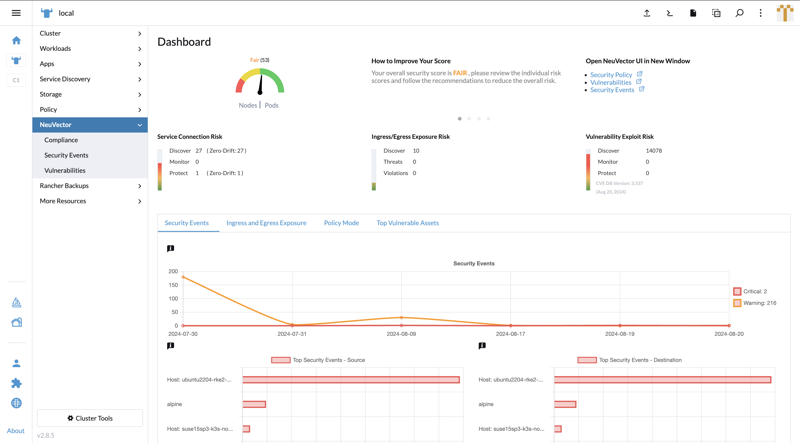
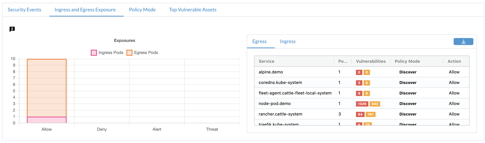
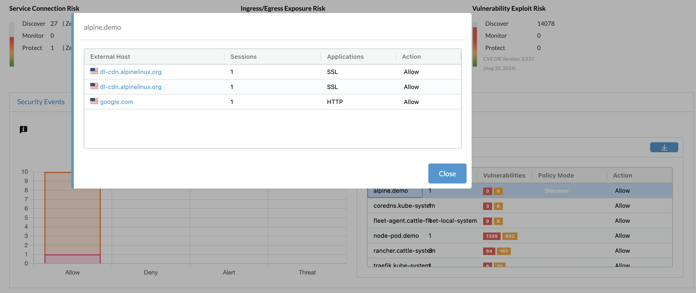
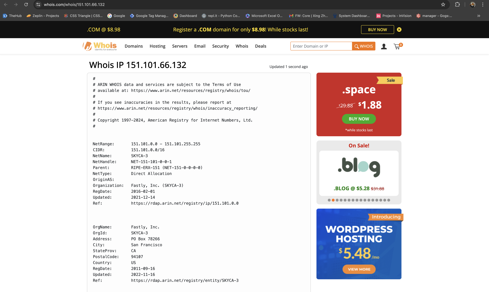
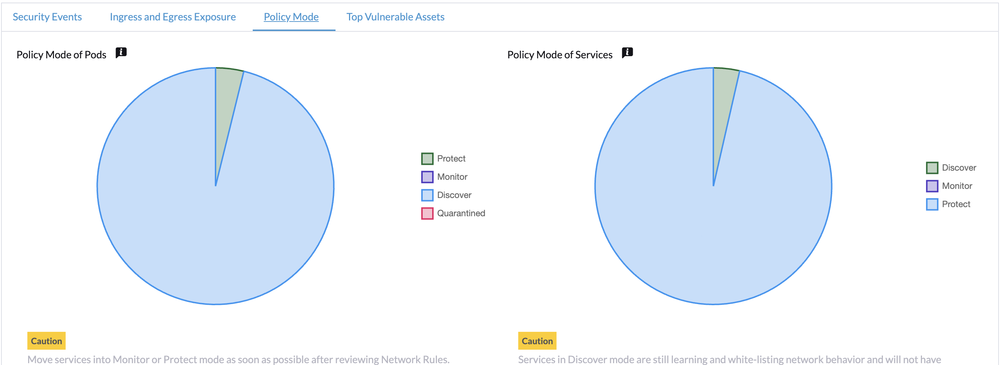
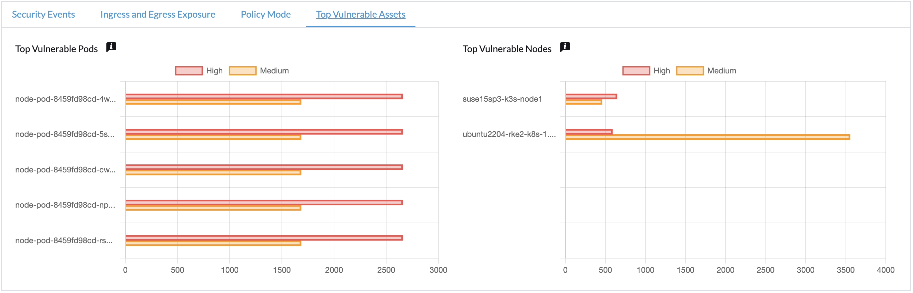

### Monitor Overview of Security Status

In the UI Extension in the Rancher portal, NeuVector's Dashboard works similar as its standalone page. It provides security risk score factors to let users know the security status of their clusters. In the bottom panel, it provides 4 tabs to let users switch the charts to monitor different categories.

In the Security Events tab, the line chart shows a date-based event count in a timeline.
The top security events bar charts presents the top 5 source and destination endpoints.

In Ingress and Egress Exposure tab, the stacked bar chart shows the amount of exposed endpoints by actions.
On the right side, the exposure tables show egress and ingress endpoint service with scan information.

Click on the row of egress/ingress table, the table shows conversations on specific services. The FQDN name / IP address is shown with a geography location based national flag in the External Host field.

Click on the External Host, it redirects to whois.com to show the IP address' detail information.

In the Policy Mode tab, the pie charts show the ratio and numbers of pods / services under different policy modes.

In the Top Vulnerable Assets tab, the bar charts show the top 5 pods / nodes which contain high or medium severity vulnerabilities.

### Functions Not Included When Comparing with NeuVector Standalone Page

Score improvement dialog

Application Protocols Detected and Protected by Layer 7 Network Rules

Namespace base PDF reports
