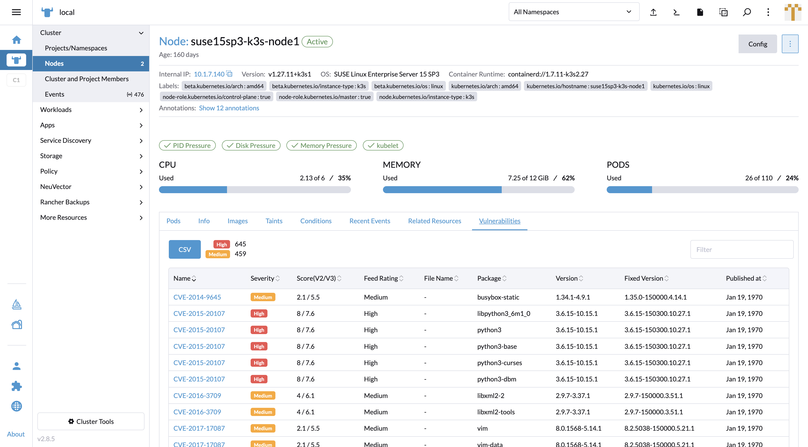
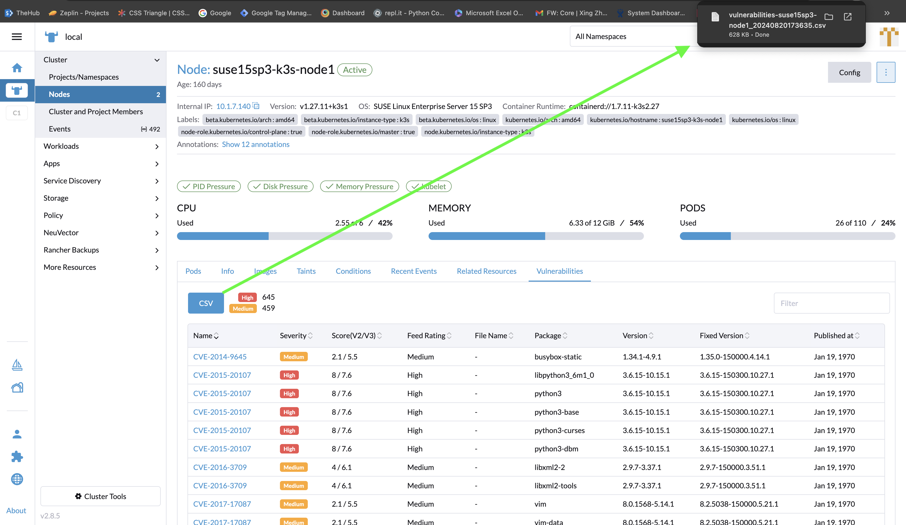
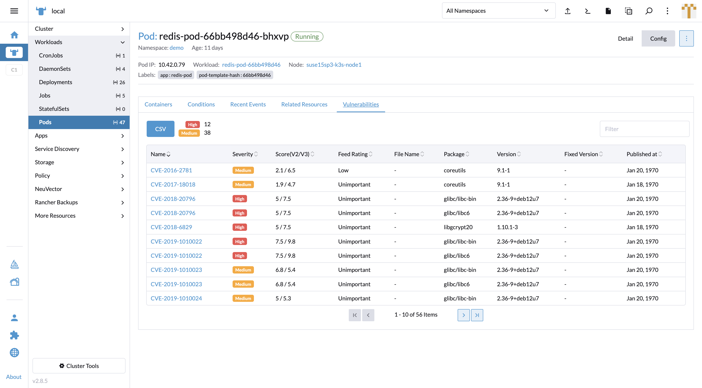

### Assets Security Scan Result

As Rancher has its own Nodes and Workloads page to manage and monitor the assets statuses, NeuVector injects components to display its runtime scan result.

#### Nodes

In the nodes summary table, the vulnerabilities column is injected to show each node's detected vulnerabilities amount by high / medium severity.

Click on the vulnerabilities cell, a slide panel will come from the right side of the page to show scan result details. The database version of the scanner is shown as well as a filterable vulnerability list.

Click on the node name cell on nodes table, it redirects to the node detail page. NeuVector injects a tab to show the vulnerability list.

Click on the CVE name cell on the vulnerabilities table, it opens a popup to show CVE description with an external link on the header to SUSE's CVE information website.

A CSV file download button is provided above the vulnerabilities table. The file data includes all the fields which are in the table.

#### Workloads

Temporarily, the vulnerabilities column will not be injected in the workloads table in the v5.4 release due to potential performance concern. The NeuVector team will work with the Rancher team to integrate it soon.

Click on a pod name in the workloads table, it redirects to the pod detail page. NeuVector injects a tab to show the vulnerability list.

