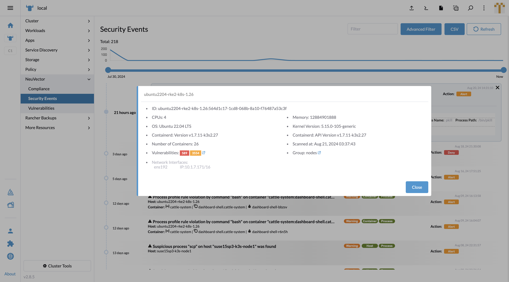

### Event Reporting

#### Security Events

In UI Extension on Rancher portal, Security Events works similar as NeuVector standalone page.
The events can be triggered by several factors

- Dangerous conversation or data transportation from somewhere to the endpoint (Node or pod)
- End-to-end violated connection against network policy
- Violated operation against process profile rule
- Violated operation against file access rule

Slide left or  / and right dot on the time slider to filter events by date.

Type in keyword into quick filter box to filter any event which includes the keyword.

Open the Advanced filter slide panel, there are multiple options supporting your searching.

- Severity, Location and Category can be filtered according to the tags on the right side of the event title.
- Autocomplete list can support user to enter Host, Source, Destination
- Autocomplete list also support multiple tag-input box for Namespace

To read the details of the event, click on a record to expand the panel. In the message box, it contains more informations.

Host name is clickable for opening host detail popup. Vulnerabilities and Group have external link to redirect to NeuVector SSO page.

Workload name is clickable for opening workload detail popup. Group has external link to redirect to NeuVector SSO page.

Reported by field in the message box is clickable for opening enforcer detail popup.

### Not included functions comparing with NeuVector standalone page

Review / Propose rule

PDF report