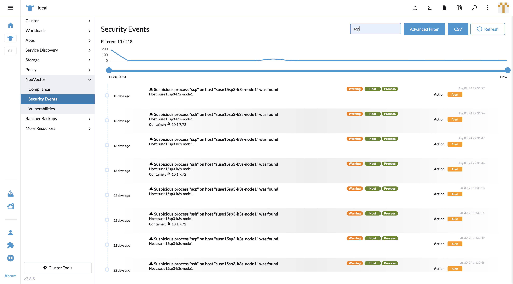
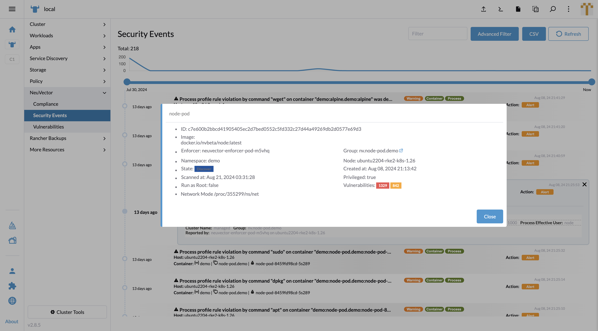

### Event Reporting

#### Security Events

In the UI Extension on the Rancher portal, Security Events work similar to the NeuVector standalone page.
The events can be triggered by several factors:

- Dangerous conversation or data transportation from somewhere to the endpoint (Node or pod)
- End-to-end violated connection against network policy
- Violated operation against process profile rule
- Violated operation against file access rule

Slide the dot left or right on the time slider to filter events by date.

Type in keywords into the quick filter box to filter any event which includes the keyword.

Open the Advanced filter slide panel, and you will find multiple options supporting your search:

- Severity, Location and Category can be filtered according to the tags on the right side of the event title.
- Autocomplete list can support user to enter Host, Source, Destination
- Autocomplete list also support multiple tag-input box for Namespace

To read the details of the event, click on a record to expand the panel. In the message box you can view more information.

The Host name is clickable for opening the host detail popup. Vulnerabilities and Group have an external link to redirect to the NeuVector SSO page.

The Workload name is clickable for opening the workload detail popup. Group has an external link to redirect to the NeuVector SSO page.

The Reported by field in the message box is clickable and opens the enforcer detail popup.

### Functions Not Included When Comparing with NeuVector Standalone Page

Review / Propose rule

PDF report