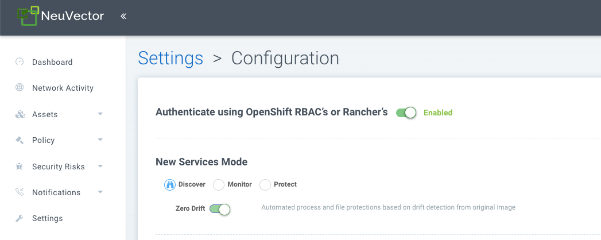

### Deploy and Manage NeuVector through Rancher Apps & Marketplace
NeuVector is able to be deployed easily through Rancher Apps and Marketplace and managed through Rancher Manager. The default (Helm-based) NeuVector deployment will deploy NeuVector containers into the cattle-neuvector-system namespace.

Note: Only NeuVector deployments through Apps & Marketplace of Rancher version 2.6.5+ can be managed directly (single sign on to NeuVector console) through Rancher. If adding clusters to Rancher with NeuVector already deployed, or where NeuVector has been deployed directly onto the cluster, these clusters will not be enabled for SSO integration.

####Deploy NeuVector

First, find the NeuVector chart in Rancher charts, select it and review the instructions and various configuration values. (Optional) Create a project to deploy into if desired, e.g. NeuVector. Note: If you see more than one NeuVector chart, don't select the one that is for upgrading legacy NeuVector 4.x Helm chart deployments.


Deploy the NeuVector chart, first configuring appropriate values for a Rancher deployment, such as:
+ Container run-time, e.g. docker for RKE and containerd for RKE2, or select the K3s value if using K3s.
+ Manager service type: change to LoadBalancer if available on public cloud deployments. If access is only desired through Rancher, any allowed value will work here. See the Important note below about changing the default admin password in NeuVector.
+ Indicate if this cluster will be either a multi-cluster federated Primary, or remote (or select both if either option is desired).
+ Persistent volume for configuration backups


Click 'Install' after you have reviewed and updated any chart values.

After successful NeuVector deployment, you will see a summary of the deployments, daemon sets, and cron job for NeuVector. You will also be able to see the services deployed in the Services Discovery menu on the left.


####Manage NeuVector

You will now see a NeuVector menu item in the left, and selecting that will show a NeuVector tile/button, which when clicked will take you to the NeuVector console, in a new tab.


When this Single Sign On (SSO) access method is used for the first time, a corresponding user in the NeuVector cluster is created for the Rancher user login. The same user name of the Rancher logged in user will be created in NeuVector, with a role of either admin or fedAdmin, and Identity provider as Rancher. 


Note in the above screen shot, two Rancher users admin and gkosaka have been automatically created for SSO. If another user is create manually in NeuVector, the Identity provider would be listed as NeuVector, as shown below. This local user can login directly to the NeuVector console without going through Rancher.


***Important:*** It is recommended to login directly to the NeuVector console as admin/admin to manually change the admin password to a strong password. This will only change the NeuVector identity provider admin user password (you may see another admin user whose identify provider is Rancher). Alternatively, include a [ConfigMap as a secret](/deploying/production/configmap#protect-sensitive-data-using-a-secret) in the initial deployment from Rancher (see chart values for ConfigMap settings) to set the default admin password to a strong password.

#### Disabling NeuVector/Rancher SSO
To disable the ability to login to NeuVector from Rancher Manager, go to Settings -> Configuration.




####Rancher Legacy Deployments
The sample file will deploy one manager and 3 controllers. It will deploy an enforcer on every node. See the bottom section for specifying dedicated manager or controller nodes using node labels. Note: It is not recommended to deploy (scale) more than one manager behind a load balancer due to potential session state issues.

Note: Deployment on Rancher 2.x/Kubernetes should follow the Kubernetes reference section and/or Helm based deployment.

1. Deploy the catalog docker-compose-dist.yml, controllers will be deployed on the labelled nodes, enforcers will be deployed on the rest of nodes. (The sample file can be modified so that enforcers are only deployed to the specified nodes.)

2. Pick one of controllers for the manager to connect to. Modify the manager's catalog file docker-compose-manager.yml, set CTRL_SERVER_IP to the controller's IP, then deploy the manager catalog.

Here are the sample compose files. If you wish to only deploy one or two of the components just use that section of the file.

Rancher Manager/Controller/Enforcer Compose Sample File:
```
manager:
   scale: 1
   image: neuvector/manager
   restart: always
   environment:
     - CTRL_SERVER_IP=controller
   ports:
     - 8443:8443
controller:
   scale: 3
   image: neuvector/controller
   restart: always
   privileged: true
   environment:
     - CLUSTER_JOIN_ADDR=controller
   volumes:
     - /var/run/docker.sock:/var/run/docker.sock
     - /proc:/host/proc:ro
     - /sys/fs/cgroup:/host/cgroup:ro
     - /var/neuvector:/var/neuvector
enforcer:
   image: neuvector/enforcer
   pid: host
   restart: always
   privileged: true
   environment:
     - CLUSTER_JOIN_ADDR=controller
   volumes:
     - /lib/modules:/lib/modules
     - /var/run/docker.sock:/var/run/docker.sock
     - /proc:/host/proc:ro    
     - /sys/fs/cgroup/:/host/cgroup/:ro
   labels:
     io.rancher.scheduler.global: true
```

### Deploy Without Privileged Mode
On some systems, deployment without using privileged mode is supported. These systems must support the ability to add capabilities using the cap_add setting and to set the apparmor profile.

See the sections on deployment with Docker-Compose, Docker UCP/Datacenter for sample compose files.

Here is a sample Rancher compose file for deployment without privileged mode:
```
manager:
   scale: 1
   image: neuvector/manager
   restart: always
   environment:
     - CTRL_SERVER_IP=controller
   ports:
     - 8443:8443
controller:
   scale: 3
   image: neuvector/controller
   pid: host
   restart: always
   cap_add:
     - SYS_ADMIN
     - NET_ADMIN
     - SYS_PTRACE
   security_opt:
     - apparmor=unconfined
     - seccomp=unconfined
     - label=disable
   environment:
     - CLUSTER_JOIN_ADDR=controller
   volumes:
     - /var/run/docker.sock:/var/run/docker.sock
     - /proc:/host/proc:ro
     - /sys/fs/cgroup:/host/cgroup:ro
     - /var/neuvector:/var/neuvector
enforcer:
   image: neuvector/enforcer
   pid: host
   restart: always
   cap_add:
     - SYS_ADMIN
     - NET_ADMIN
     - SYS_PTRACE
     - IPC_LOCK
   security_opt:
     - apparmor=unconfined
     - seccomp=unconfined
     - label=disable
   environment:
     - CLUSTER_JOIN_ADDR=controller
   volumes:
     - /lib/modules:/lib/modules
     - /var/run/docker.sock:/var/run/docker.sock
     - /proc:/host/proc:ro    
     - /sys/fs/cgroup/:/host/cgroup/:ro
   labels:
     io.rancher.scheduler.global: true
```

### Using Node Labels for Manager and Controller Nodes
To control which nodes the Manager and Controller are deployed on, label each node. Pick the nodes where the controllers are to be deployed. Label them with "nvcontroller=true". (With the current sample file, no more than one controller can run on the same node.).

For the manager node, label it “nvmanager=true”.

Add labels in the yaml file. For example for the manager:
```
   labels:
     io.rancher.scheduler.global: true
     io.rancher.scheduler.affinity:host_label: "nvmanager=true"
```

For the controller:
```
   labels:
     io.rancher.scheduler.global: true
     io.rancher.scheduler.affinity:host_label: "nvcontroller=true"
```

For the enforcer, to prevent it from running on a controller node (if desired):
```
  labels:
     io.rancher.scheduler.global: true
     io.rancher.scheduler.affinity:host_label_ne: "nvcontroller=true"
```

