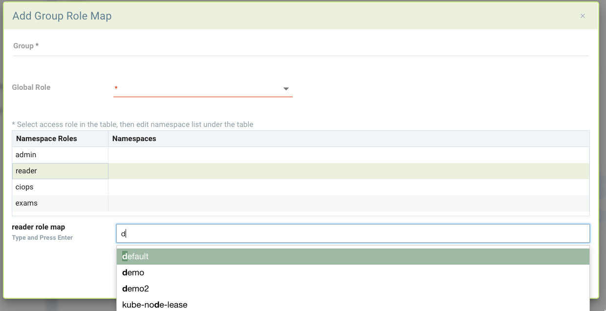

### Configuring Users and Custom Roles
The Settings -> Users and Roles menu enables management of users as well as roles. Each user is assigned to a predefined or custom role. Users can be mapped to roles through group integration with LDAP/AD or other SSO system integrations. See the [Enterprise Integration](/integration/integration#directorysso-integration) section for detailed instructions for each type or directory or SSO integration.

#### Users
Users can be configured directly in NeuVector or integrated through directories/SSO. To create a new user in NeuVector go to Settings -> Users & Roles and add the user. Select the role of the user from the predefined roles, or see below to create a custom role.

The default password requirement is minimum 8 characters length, 1 uppercase letter, 1 lowercase letter, 1 numeric character. These and other requirements can be changed by an admin in Settings -> Users under Authentication and Security Policies.

#### Namespace Restricted Users
Users can be restricted to certain namespaces. First select the global role (use 'none' if no global role is desired), then click on the Advanced Settings.

Select a role name from the list of roles, then enter the namespace(s) which the user allowed. For example, below is a global reader (view only) role, but for namespace 'demo' the user has admin permissions and for the namespace 'staging' the user has CI/Ops permissions. If a custom role was previously configured that can also be selected.

Note 1: If a user has previously logged in through an enterprise integration, their Identify Provider (e.g. OpenID Connect) will be listed. A user can be promoted to a Federated admin if multi-cluster management is in use by selecting the user and editing. 

Note 2: When a namespace restricted user configures a registry in Assets in NeuVector, only users with access to that namespace can see/scan that registry. Global users will be able to see/manage that registry, but not any users with restricted namespaces / role.

#### Roles
Preconfigured roles include Admin, Reader, and CI/Ops. To create a new custom role, select  the Roles tab in Settings -> Users & Roles. Name the role and add the appropriate read or write permission to it.

#### RBAC Permissions

+ Admission Control. Manage admission control rules.
+ Audit Events. View Notification -> Risk reports logs.
+ Authentication. Enable directory and SSO (oidc/saml/ldap) configuration.
+ Authorization. Create new users and custom roles.
+ CI Scan. Allows scanning on images through REST API. Useful for configuring a build-phase plug-in scanner user.
+ Compliance. Create custom compliance scripts and review Compliance check results.
+ Event. Access Notifications -> Events logs.
+ Registry Scan. Configure registry scanning and view results.
+ Runtime Policy. Manage Policy menus for Policy Mode (Discover, Monitor, Protect), Network Rules, Process Rules, File Access Rules, DLP, Packet capture, Response Rules.
+ Runtime Scan. Trigger and view run-time vulnerability scanning of containers/nodes/platform.
+ Security Event. Access Notifications -> Security Events logs.
+ System Config. Allow configuration of Settings -> Configuration.

#### Mapping Groups to Roles and Namespaces
Groups can be mapped to preset or custom roles in NeuVector. In addition, a role can be restricted to one or more namespaces.

In the LDAP/AD, SAML, or OIDC configuration in Settings, the last section of the configuration screen maps Groups to Roles and Namespaces. First select a default role, if any, for mapping.

To map a group to a role and namespace, click Add to create a new mapping. Select a global role or none. If admin or FedAdmin is selected, this gives write access to all namespaces. If a different role is selected, it can be further restricted by selecting the desired namespace(s).

The following example provides some possible mappings. Demo_admin can read/view all namespaces but has admin rights to the demo and demo2 namespaces. System_admin only has admin rights to the kube-system namespace.  And fed_admins has the preset fedAdmin role which gives write access to all resources across multiple clusters.

<strong>Important</strong>: If the user is in multiple groups, the role will be 'first matched' in the order listed and group's role assigned. Please adjust the order of configuration for proper behavior by dragging and dropping the mappings to the appropriate order in the list.

#### Multi-Cluster FedAdmin and Admin Roles for Primary and Remote Management
When a cluster is [promoted](/navigation/multicluster) to be a Primary cluster, the admin becomes a FedAdmin automatically. The FedAdmin can perform operations on the primary such as generate a federation token for connecting a remote cluster as well as creating federated security rules such as network, process, file, and admission control rules.

Multi-cluster management roles are as follows:
+ On any cluster, a local admin or a Rancher SSO admin can promote the cluster to become a primary.
+ Ldap/SSO/SAML/OIDC users with admin roles are not able to promote a cluster to primary.
+ Only the FedAdmin can generate the token required to join a remote cluster to the primary.
+ Any admin, including ldap/sso/saml/oidc users can join a remote cluster to the primary if they have the token.
+ Only the FedAdmin can create a new user as a FedAdmin (or FedReader) or assign the FedAdmin (or FedReader) role to an existing user (including ldap/sso/saml/oidc users).

