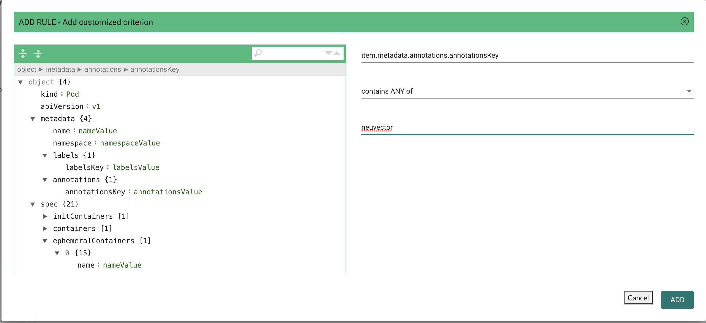

### Controlling Image / Container Deployments

With Admission Control integration with orchestration platforms such as Kubernetes and OpenShift, NeuVector is playing an important role within the orchestration platform’s deployment pipeline. Whenever a cluster resource such as Deployment is created, the request from the cluster apiserver will be passed to one of the NeuVector Controllers to determine if it should be allowed to deploy or denied based on the user-defined Admission Control rules prior to creating the cluster resource. The policy decision NeuVector makes will be passed back to cluster apiserver for enforcement.

This feature is supported in Kubernetes 1.9+ and Openshift 3.9+. Before using the Admission Control function in NeuVector, there are two values that need to be set in the --admission-control argument passed to the cluster apiserver. Please see Kubernetes and Openshift sections below for configuration.

#### Kubernetes
The ValidatingAdmissionWebhook and MutatingAdmissionWebhook plugins are enabled by default.

Check if admissionregistration.kubernetes.io/v1beta1 is enabled
```
$ kubectl api-versions | grep admissionregistration
admissionregistration.k8s.io/v1beta1
```

#### Openshift
The ValidatingAdmissionWebhook and MutatingAdmissionWebhook plugins are NOT enabled by default. Please see the examples in the OpenShift deployment sections for instructions on how to enable these. A restart of the OpenShift api and controllers services is required.

Check if admissionregistration.kubernetes.io/v1beta1 is enabled
```
$ oc api-versions | grep admissionregistration
admissionregistration.k8s.io/v1beta1
```

### Enabling Admission Control (Webhook) in NeuVector
The Admission Control feature is disabled by default. Please go to Policy -> Admission Control page to enable it in the NeuVector console.



Once the Admission Control feature is enabled successfully, the following ValidatingWebhookConfiguration resource will be created automatically. To check it:
```
$ kubectl get ValidatingWebhookConfiguration neuvector-validating-admission-webhook
```
Sample output:
```
NAME                                     CREATED AT
neuvector-validating-admission-webhook   2019-03-28T00:05:09Z
```

The most important information in ValidatingWebhookConfiguration resource for NeuVector is cluster resources. Currently once a cluster resource such as Deployment NeuVector registered is created, the request will be sent from orchestration platform apiserver to one of the NeuVector Controllers to determine if it should be allowed or denied based on the user-defined rules in NeuVector Policy -> Admission Control page. 

If the resource deployment is denied, an event will be logged in Notifications.

To test the Kubernetes connection for the client mode access, go to Advanced Setting.


For special cases, the URL access method using the NodePort service may be required.

### Admission Control Events/Notifications
All admission control events for allowed and denied events can be found in the Notifications -> Security Risks menu.

### Admission Control Criteria
NeuVector supports many criteria for creating an Admission Control Rule. These include CVE High Count, CVE Names, image labels, imageScanned, namespace, user, runAsRoot, etc. There are two possible sources of criteria evaluation, Image Scans and Deployment Yaml file scans. If a criterion requires an image scan, the scan results from Registry Scanning will be used. If the image was not scanned, the admission control rule will not be applied. If a criterion requires scanning of the deployment yaml, it will be evaluated from the Kubernetes deployment. Some criteria will use the results  from either an image scan OR a deployment yaml scan.

+ CVE score is an example of a criterion requiring an image scan.
+ Environment variables with secrets is an example of a criterion using the deployment yaml scan.
+ Labels and Environment variables are examples of criteria which will use BOTH image and deployment yaml scans results  (logical OR) to determine matches.


After the criterion is selected, the possible Operators will be displayed. Click the ‘+’ button to add each criterion.

<strong>Using Multiple Criteria in a Single Rule</strong>
The matching logic for multiple criteria in one admission control rule is:
+ For different criteria types within a single rule, apply 'and'
+ For multiple criteria of same type (e.g. multiple namespaces, registries, images), 
    - Apply 'and' for all negative matches("not contains any", "is not one of") until the first positive match;
    - After the first positive match, apply 'or'

####Example with Matching a Pod Label
```
apiVersion: apps/v1
kind: Deployment
metadata:
  name: iperfserver
  namespace: neuvector-1
spec:
  replicas: 1
  template:
    metadata:
      labels:
        app: iperfserver
 ```
The rule to match would be:


####Example with Matching Environment Variables with Secrets
```
apiVersion: apps/v1
kind: Deployment
metadata:
  name: iperfserver
  namespace: neuvector-1
  labels:
    name: iperfserver
spec:
  selector:
    matchLabels:
      name: iperfserver
  replicas: 1
  template:
    metadata:
      labels:
        name: iperfserver
    spec:
      containers:
        - name: iperfserver
          image: nvlab/iperf
          env:
            - name: env1
              value: AIDAJQABLZS4A3QDU576
            - name: env2
              valueFrom:
                fieldRef:
                  fieldPath: status.podIP
            - name: env5
              value: AIDAJQABLZS4A3QDU57E
          command:
            - iperf
            - -s
            - -p
            - "6068"
      nodeSelector:
        nvallinone: "true"
      restartPolicy: Always
```
The Matching rule would be:


#### Criteria Related to Scan Results
The following criteria are related to the results in NeuVector Assets > Registry scan page:

Image, imageScanned, cveHighCount, cveMediumCount, Image compliance violations, cveNames and others.

Before NeuVector performs the match against the Admission Control rules, NeuVector retrieves the image information (For example, 10.1.127.3:5000/neuvector/toolbox/iperf:latest) from the cluster apiserver
(Please refer to Request from apiserver section below). The image is composed by registry server (https://10.1.127.3:5000), repository (neuvector/toolbox/iperf) and tag (latest).

NeuVector uses this information to match the results in NeuVector Assets -> Registry scan page and collects the corresponding information such as cve name, cve high or medium count etc. Image compliance violations are considered any image which has secrets or setuid/setgid violations.
If users are using the image from docker registry to create a cluster resource, normally the registry server information is empty or docker.io and currently NeuVector is using the following hard-coded registry servers to match the registry scan result instead of empty or docker.io string. Of course, if there are more other than the following supported docker registry servers defined in the registry scan page, NeuVector is unable to get the registry scan results successfully.

If users are using the built-in image such as alpine or ubuntu from the docker registry, there is a hidden organization name called library. When you look at the results for docker build-in image in NeuVector Assets > Registry scan page, the repository name will be library/alpine or library/ubuntu. Currently NeuVector assumes there is only one hidden library organization name in docker registry. If there is more  than one, NeuVector is unable to get the registry scan results successfully as well.
The above limitation could also apply on other type of docker registry servers if any.

#### Creating Custom Criteria Rules
Users can create a customized criterion to be used to allow or block deployments based on common objects found in the image yaml (scanned upon deployment). Select the object to be used, for example annotationsKey and the matching value, for example neuvector to create the criterion. It is also recommended to use additional criteria to further target the rule, such as namespace, PSP/PSA, CVE conditions etc.




### Admission Control Modes
There are two modes NeuVector supports - Monitor and Protect.
+ Monitor: there is an alert message in the event log if a decision is denied. In this case, the cluster apiserver is allowed to create a resource successfully. Note: even if the rule action is Deny, in Monitor mode this will only alert.
+ Protect: this is an inline protection mode. Once a decision is denied, the cluster resource will not be able to be created successfully, and an event will be logged.

### Admission Control Rules

Rules can be Allow (whitelist) or Deny (blacklist) rules. Rules are evaluated in the order displayed, from top to bottom. Allow rules are evaluated first, and are useful to define exceptions (subsets) to Deny rules. If a resource deployment does not match any rules, the default action is to Allow the deployment.

There are two pre-configured rules which should be allowed to enable Kubernetes system container and NeuVector deployments.

Admission control rules apply to all resources which create pods (e.g. deployments, daemonsets, replicasets etc)

### Federated Scan Results in Admission Control Rules
The primary (master) cluster can scan a registry/repo designated as a federated registry. The scan results from these registries will be synchronized to all managed (remote) clusters. This enables display of scan results in the managed cluster console as well as use of the results in admission control rules of the managed cluster. Registries only need to be scanned once instead of by each cluster, reducing CPU/memory and network bandwidth usage. See the [multi-cluster](/navigation/multicluster/) section for more details.

### Troubleshooting

If experiencing errors and you have access to the master node you can inspect the kube-apiserver log to search for admission webhook events. Examples:


```
W0406 13:16:49.012234 1 admission.go:236] Failed calling webhook, failing open neuvector- validating-admission-webhook.neuvector.svc: failed calling admission webhook "neuvector-validating- admission-webhook.neuvector.svc": Post https://neuvector-svc-admission- webhook.neuvector.svc:443/v1/validate/1554514310852084622-1554514310852085078?timeout=30s: dial tcp: lookup neuvector-svc-admission-webhook.neuvector.svc on 8.8.8.8:53: no such host
```

The above log indicates that the cluster kube-apiserver is unable to send the request to the NeuVector webhook successfully because it fails to resolve the neuvector-svc-admission-webhook.neuvector.svc name.

```
W0405 23:43:01.901346 1 admission.go:236] Failed calling webhook, failing open neuvector- validating-admission-webhook.neuvector.svc: failed calling admission webhook "neuvector-validating- admission-webhook.neuvector.svc": Post https://neuvector-svc-admission-webhook.neuvector.svc:443/v1/validate/1554500399933067744-1554500399933068005?timeout=30s: net/http: request canceled while waiting for connection (Client.Timeout exceeded while awaiting headers)
```

The above log indicates that the cluster kube-apiserver is unable to send the request to the NeuVector webhook successfully because it resolves the neuvector-svc-admission-webhook.neuvector.svc name with the wrong IP address. It could also indicate a network connectivity or firewall issue between api-server and the controller nodes.

```
W0406 01:14:48.200513 1 admission.go:236] Failed calling webhook, failing open neuvector- validating-admission-webhook.xyz.svc: failed calling admission webhook "neuvector-validating- admission-webhook.xyz.svc": Post https://neuvector-svc-admission- webhook.xyz.svc:443/v1/validate/1554500399933067744-1554500399933068005?timeout=30s: x509: certificate is valid for neuvector-svc-admission-webhook.neuvector.svc, not neuvector-svc-admission- webhook.xyz.svc
```

The above log indicates that the cluster kube-apiserver can send the request to the NeuVector webhook successfully but the certificate in caBundle is wrong.

```
W0404 23:27:15.270619 1 admission.go:236] Failed calling webhook, failing open neuvector- validating-admission-webhook.neuvector.svc: failed calling admission webhook "neuvector-validating- admission-webhook.neuvector.svc": Post https://neuvector-svc-admission- webhook.neuvector.svc:443/v1/validate/1554384671766437200-1554384671766437404?timeout=30s: service "neuvector-svc-admission-webhook" not found
```

The above log indicates that the cluster kube-apiserver is unable to send the request to the NeuVector webhook successfully because the neuvector-svc-admission-webhook service is not found.

#### Review Admission Control Configurations

First, check your Kubernetes or OpenShift version. Admission control is supported in Kubernetes 1.9+ and OpenShift 3.9+.
For OpenShift, make sure you have edited the master-config.yaml to add the MutatingAdmissionWebhook configuration and restarted the master api-servers.

<strong>Check the Clusterrole</strong>
```
kubectl get clusterrole neuvector-binding-admission -o json
```
Make sure the verbs include:
```
                "get",
                "list",
                "watch",
                "create",
                "update",
                "delete"
```
Then check:
```
kubectl get clusterrole neuvector-binding-app -o json
```
Make sure the verbs include:
```
   "get",
   "list",
   "watch",
   "update"
```

If the above verbs are not listed, the Test button will fail.

<strong>Check the Clusterrolebinding</strong>
```
kubectl get clusterrolebinding neuvector-binding-admission -o json
```
Make sure the ServiceAccount is set properly:
```
"subjects": [
        {
            "kind": "ServiceAccount",
            "name": "default",
            "namespace": "neuvector"
```

<strong>Check the Webhook Configuration</strong>
```
kubectl get ValidatingWebhookConfiguration --as system:serviceaccount:neuvector:default -o yaml > nv_validation.txt
```
The nv_validation.txt should have similar content to:
```
apiVersion: v1
items:
- apiVersion: admissionregistration.k8s.io/v1beta1
  kind: ValidatingWebhookConfiguration
  metadata:
    creationTimestamp: "2019-09-11T00:51:08Z"
    generation: 1
    name: neuvector-validating-admission-webhook
    resourceVersion: "6859045"
    selfLink: /apis/admissionregistration.k8s.io/v1beta1/validatingwebhookconfigurations/neuvector-validating-admission-webhook
    uid: 3e1793ed-d42e-11e9-ba43-000c290f9e12
  webhooks:
  - admissionReviewVersions:
    - v1beta1
    clientConfig:
      caBundle: {.........................}
      service:
        name: neuvector-svc-admission-webhook
        namespace: neuvector
        path: /v1/validate/{.........................}
    failurePolicy: Ignore
    name: neuvector-validating-admission-webhook.neuvector.svc
    namespaceSelector: {}
    rules:
    - apiGroups:
      - '*'
      apiVersions:
      - v1
      - v1beta1
      operations:
      - CREATE
      resources:
      - cronjobs
      - daemonsets
      - deployments
      - jobs
      - pods
      - replicasets
      - replicationcontrollers
      - services
      - statefulsets
      scope: '*'
    - apiGroups:
      - '*'
      apiVersions:
      - v1
      - v1beta1
      operations:
      - UPDATE
      resources:
      - daemonsets
      - deployments
      - replicationcontrollers
      - statefulsets
      - services
      scope: '*'
    - apiGroups:
      - '*'
      apiVersions:
      - v1
      - v1beta1
      operations:
      - DELETE
      resources:
      - daemonsets
      - deployments
      - services
      - statefulsets
      scope: '*'
    sideEffects: Unknown
    timeoutSeconds: 30
kind: List
metadata:
  resourceVersion: ""
  selfLink: ""
```
If you see any content like "Error from server ...." or "... is forbidden", it means the NV controller service account doesn't have access right for ValidatingWebhookConfiguration resource. In this case it usually means the neuvector-binding-admission clusterrole/clusterrolebinding has some issue. Deleting and recreating neuvector-binding-admission clusterrole/clusterrolebinding usually the fastest fix.

<strong>Test the Admission Control Connection Button</strong>

In the NeuVector Console in Security Risks -> Admission Control, go to More Operations ->  Advanced Setting and click the "Test" button. NeuVector will modify service neuvector-svc-admission-webhook and see if our webhook server can receive the change notifification or if it fails.

1. Run 
```
kubectl get svc neuvector-svc-admission-webhook -n neuvector -o yaml
```
The output should look like:
```
apiVersion: v1
   kind: Service
   metadata:
     annotations:
       ...................
     creationTimestamp: "2019-09-10T22:53:03Z"
     labels:
       echo-neuvector-svc-admission-webhook: "1568163072"      //===> from last test. could be missing if it's a fresh NV deployment
       tag-neuvector-svc-admission-webhook: "1568163072"       //===> from last test. could be missing if it's a fresh NV deployment
     name: neuvector-svc-admission-webhook
     namespace: neuvector
     ...................
   spec:
     clusterIP: 10.107.143.177
     ports:
     - name: admission-webhook
       port: 443
       protocol: TCP
       targetPort: 20443
     selector:
       app: neuvector-controller-pod
     sessionAffinity: None
     type: ClusterIP
   status:
     loadBalancer: {}
```
2. Now click admission control's advanced setting => "Test" button. Wait until it shows success or failure.
NeuVector will modify the service neuvector-svc-admission-webhook's tag-neuvector-svc-admission-webhook label implicitly.
3. Wait for controller internal operation. If the NeuVector webhook server receives update request from kube-apiserver about this service change, NeuVector will modify the service neuvector-svc-admission-webhook's echo-neuvector-svc-admission-webhook label to the same value as tag-neuvector-svc-admission-webhook label.
4. Run
```
kubectl get svc neuvector-svc-admission-webhook -n neuvector -o yaml
```
The output should look like
```
   apiVersion: v1
   kind: Service
   metadata:
     annotations:
       .............
     creationTimestamp: "2019-09-10T22:53:03Z"
     labels:
       echo-neuvector-svc-admission-webhook: "1568225712"      //===> changed in step 3-3 after receiving request from kube-apiserver
       tag-neuvector-svc-admission-webhook: "1568225712"       //===> changed in step 3-2 because of UI operation
     name: neuvector-svc-admission-webhook
     namespace: neuvector
     .................
   spec:
     clusterIP: 10.107.143.177
     ports:
     - name: admission-webhook
       port: 443
       protocol: TCP
       targetPort: 20443
     selector:
       app: neuvector-controller-pod
     sessionAffinity: None
     type: ClusterIP
   status:
     loadBalancer: {}
```
5. After the test, if the value of label tag-neuvector-svc-admission-webhook doesn't change, it means the controller service fails to update neuvector-svc-admission-webhook service. Check if neuvector-binding-app clusterrole/clusterrolebinding are configured correctly.
6. After the test, if the value of label tag-neuvector-svc-admission-webhook is changed but not the value of label echo-neuvector-svc-admission-webhook, it means the webhook server didn't receive the request from the kube-apiserver. The kub-apiserver's request can't reach the NeuVector webhook server. The cause of this could be network connectivity issues, firewalls blocking the request (on default port 443 in), the resolving of the wrong IP for the controller or others.


