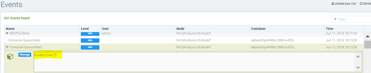

### Policy: Response Rules
Response Rules provide a flexible, customizable rule engine to automate responses to important security events. Triggers can include Security Events, Vulnerability Scan results, CIS Benchmarks, Admission Control events and general Events. Actions include container quarantine, webhooks, and suppression of alerts. 


Creating a new Response Rule using the following:
+ Group. A rule will apply to a Group. Please see the section Run-Time Security Policy -> Groups for more details on Groups and how to create a new one if needed.
+ Category. This is the type of event, such as Security Event, or CVE vulnerability scan result.
+ Criteria. Specify one or more criteria. Each Category will have different criteria which can be applied. For example, by the event name, severity, or minimum number of high CVEs.
+ Action. Select one or more actions. Quarantine will block all network traffic in/out of a container. Webhook requires that a webhook endpoint be defined in Settings -> Configuration. Suppress log will prevent this event from being logged in Notifications.


<Strong>IMPORTANT</Strong>  All Response Rules are evaluated to determine if they match the condition/criteria. If there are multiple rule matches, each action(s) will be performed. This is different than the behavior of Network Rules, which are evaluated from top to bottom and only the first rule which matches will be executed.

Additional events and actions will continue to be added by NeuVector in future releases.

### Detailed Configuration for Response Rules

Response Rules enable automated responses such as quarantine, webhook, and suppress log based on certain security events. Currently, the events which can be defined in the response rule include event logs, security event logs, and CVE (vulnerability scan) and CIS benchmark reports. Response rules are applied in all modes: Discover, Monitor and Protect and the behavior is same for all 3 modes.

Actions from multiple rules will be applied if an event matches multiple rules. Each rule can have multiple actions and multiple match criteria. All actions defined will be applied to containers when events match the response rule criteria. In the case there is a match for Host (not container) events, currently the actions webhook and suppress log are supported.

There are 6 default response rules included with NeuVector which are set to the status ‘disabled,’ one for each category. Users can either modify a default rule to match their requirements or create new ones. Be sure to enable any rules which should be applied.

#### Response Rule Parameters Matrix


#### Using Multiple Criteria in a Single Rule
The matching logic for multiple criteria in one response rule is:
+ For different criteria types  (e.g. name:Network.Violation, name:Process.Profile.Violation) within a single rule, apply 'and'


#### Actions
+ Quarantine – container is quarantined. Note that Quarantine means that all network traffic is blocked.  The container will remain and continue to run - just without any network connections.  Kubernetes will not start up a container to replace a quarantined container, as the api-server is still able to reach the container.
+ Webhook - a webhook log generated
+ suppress-log – log is suppressed - both syslog and webhook log

Note1: Quarantine action is not applicable to rule triggered for Host events

Note2: Action and Event parameters are mandatory; other parameters can be empty to match broader conditions.

Note3: Multiple rules can match for a single log, which can result in multiple actions taken.

Note4: Each rule can have multiple actions.

#### Creating a response rule for security event logs

+ Click "insert to top" to insert the rule at the top
+ Choose a service group name if the rule needs to be applied to a particular service group 
+ Choose category as security event
+ Add criteria for the event log to be included as matching criteria
+ Select actions to be applied Quarantine, Webhook or suppress log 
+ Enable status
+ The log levels or process names can be used as other matching criteria


#### Sample rule to quarantine container and send webhook when package is updated in the nv.alpinepython.default container.


#### Icons to manage rules - edit, delete, disable and insert new rule below


#### Creating a response rule for event logs

+ Click "insert to top" to insert the rule at the top
+ Choose a service group name if the rule needs to be applied to a particular service group 
+ Choose Event the category
+ Add name of the event log to be included as the matching criteria
+ Select actions to be applied - Quarantine, Webhook or suppress log 
+ Enable status
+ The log Level can be used as other matching criteria


#### Sample events that can be chosen for a response rule


#### Sample criteria for Admission control events


#### Creating a response rule for cve-report category (log level and report name as matching criteria)

+ Click "insert to top" to insert the rule at the top
+ Choose a service group name if the rule needs to be applied to a particular service group 
+ Choose category CVE-Report 
+ Add log level as matching criteria or cve-report type 
+ Select actions to be applied Quarantine, Webhook or suppress log (quarantine is not applicable for registry scan)
+ Enable status

#### Sample CVE report types that can be chosen for CVE-Report category response rule


#### Quarantine container and send webhook when vulnerability scan results contain more than 5 high level CVE vulnerabilities for that container


#### Send a webhook if container contains vulnerability with name cve-2018-12


#### Creating response rule for CIS benchmarks (log level and benchmark number as matching criteria) 

+ Click "insert to top" to insert the rule at the top 
+ Choose service group name if rule need to be applied  for a particular service group
+ Choose category Benchmark
+ Add log level as matching criteria or benchmark number, e.g. “5.12” Ensure the container's root filesystem is mounted as read only
+ Select actions to be applied Quarantine, Webhook and suppress log (quarantine is not applicable Host Docker and Kubenetes benchmark)
+ Enable status


#### Unquarantine a container by deleting response rule

+ You may want to unquarantine a container if it is quarantined by a response rule
+ Delete the response rule which caused the container to be quarantined, which can be found in the event log
+ Select the unquarantine option to unquarantine the container after deleting the rule

#### Viewing the rule id responsible for the container quarantine (in Notifications -> Events)



#### Unquarantine option popup when the appropriate response rule is deleted
Check the box to unquarantine any containers which were quarantined by this rule


#### Complete list of categoried criteria that can be configured for Response Rules 
Note that some criteria require a value (e.g. cve-high:1, name:D.5.4, level:critical) delimited by a colon, while others are preset and will show in the drop down when you start typing a criteria.

##### Events

```
Container.Start 
Container.Stop
Container.Remove
Container.Secured
Container.Unsecured
Enforcer.Start
Enforcer.Join
Enforcer.Stop
Enforcer.Disconnect
Enforcer.Connect
Enforcer.Kicked
Controller.Start
Controller.Join
Controller.Leave
Controller.Stop
Controller.Disconnect
Controller.Connect
Controller.Lead.Lost
Controller.Lead.Elected
User.Login
User.Logout
User.Timeout
User.Login.Failed
User.Login.Blocked
User.Login.Unblocked
User.Password.Reset
User.Resource.Access.Denied
RESTful.Write
RESTful.Read
Scanner.Join
Scanner.Update
Scanner.Leave
Scan.Failed
Scan.Succeeded
Docker.CIS.Benchmark.Failed
Kubenetes.CIS.Benchmark.Failed
License.Update
License.Expire
License.Remove
License.EnforcerLimitReached
Admission.Control.Configured   // for admission control
Admission.Control.ConfigFailed // for admission control
ConfigMap.Load                 // for initial Config
ConfigMap.Failed               // for initial Config failure
Crd.Import                     // for crd Config import
Crd.Remove                     // for crd Config remove due to k8s miss
Crd.Error                      // for remove error crd
Federation.Promote             // for multi-clusters
Federation.Demote              // for multi-clusters
Federation.Join                // for joint cluster in multi-clusters
Federation.Leave               // for multi-clusters
Federation.Kick                // for multi-clusters
Federation.Policy.Sync         // for multi-clusters
Configuration.Import
Configuration.Export
Configuration.Import.Failed
Configuration.Export.Failed
Cloud.Scan.Normal // for cloud scan nomal ret
Cloud.Scan.Alert  // for cloud scan ret with alert
Cloud.Scan.Fail   // for cloud scan fail
Group.Auto.Remove
Agent.Memory.Pressure
Controller.Memory.Pressure
Kubenetes.NeuVector.RBAC
Group.Auto.Promote
User.Password.Alert
```

##### Incidents (Security Event)

```
Host.Privilege.Escalation
Container.Privilege.Escalation
Host.Suspicious.Process
Container.Suspicious.Process
Container.Quarantined
Container.Unquarantined
Host.FileAccess.Violation
Container.FileAccess.Violation
Host.Package.Updated
Container.Package.Updated
Host.Tunnel.Detected
Container.Tunnel.Detected
Process.Profile.Violation // container
Host.Process.Violation    // host
```


##### Threats (Security Event)

```
TCP.SYN.Flood
ICMP.Flood
Source.IP.Session.Limit
Invalid.Packet.Format
IP.Fragment.Teardrop
TCP.SYN.With.Data
TCP.Split.Handshake
TCP.No.Client.Data
TCP.Small.Window
TCP.SACK.DDoS.With.Small.MSS
Ping.Death
DNS.Loop.Pointer
SSH.Version.1
SSL.Heartbleed
SSL.Cipher.Overflow
SSL.Version.2or3
SSL.TLS1.0
HTTP.Negative.Body.Length
HTTP.Request.Smuggling
HTTP.Request.Slowloris
DNS.Stack.Overflow
MySQL.Access.Deny
DNS.Zone.Transfer
ICMP.Tunneling
DNS.Type.Null
SQL.Injection
Apache.Struts.Remote.Code.Execution
DNS.Tunneling
K8S.externalIPs.MitM
```

##### Violations (Security Event)

```
Network.Violation
```

##### Compliance

```
Compliance.Container.Violation
Compliance.ContainerFile.Violation
Compliance.Host.Violation
Compliance.Image.Violation
Compliance.ContainerCustomCheck.Violation
Compliance.HostCustomCheck.Violation
Compliance.Test.Name   // D.[1-5].*
```

##### CVE-Report

```
ContainerScanReport
HostScanReport
RegistryScanReport
PlatformScanReport
cve-name
cve-high
cve-medium
```

##### Admission
```
Admission.Control.Allowed   // for admission control
Admission.Control.Violation // for admission control
Admission.Control.Denied    // for admission control
```

##### Dynamically Generated Criteria

```
DLP
WAF
CustomCheckCompliance
```

