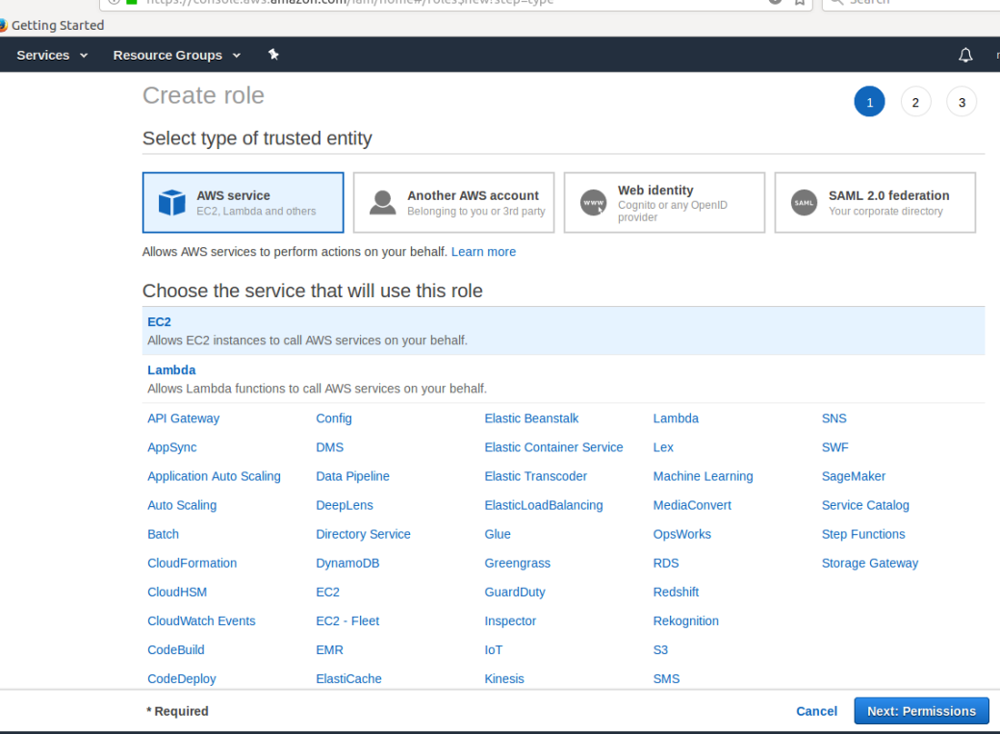

### AWS ECR - IAM Roles
When the NeuVector containers are deployed in AWS, and an EC2 instance is assigned a role of “EC2 Container Registry” Read Access, the AWS ECR registry can be scanned without an Access Key and Secret Key.

Here is how to create an AWS role and assign it to the node.

#### Select the Instance
Note that the IAM role is either blank or does not include the ECR role


#### Attach a Role
Select Actions -> Instance Settings -> Attach/Replace IAM Role


If you have not previously created the ECR role, click Create New IAM Role. Enter the role name.



#### Select the AWS Service


#### List of Roles


#### Attach the ECR Read Permission to the Role


#### Review Your Settings




#### Check the Instance for IAM Role

