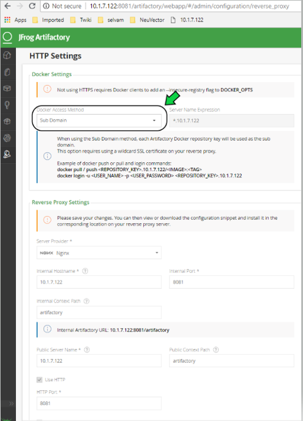
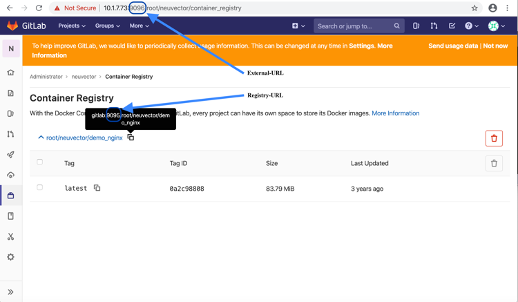

Registry scanning requires that the NeuVector Allinone or Controller container be deployed on a host/node. Please see the [Installation/Deployment](/basics/installation) section for how to deploy the NeuVector containers. Configure registry scanning from the NeuVector console after logging in to the manager.

In addition, make sure there is a NeuVector scanner container deployed and configured to connect to the Allinone or Controller. In 4.0 and later, the neuvector/scanner container must be deployed separate from the allinone or controller.

Note: Registry image scanning is performed by the scanner and the image is pulled and expanded in memory. If expanded image sizes larger than 500MB are expected, consider increasing the scanner memory to 1.5GB or more to provide capacity and headroom for the scanner.

To increase registry scanning performance and scalability, multiple scanner pods can be deployed on different nodes to distribute the scanning tasks across multiple scanners. See the section [Multiple Parallel Scanners](/scanning/scanners) for details.

For multi-cluster (federated) environments, the primary (master) cluster can scan a registry/repo designated as a federated registry. The scan results from these registries will be synchronized to all managed (remote) clusters. This enables display of scan results in the managed cluster console as well as use of the results in admission control rules of the managed cluster. Registries only need to be scanned once instead of by each cluster, reducing CPU/memory and network bandwidth usage. See the [multi-cluster](/navigation/multicluster/) section for more details.


### Configure Registry Scanning
To configure registries and repositories to be scanning, go to the Assets -> Registries menu in the NeuVector console. Add or edit registries to be scanned. Use the Filter to define repositories or subsets of images to be scanned. If your registry requires access through a proxy, this can be configured in Settings -> Configuration.


The registry will be scanned according to a schedule, which is configurable. By default, only new or updated images will be scanned. If you want to re-scan all applicable images whenever the CVE database is updated, select the Rescan After CVE DB Update button when configuring the registry. You can also select Layered Scan to show vulnerabilities by each layer in the image (note: layered scans can take longer and consume more resources to complete).

After the scan is completed you will see the results below it. Click on the repository/tag to see vulnerabilities and click on the vulnerability to see more info. You can also download the report in a CSV file or see the results in the Event logs.


The scan results include vulnerabilities by image layer, if this option was selected during registry/repository configuration, as well the compliance checks results. Click the compliance tab when viewing the scan results for the image to see compliance checks.

Scanning will also discover and list all Modules (ie, an inventory) in the image, as shown below. It will also summarize the vulnerability risk by module and list all vulnerabilities for each module.


Scanning is supported for images on public and private docker registries that are based on Native Docker, Amazon ECR, Redhat/Openshift, jFrog, Microsoft ACR, Sonatype Nexus, Harbor, Google cloud and other registries.  The scan report for the image comprises of the vulnerability status of various packages and binaries in the image. The brief summary of the scan report can be sent via webhook using the Response rule configuration in Policy -> Response Rules, or by Syslog by configuring a syslog server in Settings -> Configuration. Results can also be viewed in the Event logs.

At least one repository filter is required (can't be left blank).

#### Repository filter examples


Notes:
1. To scan all image tags, add filter as &#42; or &#42;:&#42;. This works on all registry types except the public docker registry.
2. Repository should be full name if organization is nil for public docker registry or add library before repository as given above.
3. Create a virtual repository and add all local repository to it to scan all tags on a JFrog registry with the subdomain docker access method.
4. Regular expressions can be used in a filter. For example alpine:3.[8|9].* will scan all 3.8.x and 3.9.x images and tags on docker hub.

#### Registry scan options
+ Scan Layers:
    - Provides vulnerability scan result for every image layer separately
    - Provides information about commands executed, packages added in the layer
    - Images size of each layer 
+ Auto Scan:
    - Auto Scan is only supported with OpenShift imagestream integration. Proper role binding should be configured in advance.
    - When Auto Scan is enabled, as soon as an image is pushed to the registry, the image scan will be scheduled.
+ Periodical Scan:
    - Enable periodic scan to scan periodically
    - Scan interval can set to be between 5 minutes to every 7 days.
    - Because many Admission Control checks rely on image scan result, enabling periodical scan helps make sure Admission Control has the up-to-date information of the images.
+ Rescan after CVE DB update
    - Enable this option to rescan all images after the vulnerability database is updated.

#### Configuring Proxy server for Registry 
Please go to Settings -> Configuration to configure proxy settings for registry scanning.


#### Native Docker registry (also Quay and Harbor)
##### Add Native Docker registry
+ Choose Docker registry as type
+ Give unique name to the registry
+ Type registry URL with port
+ Provide username and password if required by the registry
+ Add repository as filter in the below format
    - Organization/repository:tag
    - Repository can have wildcard with starting string
    - Example neuvector/all&#42;:2&#42;

Adding private docker registry with username/password, scan layers enabled, periodic scan for every 30 minutes enabled and * as filter to scan all tags from all repository. 


Adding public docker registry for scanning without username/password and 2 repositories with wildcard, scan layers enabled and periodic scan enabled.


Adding public docker registry for scanning with username/password, wildcard repository, scan layers enabled, and periodic scan enabled.


Note for Quay: 
+ Enter the top-level URL for your Quay registry; do not enter any directories to the path. 
+ You will need to generate an encrypted password in your Quay server/account, and use these credentials here.  Then, pass filter(s) as described above.


##### Start scanning the Docker registry
+ Select registry to be scanned
+ Click start button to scan
+ Wait till status changes from scanning to idle 
    - Scanning time varies depending on the size of the repository


##### View the scan result
+ Click on an image from images pane to view the scan result for the image.
+ Access the scan result to find the vulnerability status of the image.
+ Click download button to download scan result of the image if needed
+ Move mouse in between CVE detail and images to get back to summary

Showing images scanned for the selected registry


Example showing layer scan result of an image, which shows vulnerabilities of each layer, layer size and commands run on each layer. In addition, there is a Compliance tab which shows the compliance test results for the image.


#### Amazon ECR Registry
Ref:  https://docs.aws.amazon.com/AmazonECR/latest/userguide/Registries.html

##### Add Amazon ECR registry
+ Choose Amazon registry as type
+ Give unique name to the registry
+ Registry URL is automatically found with other information
+ Supply below information for the registry. Refer above amazon link to get below information
    - Registry id
    - Region
    - Access key id
    - Secret access key
+ Add repository as filter in the following format
    - Organization/repository:tag
    - Repository can have wildcard with starting string
    - Example neuvector/all&#42;:2&#42;
    - Organization can be empty if such image available in the registry
    - &#42; to scan all image tags


#### Redhat registry
Ref:  https://access.redhat.com/containers

##### Add Red Hat registry
+ Choose Redhat registry as type
+ Give unique name to the registry
+ Type registry URL https://registry.connect.redhat.com/
+ Provide username and password of the account used for managing registry 
+ Add repository as filter in the below format
    - Organization/repository:tag
    - Repository can have wildcard with starting string
    - Example neuvector/all&#42;:2&#42;
    - &#42; to scan all image tags

 

#### Openshift registry

##### Add OpenShift registry with username and password
+ Choose OpenShift registry as type
+ Give unique name to the registry
+ Type registry URL (obtain from the output of "oc get is" command in OpenShift network if it is different than default)
    - Default registry URL https://docker-registry.default.svc:5000/ 
+ Provide username and password of the account used for managing registry 
+ Add repository as filter in the below format
    - Organization/repository:tag
    - Example openshift/htt&#42;:&#42;
    - &#42; to scan all image tags
+ Enable auto scan to start the scan as soon as image is updated on OpenShift image stream.


##### Add OpenShift registry with token 

+ Choose OpenShift registry as type
+ Give unique name to the registry
+ Type registry URL (obtain from the output of "oc get is" command in OpenShift network if it is different than default)
    - Default registry URL https://docker-registry.default.svc:5000/  
+ Provide token of the service account which has access to all namespaces 
    - Check below note to create service account and get token.
    - Create service account
        - oc project default 
        - oc create sa nvqa
        - oc get sa
    - Assign cluster admin role to service account to read all registry
        - oc adm policy add-cluster-role-to-user cluster-admin system:serviceaccount:default:nvqa
    - Get token for the service account
        -   oc sa get-token nvqa
+ Add repository as filter in the below format
    - Organization/repository:tag
    - Example openshift/htt&#42;:&#42;
    - &#42; to scan all image tags
+ Enable auto scan to start the scan as soon image is updated on OpenShift image stream.


##### Stability issues in Openshift 3.7 Registry

In OpenShift 3.7, API calls to pull container image metadata or to download an image can fail randomly. It can also fail on random images in different scan runs. You may see incomplete image lists or scans may fail on some images when this happens. If this occurs, the repository can be rescanned.


#### JFrog Artifactory

Adding JFrog Artifactory registry (Docker Access method – Repository Path)
JFrog management page admin->HTTP Setting showing docker access method  - Repository Path


##### Add JFrog Artifactory registry (Docker Access method – Repository Path)
+ Choose JFrog Artifactory as type
+ Give a unique name to the registry
    - Type the registry URL with port, for example http://10.1.7.122:8081/
+ Provide a username and password if required by the registry
+ Add the repository as a filter in the below format
    - Organization/repository:tag
    - Repository or tag can have wildcards at end, such as abc/&#42;, abc/n&#42;
    - To scan all tags for a repository, for example alpine, use alpine:&#42;
    - The wildcard must be preceded by the full name, path, or starting string
    - &#42; to scan all tags

##### Adding JFrog Artifactory registry (Docker Access method – subdomain)
JFrog management page admin->HTTP Setting showing docker access method – Sub Domain



Add JFrog Artifactory registry (Docker Access method – subdomain)
+ Choose JFrog Artifactory as type
+ Give a unique name to the registry
+ Type the registry URL with port, for example http://10.1.7.122:8081/
+ Choose Subdomain as JFrog Docker Access Method
+ Provide a username and password if required by the registry
+ Add the repository as a filter in the below format
    - Subdomain/repository:tag
    - Repository or tag can have wildcards at end, such as abc/&#42;, abc/n&#42;
    - To scan all tags for a repository, for example alpine, use alpine:&#42;
    - The wildcard must be preceded by the full name, path, or starting string
    - &#42; for scanning all tags from all subdomains

Note: Create a virtual repository and add all local and remote repository to it. Specify this virtual repository in the filter section to scan all tags from local and remote remote repository.

Adding subdomain based JFrog registry to scan images from docker-local subdomain


Adding subdomain based JFrog registry to scan all tags from all subdomains


##### Add JFrog Artifactory registry (Docker Access method – port)

JFrog management page admin->HTTP Setting showing docker access method - Port 


JFrog management page admin->Local Repository->docker-local repository-> Advanced - showing repository URL and registry port 8181


JFrog management page admin->Local Repository->guo repository-> Advanced - showing repository URL and registry port 8182


+ Choose JFrog Artifactory as type
+ Give a unique name to the registry
+ Type the registry URL with port, for example http://10.1.7.122:8181/
    - Every Registry name has unique port 
+ Choose Port as JFrog Docker Access Method
+ Provide a username and password if required by the registry
+ Add the repository as a filter in the below format
    - Organization/repository:tag
    - Repository or tag can have wildcards at end, such as abc/*, abc/n*
    - To scan all tags for a repository, for example alpine, use alpine:*
    - The wildcard must be preceded by the full name, path, or starting string
    - &#42; for scanning all tags

Adding JFrog registry for port access method for registry docker-local with port 8181
 


Adding JFrog registry for port access method for registry with port 8182


Adding JFrog registry for port access method for the virtual registry with port 8188, which has all local registries added to it.


Showing scanned result for docker-local registry


##### Add SaaS JFrog Artifactory registry (Docker access method – Port)
Choose JFrog Artifactory as type 
+ Give a unique name to the registry 
+ Type the registry URL, for example https://jfrogtraining-docker-nv-virtual.jfrog.io
+ Choose Port as JFrog Docker Access Method 
+ Provide a username and password if required by the registry 
+ Add the repository as a filter in the below format 
    - Organization/repository:tag 
    - &#42; to scan all tags of all repository


##### Start Scanning a JFrog Artifactory Registry
+ Select registry to be scanned
+ Click start button to scan
+ Wait until status changes from scanning to idle
    - Scanning time varies depending on the size of the repository


#### Google Container Registry
Ref: 
https://cloud.google.com/container-registry/docs/advanced-authentication
https://cloud.google.com/container-registry/docs/advanced-authentication#json_key_file

##### Enable Cloud Resource Manager API for the project
Google Cloud Platform->Choose Project->API and Services->Enable APIS and Services->Search “Cloud Resource Manager API”->Enable API
https://console.cloud.google.com/apis/library?project=nvtest-219600&q=Cloud%20Resource%20Manager%20API   (change project name)


##### Create key for container service account
Google Cloud Platform-->IAM-->Service Account-->account with container registry-->CreateKey(action)-->


##### Copy json file to client machine

##### Add Google Container Registry from the NeuVector GUI
+ Choose Google registry as type
+ Give unique name to the registry
+ Type registry URL. Sample https://gcr.io/ (this could also be us.gcr.io, eu.gcr.io etc)
+ Paste all content above captured json file into JSON key.
+ Add repository as filter in the below format
    - Project-id/repository:tag
    - Example nvtestid-1/neuvector&#42;:&#42;
    - &#42; to scan all image tags


##### Start Scanning a Google Container Registry
+ Select registry to be scanned
+ Click start button to scan
+ Wait until status changes from scanning to idle
    - Scanning time varies depending on the size of the repository

#### Azure Container Registry
Ref: 
https://azure.microsoft.com/en-us/services/container-registry/

##### Obtain Azure container username and password as shown below
Azure container registry -> user-> access keys->password

Showing azure portal username and password for container registry access


##### Add Azure Container Registry from the NeuVector GUI
+ Choose Azure registry as type
+ Give unique name to the registry
+ Type registry URL. Sample https://neuvector.azure.io (obtain from azure portal)
    - Container registry->user->Overview->Login Server 
+ Add username and password
    - Azure container registry -> user-> access keys->password
+ Add repository as filter in the below format
    - repository:tag
    - example alpine:&#42;
    - &#42; to scan all image tags

Showing azure portal login server for Azure container registry 


Adding Azure container registry to scan all tags


##### Start Scanning a Azure Container Registry
+ Select registry to be scanned
+ Click start button to scan
+ Wait until status changes from scanning to idle
    - Scanning time varies depending on the size of the repository

#### Sonatype Nexus Docker registry
Ref:
https://help.sonatype.com/repomanager3/private-registry-for-docker
https://hub.docker.com/r/sonatype/nexus3/

##### Add Sonatype Nexus Docker registry
+ Choose Sonatype Nexus as type
+ Give unique name to the registry
+ Type registry URL with port
+ Provide username and password if required by the registry
+ Add repository as filter in the below format
    - Organization/repository:tag
    - Repository can have wildcard with starting string
    - Example neuvector/all&#42;:2&#42;
    - &#42; to scan all image tags

Adding Sonatype Nexus docker registry with username/password and repository &#42;:&#42;  for scanning 


##### Start scanning Sonatype Nexus Docker registry
+ Select registry to be scanned
+ Click start button to scan
+ Wait till status changes from scanning to idle 
    - Scanning time varies depending on the size of the repository


#### Gitlab Container Registry

##### Sample GitLab Environmnent Configurations
```
sudo docker run --detach \
  --hostname gitlab \
  --env GITLAB_OMNIBUS_CONFIG="external_url 'http://10.1.7.73:9096'; gitlab_rails['lfs_enabled'] = true;" \
  --publish 10.1.7.73:9095:9095 --publish 10.1.7.73:9096:9096 --publish 10.1.7.73:6222:22 \
  --name gitlab \
  --restart always \
  --volume /srv/gitlab/config:/etc/gitlab \
  --volume /srv/gitlab/logs:/var/log/gitlab \
  --volume /srv/gitlab/data:/var/opt/gitlab \
gitlab/gitlab-ce:latest
External_URL:  http://10.1.7.73:9096
Registry_URL: https://10.1.7.73:9095
```


##### Obtain Gitlab private token as shown below

+ Navigate to the settings page from the icon located at the upper-righthand corner of the GitLab login page as illustrated below:


+ Navigate to the Access_Tokens page as shown below from the User_Settings page: 


+ Fill in all applicable fields, and click “Create personal access token” when ready to generate the access token:


+ Access token will no longer be available once the user has navigated away from the generated token page.  Therefore, it is highly recommended to make a copy of the access token prior to navigating or closing the following page:


##### Obtaining External and Registry URLs
External-URL:   The external url is the API-Server's URL.  
Registry-URL:  This can be obtained from the Container Registry page of the GitLab webconsole.  One way to get to this page is navigating from the GitLab’s webconsole from Projects > Your Projects > Administrator / … > Left-Pane (Container Registry) > Mouse-over (root/.../)
 
The following is a sample screen-capture of the page that reveals both the External-URL and the Registry-URL:



##### Add Gitlab Registry from the NeuVector Console
+ Choose Gitlab as the registry type
+ Give unique name to the registry
+ Type registry URL with port
+ Provide username and password if required by the registry
+ Provide Gitlab external URL and the private token obtained from the last section


Note:  The Registry URL is used for pulling images into the NeuVector scanner-platform from GitLab to do registry scanning.  While the External URL is used for retrieving a list of images, registries, and metadata used by the registry scanning feature.

#### IBM Cloud Container Registry 
Ref:  https://www.ibm.com/cloud/container-registry

##### Add IBM Container registry
+ Choose IBM Cloud Container Registry as type
+ Give unique name to the registry
+ Type registry URL https://us.icr.io/
+ Provide iamapikey as username and the apikey below as password 
    - Create apikey from CLI
        - ibmcloud iam api-key-create atibmKey
    - Create apikey from GUI
        - IBM Cloud->Manage-Access(IAM)-IBM Cloud API Keys
+ Provide IBM Cloud Account 
    - Obtain IBM cloud account from CLI
        - Ibmcloud cr info
+ Add repository as filter in the below format
    - Organization/repository:tag
    - Repository can have wildcard with starting string
    - Example neuvector/all*:2*
    - * to scan all image tags
+ Enable other parameters if needed


Note: The username for the registry authentication must be 'iamapikey'

#### Harbor Registry
Use the same instructions as for the Native Docker registry, choosing Docker as the registry.

The filter field can not be left blank. Enter a repository filter, or add filter as &#42; to scan all repositories.

