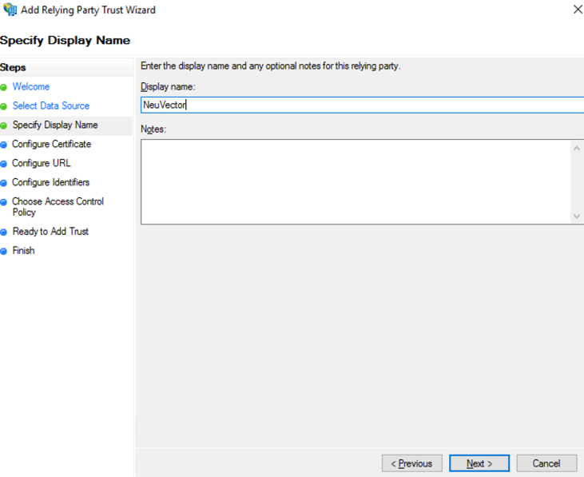
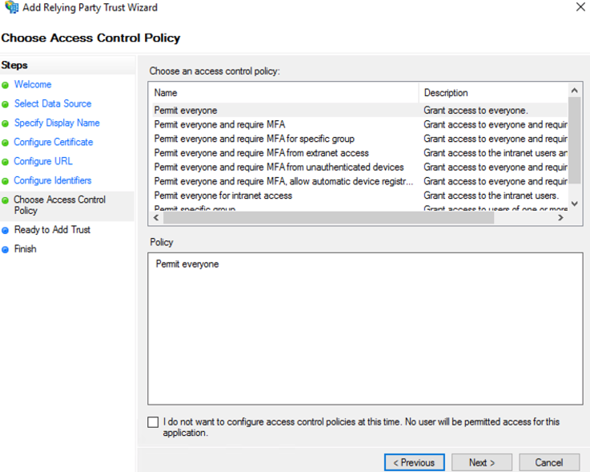
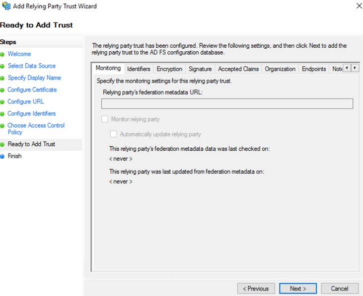

### Setting Up ADFS and NeuVector Integration
This section describes the setup steps in ADFS first, then in the NeuVector console.

#### ADFS Setup

1.From AD FS Management, right click on “Relying Party Trusts” and select “Add Relying Party Trust…”.


2.Select “Start” button from Welcome step.


 
3.Select “Enter data about the relying party manually” and select “Next”.


4.Enter a unique name for Display name field and select “Next”.



5.Select “Next” to skip token encryption.


6.Check “Enable support for the SAML 2.0 WebSSO protocol” and enter  the SAML Redirect URI from NeuVector Settings>SAML Setting page into the “Relying party SAML 2.0 SSO service URL” field.  Select “Next” to continue.


7.Enter the same SAML Redirect URI into the “Relying party trust identifier” field and click “Add”; then select “Next” to continue.


8.Customize Access Control; then select “Next” to continue.



9.Select “Next” to continue.



10.Select “Close” to finish.

11.Select Edit Claim Issuance Policy…


12.Select “Add Rule…” and choose “Send LDAP Attributes as Claims”; then select “Next”.  Name the rule and choose Active Directory as the Attribute store. Only Username outgoing claim is required for authentication if default role is set; else groups is needed for role mapping.  Email is optional.
+ SAM-Account-Name -> Username
+ E-Mail-Address -> Email
+ Token-Groups – Unqalified Names -> groups


13.Select “Add Rule…” and choose “Transform an Incoming Claim”; then select “Next”.  Name the rule and set the field as captured in the screenshot below.  The Outgoing name ID format needs to be Transient Identifier.


14.ADFS SamlResponseSignature needs to be either MessageOnly or MessageAndAssertion.  Use Get-AdfsRelyingPartyTrust command to verify or update it, for example:

```
Set-AdfsRelyingPartyTrust -TargetName NeuVector -SamlResponseSignature MessageAndAssertion
```


15.(Optional) To enable SAML Single Logout (SLO), in the properties of NeuVector in Relying Party Trusts, select endpoints tab.  Then add a new SAML SLO endpoint and fill the same SAML Redirect URI but with `samlslo` suffix.


After that, generate a signing key pair using below command.

```
openssl req -x509 -sha256 -nodes -days 365 -newkey rsa:2048 -keyout tls.key -out tls.crt
```

Then, click signature tab and add the certificate you just generated.


The certificate and key will be used later in the following steps.


#### NeuVector Setup

1.Identify Provider Single Sign-On URL
+ View Endpoints from AD FS Management > Service and use “SAML 2.0/WS-Federation” endpoint URL.
+ Example: https://&lt;adfs-fqdn>/adfs/ls

Note: Make sure you use exactly the same protocol, e.g., https.  Otherwise SAML authentication will fail.

2.Identity Provider Issuer
+ Right click on AD FS from AD FS Management console and select “Edit Federation Service Properties…”; use the “Federation Service identifier”.
+ Example: http://&lt;adfs-fqdn>/adfs/services/trust

Note: Make sure you use exactly the same protocol, e.g., http.  Otherwise SAML authentication will fail.

3.X.509 Certificate
+ From AD FS Management, select Service > Certificate, right click on Token-signing certificate and choose “View Certificate…”
+ Select the Details tab and click “Copy to File”
+ Save it as a Base-64 encoded x.509 (.CER) file
+ Copy and paste the contents of the file into the X.509 Certificate field

4.(Optional) To enable SAML Single Logout (SLO), first generate a signing key pair following the steps in ADFS setup section. Then, enable `SAML Single Logout` on NeuVector console and fill below fields
- Identity Provider Single Logout URL
  - The same endpoint of Provider Single Sign-On URL, e.g., `https://<adfs-fqdn>/adfs/ls`
- Single Logout Signing Certificate
  - The tls.crt you just generated
- Single Logout Signing Key
  - The tls.key you just generated

Note: The signing key will not be retrivable via console anymore.  Make sure you keep a backup if you want to access it later.


5.Group claim
+ Enter the Outgoing claim name for the groups
+ Example: groups

6.Default role
+ Recommended to be “None” unless you want to allow any authenticated user a default role.

7.Role map
+ Set the group names of the users for the appropriate role.  (See screenshot example below.)


#### Mapping Groups to Roles and Namespaces
Please see the [Users and Roles](/configuration/users#mapping-groups-to-roles-and-namespaces) section for how to map groups to preset and custom roles as well as namespaces in NeuVector.


### Troubleshooting

Sometimes, a misconfigured SAML integration won't provide useful information for troubleshooting on NeuVector console.  This is designed as such so we provide less information to an unauthorized user.


However, when unexpected authentication error happens, you can still check NeuVector container's logs to see what happened. 

For example, on Kubernetes, you can use `kubectl logs`

```
# kubectl logs -l app=neuvector-controller-pod
...
2023-11-29T05:18:14.497|ERRO|CTL|rest.handlerAuthLoginServer: User login failed - error=error validating response: missing Assertion element server=saml1
```

Here we list some common configuration errors and their error messages:

#### Missing Assertion element

```
2023-11-29T05:18:14.497|ERRO|CTL|rest.handlerAuthLoginServer: User login failed - error=error validating response: missing Assertion element server=saml1
```

This happens when SAML SSO response that IdP generates doesn't include assertion section in their SAML response.  This implies IdP rejects the login request.  When this happens, make sure that the content of SSO URL and Issuer fields are consistent with what IdP provides.  (The protocol, e.g., http and https should match too.)

#### No signature

```
2023-11-03T19:18:45.811|ERRO|CTL|rest.handlerAuthLoginServer: User login failed - error=no signature server=saml1
```

This happens when SAML SSO/SLO response doesn't come with a signature field in message body.  On some version of ADFS, signature is only included in assertion section by default, which NeuVector doesn't expect.  You can make SAML response include signature in message as well by running this command.

```
Set-AdfsRelyingPartyTrust -TargetName NeuVector -SamlResponseSignature MessageAndAssertion
```