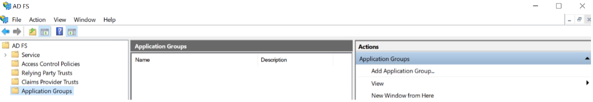

### Integrating with OpenID Connect (OIDC) for ADFS

From AD FS Management, click on "Application Groups" and then click on "Add Application Group..."

Enter a name, select "Server application accessing a web API" and then click Next

Enter Redirect URI from NeuVector Settings > OpenID Connect Setting page and then click Next

Enable "Generate a shared secret" checkbox and then click Next

Enter the Identifier created in previous step and then click Next

Enable allatclaims, email, openid and profile scopes and then click Next

Double click on an application group you just created previously

Double click on Web API and then click Issuance Transform Rules tab

Click Add Rule... and select "Send LDAP Attributes as Claims" and then click Next

Enter a Claim rule name, choose Active Directory as the Attribute store and provide the mapping of LDAP attributes to outgoing claim types as below
+ Token-Groups – Unqualified Names -> groups
+ User-Principal-Name -> preferred_username
+ E-Mail-Address -> email

#### NeuVector Setup

+ Identity Provider Issuer: https://&lt;adfs-fqdn&gt;/adfs
+ Client ID: It is a "Client Identifier" showing in "Server application" dialog in "Add Application Group Wizard"
+ Client Secret: It is a Secret showing in "Configure Application Credentials" dialog in "Add Application Group Wizard"
+ Group Claim: groups

