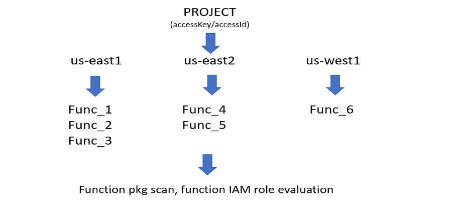
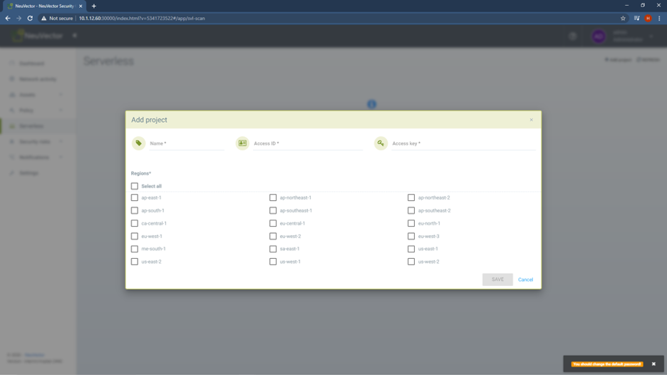
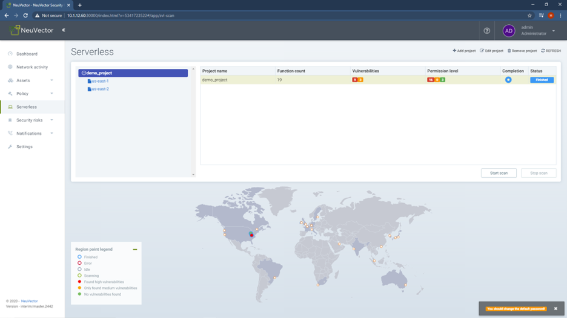
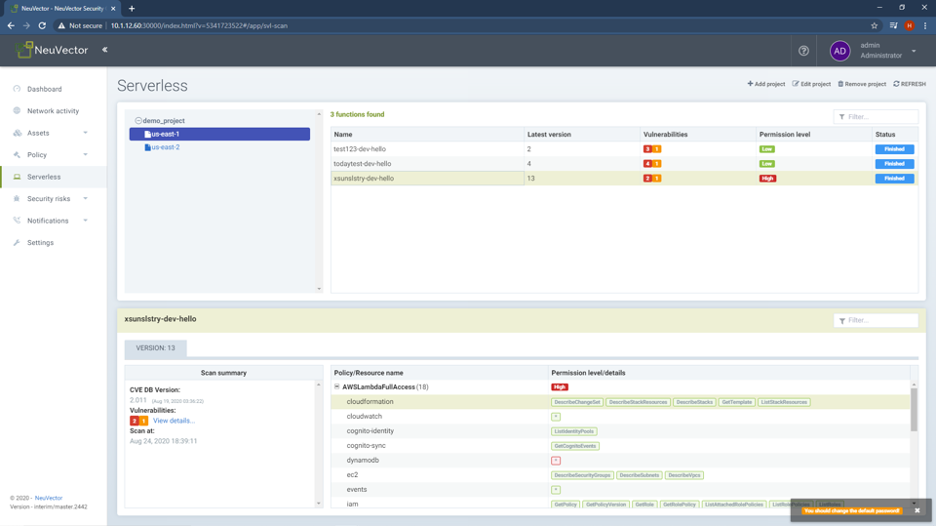
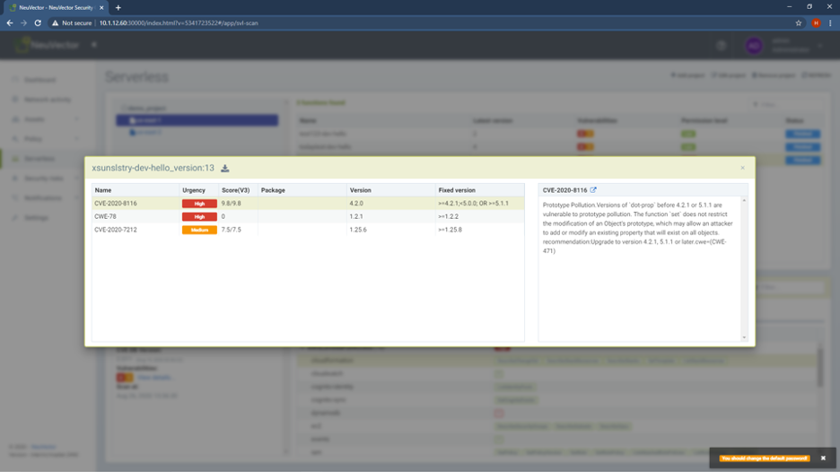
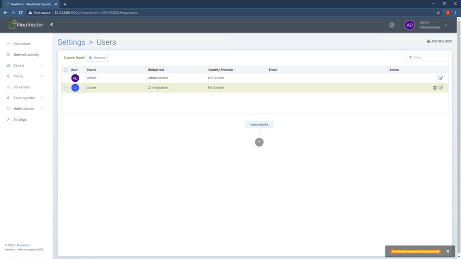
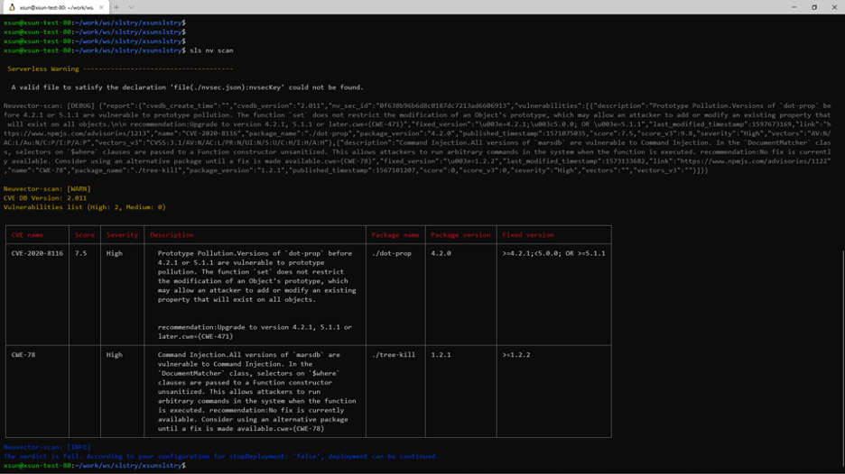
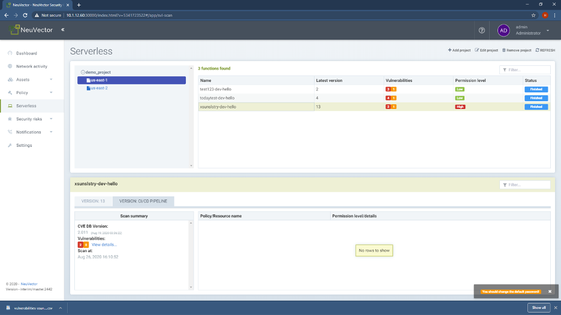

### Important! This function will be deprecated starting with the 5.0 (mid-2022) release.
Serverless scanning features will be deprecated and removed in the 5.0 release. Please contact your NeuVector representative if you have any questions about this feature and its future.

### Securing AWS Lambda

NeuVector support serverless security for AWS Lambda functions. Using the open source Serverless IDE, DevOps teams can trigger vulnerability scanning of AWS Lambda serverless functions, and remove vulnerabilities before running those functions. NeuVector includes support for functions in Java, Node.js, Python, and Ruby. NeuVector’s risk assessments automatically analyze the AWS permissions granted for each function, and indicates their risk level. DevOps can review if permissions are appropriate, or if they increase the risks of vulnerability exploits. The NeuVector platform can also scan functions and containers for embedded secrets to detect policy violations.

Serverless scanning and security is integrated into the NeuVector container security platform and console. In the console you will see a Serverless menu for managing serverless security. Currently NeuVector only supports using the [Serverless IDE](https://www.serverless.com/) framework and plug-in for scanning and AWS Lambda for public cloud serverless security integration.

Note: Serverless security requires a separate license from NeuVector. Please contact support@neuvector.com if your license does not enable serverless security.

Scanning is performed the same way it is performed for container images, managed by the NeuVector Controller and performed by one or more scanner pods. Please refer to the Deploying NeuVector and Security Risks section of these docs to deploy the Controller and scanner pods.

Note: Scanning using the Serverless IDE framework on other public cloud services (Azure, Google etc) will return scan results into the framework, but results will not be visible in the NeuVector console. Only scans linked to an AWS Lambda project can be shown in the console at this time.

#### Scanning Existing Lambda Functions

Pre-requisite:  Security_credentials (AccessKeyId/AccessKey) of an IAM user with minimal permission as arn:aws:iam::aws:policy/AWSLambdaReadOnlyAccess. 

The organization of serverless scan in NeuVector is based on a 'project.' A project is defined by a name and accessKeyId/accessKey pair. It includes a specific region for the user selected. The NeuVector security features include a function package scan and a function IAM role evaluation (risk assessment).


 
Notes: 
1. By using the accessKey/accessKeyId, NeuVector will access the source code of the lambda functions and scan for packages. No user source code is stored in the NeuVector system.
2. There may be AWS service charges associated with the NeuVector downloads required for function scans. These may include:
   a. Access to an S3 storage bucket, but if your NeuVector Controller is located in the same EC2 zone then it may be free.
   b. Outbound data transfer fees may apply if your NeuVector Controller is deployed outside of AWS.  
3. NeuVector only pulls the latest version of the lambda function from AWS. During the lifespan of a project, up to 3 versions of lambda function scan results will be saved.
4. NeuVector can only scan function source code, not compiled functions.


##### Project Creation and Scanning

Create project:  From the NeuVector console choose Serverless and choose Add Project. Select the region you wish to include for your project. You can add/remove regions after the project is created. 


 
After saving, NeuVector will access your AWS account and start the scan process. This may take a while depending on how many and how large your lambda functions are in all regions you have chosen.  When the scan is done, you will see the summary of the whole project along with details for each lambda functions.

The result consists two parts, CVE scan results of each function, and analysis of the resource permissions given to the lambda function. 

Note:  The project name must start with letters or digits; the only special characters allowed in name are  . : - _
       The regex used to verify a name is as follows:
 (^[a-zA-Z0-9]$)|(^[a-zA-Z0-9]+[ .:a-zA-Z0-9_-]*[.:a-zA-Z0-9_-]+$)

<strong>Project Summary View</strong>




<strong>Function Detail View</strong>



 
The Function details has two parts:
 
The permission level/details describe all the policy/permissions included in the function IAM role, and the details of that policy, including which resource and permission is included. NeuVector evaluates the resource permissions to determine if it requires review or attention. These are indicated as level high. For example, full access of dyanmoDb has AWSLambdaFullAccess policy for a function.

The Scan summary contains the package scan results, and clicking the View details will enable you to review the details of package scan summary. You can also download the report.



 
You can stop the scanning at any point during the project scanning, or rescan after project scan finished.

<strong>Modify A Project</strong>

You can modify project to update the AccessKeyId/AccessKey pair, add or remove regions you wish to include in project. But you will not able to change project name. Rename can only be done by delete/readd with different name of a project.


#### CI/CD Pipeline Scanning for AWS Lambda Function Development

To scan proactively during the function development phase, NeuVector integrates with the Serverless development environment. 

NeuVector currently supports the serverless framework (www.serverless.com). It is an open source project which has a flexible plugin system which enables NeuVector to integrate the security scanning function into the CI/CD pipeline.
For detailed usage and a handbook for the serverless framework, please refer to https://www.serverless.com/framework/docs/getting-started/

The plug-in for NeuVector is called the [serverless-neuvector](https://www.npmjs.com/package/serverless-neuvector) plugin. Install it into your serverless framework project.

After you create you function project, each project will have a serverless.yml file which describes the function details. 

First install the serverless-neuvector plugin into your project. 

```
npm  i serverless-neuvector
```  

After installing the plugin, modify the serverless.yml file to integrate the NeuVector security scanner into the project. 

<strong>1</strong>  In the plugin section enable the serverless-neuvector plugin and add following
```
     plugins:
          - serverless-neuvector
```

<strong>2</strong>  The serverless framework needs to communicate with NeuVector for security checks. Configure the parameters to achieve that. Add following into the serverless.yml custom section. 

```
   custom:
     neuvector:
       stopDeployment: false
       ipAddress: "10.1.12.60"
       port: 30001
       username: "ci_admin"
       password: "admin"
       projectname: "demo_project"
       path: "."
       tolerance:   
         high: 5
         medium: 30
```

a. stopDeployment: this parameter defines whether NeuVector should stop the function deployment if the scan finds vulnerabilities which meet the stop criteria defined in the tolerance section. Selecting “true” will stop the deployment if the criteria is met.

b. ipAddress/port : this is the address/port of NeuVector Controller or its exposed REST API service. Make a note of the IP address of the host where the Allinone or Controller is running. Note: The default REST API port is 10443. This port must be exposed through the Allinone or Controller through a service in Kubernetes or a port map (e.g. - 10443:10443) in the Docker run or compose file.

c. username/password : this is username/password you created in NeuVector in order to authenticate to run the serverless scan. Note that a special 'ci_user' can be created in NeuVector with the global role 'ciops' (CI Integration) which only allows the user to trigger scans but not any other admin activity in NeuVector.




d. projectname : if you have configured an AWS project in the NeuVector console, enter the projectname so neuvector can store the scan results in the proper location. 
     Note: the project status only shows in NeuVector after you connect with AWS. This enables the correlation of the serverless scan results with the AWS stored lambda functions. You can create the project with projectname in NeuVector as shown in the first part of this section.

e. path: config which subfolder you want to include for package scanning. You can include all folders in the root by user “.” 

f. tolerance:  this defines the criteria that should stop deployment of the function. It includes the count (number) of high/medium cve, that if exceeded (function: greater than) will stop the deployment if the stopDeployment is set too true.
       

<strong>3</strong>  The serverless framework scan result can return for user’s deployment decision. It can also be saved and displayed in the NeuVector console to correlate with the appropriate AWS lambda function after user deploys it. This has two benefits:

a. You can deploy a compiled version of the lambda function into AWS to save S3 storage space. NeuVector is not able to retrieve package information from compiled functions, but by linking it to a scan from the serverless framework NeuVector can retrieve the stored serverless framework scan results and display them for the compiled function.

b. This provides for potentially tracing the AWS lambda function to the developer who deployed the function because it create a link between the development scan result with deployed function. This can used as a user audit tool.

In order to link the serverless IDE environment with AWS lambda project, add an environment variable named nvsecKey to the serverless.yml file.

```
functions:
  hello:    
    handler: handler.yourApp_handler    
    environment:       nvsecKey: ${file(./nvsec.json):nvsecKey}
```

This nvsecKey will be uploaded to AWS to help correlate the serverless framework scan resulst to the appropriate NeuVector project.

To use the serveless-neuvector plugin:

```
# sls nv scan  // this will only invoke the plugin for scanning without other operations.
# sls deploy  // this will initiate function deployment and in the middle invoke plugin for the scan then decide if it should interrupt deployment based on the scan results (tolerance and stopDeployment defined in serverless.yml).
```

This will return the scan results as below



 
If the project demo_project was already created in NeuVector as a project, then this scan report will also show in UI


 


