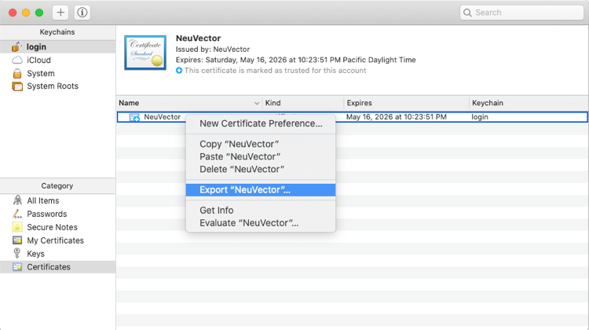

### Enabling Chrome Browsers to Accept the NeuVector Self-Signed Certificate on MacOS

Under certain circumstances the Chrome browser will flat out refuse to accept a NeuVector self-signed certificate.  A possible reason could be that the certificate has not yet been imported into macOS login certificates store.  Another possibility is that an existing certificate has not yet been configured to be trusted.  This will disallow the user from accepting it and proceeding to the NeuVector login page with the use of Chrome as illustrated with the example shown below:

Corrective steps can be taken to enable Chrome on accepting the self-signed certificate placed on macOS Keychain store.  This can be done by configuring the NeuVector’s certificate to be trusted using the Mac’s Keychain Access application.  This is with the assumption that the certificate does indeed exists in the macOS Keychain Access store.  We will first look at how to export a certificate from an existing NeuVector node from one system, and later can be imported into another system.   There are 2 ways to go about exporting the certificate which we will go over below.  They are, using the Chrome browser, and using the macOS Keychain Access application.

####Certificate export using Chrome
The screen capture below illustrates how to access the NeuVector certificate using Chrome.
 

To export the certificate, drag and drop the certificate to a location of choice. 

####Certificate export using macOS Keychain-Access
Launch the macOS Keychain Access application by simultaneously entering the keys ⌘ + F using a Mac keyboard, search for Keychain Access, and double click on the  application. 
This launches the Keychain Access application.  Select the NeuVector certificate and choose Export “NeuVector” from the dropdown menu.  This will allow the export of the certificate to a location of choice.
 

####Launching the macOS Keychain-Access Application
  There are two ways to launch the macOS Keychain Access Application.  This can be done by searching from the macOS, which has been described from the steps immediately above, or using the Chrome browser. 

####Launching Keychain-Access from the Chrome Browser
Settings > Advanced > Manage certificates 
 

Clicking on the Manage certificates as shown from above launches the Mac’s Keychain Access 
application as shown below.
         

####Certificate import into the macOS Keychain-Access Store
Launch the macOS Keychain Access application by simultaneously entering the keys ⌘ + F using a Mac keyboard, search for Keychain Access, and click on the application.  Then import the certificate by drag and dropping a NeuVector certificate (example:  nvcertificate.cer) into the Certificate right pane of the Keychain Access application.  Now that the certificate has been imported, it is not yet trusted.
The following is an example showing  the default trust settings after a NeuVector’s certificate has been imported  into the Keychain Access application.

Notice that none of the parameters have been configured, and it is not trusted by default.  It needs to be configured to be trusted to allow the user to access the login page using the Chrome browser. 

####Enabling trust for the NeuVector Certificate
The following steps details on how to enable trust for the NeuVector certificate in the Keychain Access store.
 

Double clicking on the NeuVector certificate from the screen capture above will bring up another popup dialog box that allows the trust permissions to be configured for different parameters.  Configure Secure Sockets Layer (SSL) to “Always Trust”.
 

Close the dialog box and click on ‘Update Settings” after entering the Mac logon user’s password from the following popup dialog box.  
 

This finalizes the trust configurations.  Next, clear all Chrome browser’s cache, close all Chrome browsers, and relaunch the Chrome browser.  Next visit the NeuVector login page, and upon clicking on the “Advanced” link, the Proceed to … (unsafe) link will be shown.  Clicking on the Proceed to … (unsafe) will allow the user to proceed to the username and password login page.
 

Below shows a screen capture that allows the user to proceed to the NeuVector login page after Proceed to … (Unsafe) link is clicked.
 

