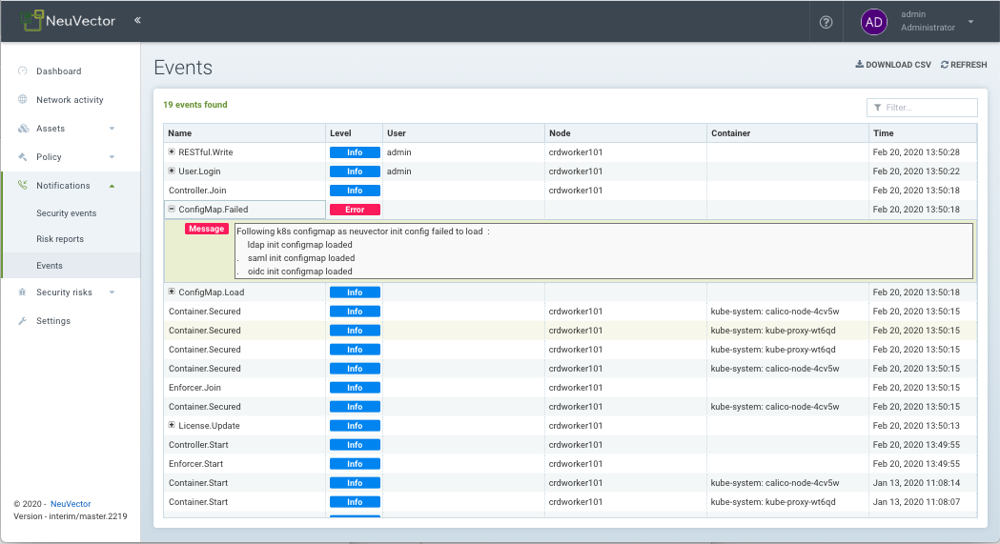

### Kubernetes ConfigMap

NeuVector supports automated deployment using the Kubernetes ConfigMap feature. This enables deployment of NeuVector containers with the appropriate configurations, integrations, license file, and other settings in an automated way.

Download all sample yaml files: [ConfigSamples](initcfg.zip)

#### Complete Sample NeuVector ConfigMap (initcfg.yaml)
This contains all the settings available. Please remove the sections not needed and edit the sections needed.

```
apiVersion: v1
data:
  eulainitcfg.yaml: |
    license_key : 0Bca63Iy2FiXGqjk...
  ldapinitcfg.yaml: |
    # Mandatory. OpenLDAP or MicrosoftAD
    directory: OpenLDAP
    # Mandatory.
    Hostname: 1.2.3.4
    # Optional. the default value is 389
    Port: 389
    # Optional true or false or empty string(false)
    SSL: false
    # Mandatory.
    base_dn: cn=admin,dc=example,dc=org
    # Optional.
    bind_dn: dc=example,dc=org
    # Optional.
    bind_password: password
    # Optional. empty string(memberUid for openldap or member for windows ad)
    group_member_attr: 
    # Optional. empty string(cn for openldap or sAMAccountName for windows ad)
    username_attr: 
    # Optional. true or false or empty string(false)
    Enable: false
    # Optional. admin or reader or empty string(none)
    Default_Role: admin
    # Optional. admin group or reader group or empty string
    Role_Groups:
      admin:
        - admin1
        - admin2
      reader:
        - reader1
        - reader2
  oidcinitcfg.yaml: |
    # Mandatory
    Issuer: https://...
    # Mandatory
    Client_ID: f53c56ec...
    # Mandatory
    Client_Secret: AyAixE3...
    # Optional. empty string(openid,profile,email)
    Scopes:
      - openid
      - profile
      - email
    # Optional. true or false or empty string(false)
    Enable: false
    # Optional. admin or reader or empty string(none)
    Default_Role: admin
    # Optional. admin group or reader group name or empty string
    Role_Groups:
      admin:
        - admin1
        - admin2
      reader:
        - reader1
        - reader2
  samlinitcfg.yaml: |
    # Mandatory
    SSO_URL: https://...
    # Mandatory
    Issuer: https://...
    # Mandatory
    X509_Cert: |
      -----BEGIN CERTIFICATE-----
      MIIC8DCCAdigAwIBAgIQSMNDFv5HI7RPgF0uHW8YJDANBgkqhkiG9w0BAQsFADA0MTIwMAYDVQQD
	  ...
      -----END CERTIFICATE-----
    # Optional. true or false or empty string(false)
    Enable: false
    # Optional. admin or reader or empty string(none)
    Default_Role: admin
    # Optional. admin group or reader group or empty string
    Role_Groups:
      admin:
        - admin1
        - admin2
      reader:
        - reader1
        - reader2
  sysinitcfg.yaml: |
    # Optional. Choose between  Discover or Monitor or Protect or empty string(Discover)
    New_Service_Policy_Mode: Discover
    # Optional. input valid ipv4 address or empty string
    Syslog_ip: 1.2.3.4
    # Optional. input 17 or 6 here for upd or tcp or empty string(17)
    Syslog_IP_Proto: 17
    # Optional. empty string(514)
    Syslog_Port: 514
    # Optional. chose between  Alert/Critical/Error/Warning/Notice/Info/Debug or empty string(Info)
    Syslog_Level: Info
    # Optional. true or false or empty string(false)
    Syslog_status: false
    Syslog_Categories:
    # Optional. can chose multiple between event/security-event/audit or empty string
      - event
      - security-event
      - audit
    Syslog_in_json: 
    # Optional. true, false, empty, unconfigured.
    #  true = In Json: checkbox enabled from Settings > Configuration > Syslog
    #  false, empty, unconfigured = In Json: checkbox disabled from Settings > Configuration > Syslog
    #
    # Optional. true or false or empty string(false)
    Auth_By_Platform: false
    # Optional. Input valid URL  ex: http://webhook.neuvector.com or empty string
    Webhook_Url: http...
    # Optional. empty string
    Cluster_Name: cluster.local
    # Optional. chose multiple between  cpath/mutex/conn/scan/cluster or empty string
    Controller_Debug:
      - cpath
    # Optional. true or false or empty string(true)
    Monitor_Service_Mesh: true
    # Optional. true or false or empty string(false)
    Registry_Http_Proxy_Status: false
    # Optional.  true or false or empty string(false)
    Registry_Https_Proxy_Status: false
    # Optional. http/https registry proxy or empty string
    Registry_Http_Proxy:
      URL: http...
      Username: username
      Password: password
    Registry_Https_Proxy:
      URL: https...
      Username: username
      Password: password
  userinitcfg.yaml: |
    users:
    # add multiple users below
    -
    # this user will be added
    # Optional.
      EMail: user1@email.com
    # Mandatory. username can have ^[a-zA-Z0-9]+[.:a-zA-Z0-9_-]*$
      Fullname: user1
    # Optional. en or zh_cn or empty string(en)
      Locale: en
    # Optional. password length minimal 6, don't lead with ]`}*|<>!%
      Password: password
    # Optional. admin or reader or empty string(none)
      Role: reader
    # Optional. admin group or reader group or empty string
      Role_Domains:
        admin:
          - admin1
          - admin2
        reader:
          - reader1
          - reader2
    # Optional. value between 30 -- 3600  default 300
      Timeout: 300
    -
    # this user will overwrite the original admin user
      Fullname: admin
      Password: password
      Role: admin
kind: ConfigMap
metadata:
  name: neuvector-init
  namespace: neuvector
```

Then create the ConfigMap object:
```
kubectl create -f initcfg.yaml
```

#### Alternate ConfigMap method 
Download and unzip the file above or use the sample yamls below as needed.
```
mkdir initcfg
cd initcfg
```
Copy ONLY the files needed into the initcfg folder (or create from the yamls below).
Modify the content of the file for your configurations.

Then create the ConfigMap object:
```
kubectl create configmap neuvector-init --from-file=. -n neuvector
```

Sample ldapinitcfg.yaml
```
# Mandatory. OpenLDAP or MicrosoftAD
directory: OpenLDAP
# Mandatory.
Hostname: 1.2.3.4
# Optional. the default value is 389
Port: 389
# Optional true or false or empty string(false)
SSL: false
# Mandatory.
base_dn: dc=example,dc=org
# Optional.
bind_dn: cn=admin,dc=example,dc=org
# Optional.
bind_password:
# Optional. empty string(memberUid for openldap or member for windows ad)
group_member_attr:
# Optional. empty string(cn for openldap or sAMAccountName for windows ad)
username_attr:
# Optional. true or false or empty string(false)
Enable: true
# Optional. admin or reader or empty string(none)
Default_Role:
# Optional. admin group or reader group or empty string
Role_Groups:
  admin:
  - admin1
#  - admin2
  reader:
  - reader1
#  - reader2
```

Sample eulainitcfg.yaml (replace key with yours)
```
# license_key: 0Bca63Iy2FiXGqjk...
```

Sample sysinitcfg.yaml
```
# Optional. Choose between  Discover or Monitor or Protect or empty string(Discover)
New_Service_Policy_Mode: Discover
# Optional. input valid ipv4 address or empty string
Syslog_ip:
# Optional. input 17 or 6 here for upd or tcp or empty string(17)
Syslog_IP_Proto: 17
# Optional. empty string(514)
Syslog_Port: 514
# Optional. chose between  Alert/Critical/Error/Warning/Notice/Info/Debug or empty string(Info)
Syslog_Level: Info
# Optional. true or false or empty string(false)
Syslog_status: false
Syslog_Categories:
# Optional. can chose multiple between event/security-event/audit or empty string
  - event
  - security-event
  - audit
Syslog_in_json: 
# Optional. true, false, empty, unconfigured.
#  true = In Json: checkbox enabled from Settings > Configuration > Syslog
#  false, empty, unconfigured = In Json: checkbox disabled from Settings > Configuration > Syslog
#
# Optional. true or false or empty string(false)
Auth_By_Platform: false
# Optional. Input valid URL or empty string
Webhook_Url:
# Optional. empty string
Cluster_Name: cluster.local
# Optional. chose multiple between cpath/mutex/conn/scan/cluster or empty string
Controller_Debug:
#  - cpath
#  - mutex
#  - conn
#  - scan
#  - cluster
# Optional. true or false or empty string(true)
Monitor_Service_Mesh: true
# Optional. true or false or empty string(false)
Registry_Http_Proxy_Status: false
# Optional.  true or false or empty string(false)
Registry_Https_Proxy_Status: false
# Optional. http/https registry proxy or empty string
Registry_Http_Proxy:
  URL:
  Username:
  Password:
Registry_Https_Proxy:
  URL:
  Username:
  Password:
```

Note: Misconfigured values in the sysinitcfg.yaml file will result in the ConfigMap loading error in the Events as shown below:



Sample userinitcfg.yaml
```
users:
# add multiple users below
-
# this user will be added
# Optional.
  EMail:
# Mandatory. username can have ^[a-zA-Z0-9]+[.:a-zA-Z0-9_-]*$
  Fullname: reader
# Optional. en or zh_cn or empty string(en)
  Locale: zh_cn
# Optional. password length minimal 6, don't lead with ]`}*|<>!%
  Password: readerpassword
# Optional. admin or reader or empty string(none)
  Role: reader
# Optional. admin group or reader group or empty string
  Role_Domains:
    admin:
    - admin1
#    - admin2
    reader:
    - reader1
#    - reader2
# Optional. value between 30 -- 3600  default 300
  Timeout: 300
-
# this user will overwrite the original admin user
  Fullname: admin
  Password: adminpassword
  Role: admin
```

Sample oidcinitcfg.yaml
```
# Mandatory
Issuer:
# Mandatory
Client_ID:
# Mandatory
Client_Secret:
# Optional. empty string(openid,profile,email)
Scopes:
  - openid
  - profile
  - email
# Optional. true or false or empty string(false)
Enable: true
# Optional. admin or reader or empty string(none)
Default_Role:
# Optional. admin group or reader group name or empty string
Role_Groups:
  admin:
  - admin1
#  - admin2
  reader:
  - reader1
#  - reader2
```

Sample samlinitcfg.yaml
```
# Mandatory
SSO_URL:
# Mandatory
Issuer:
# Mandatory
X509_Cert: |
  -----BEGIN CERTIFICATE-----
  MIIC8DCCAdigAwIB....
  -----END CERTIFICATE-----
# Optional. true or false or empty string(false)
Enable: true
# Optional. admin or reader or empty string(none)
Default_Role:
# Optional. admin group or reader group or empty string
Role_Groups:
  admin:
  - admin1
#  - admin2
  reader:
  - reader1
#  - reader2
```

### ConfigMaps and Persistent Storage
Both the ConfigMaps and the persistent storage backup are only read when a new NeuVector cluster is deployed, or the cluster fails and is restarted. They are not used during rolling upgrades.

The persistent storage configuration backup is read first, then the ConfigMaps are applied, so ConfigMap settings take precedence. All ConfigMap settings (e.g. updates) will also be saved into persistent storage.

