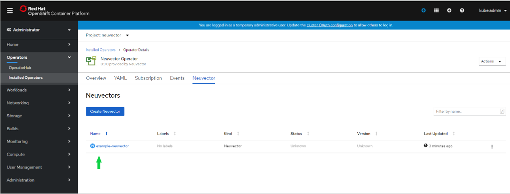

### Operators
Operators take human operational knowledge and encode it into software that is more easily shared with consumers. Operators are pieces of software that ease the operational complexity of running another piece of software. More technically, Operators are a method of packaging, deploying, and managing a Kubernetes application.

### NeuVector Operator
The NeuVector Operator is based on the NeuVector helm-chart. The NeuVector RedHat OpenShift Operator runs in the OpenShift container platform to deploy and manage the NeuVector Security cluster components. The NeuVector Operator contains all necessary information to deploy NeuVector using helm charts. You simply need to install the NeuVector operator from the OpenShift embedded Operator hub and create the NeuVector instance.

You should modify the NeuVector installation configuration by modifying the yaml values before creating the NeuVector instance. Examples include imagePullSecrets name, tag version, ingress/console access, multi-cluster federation, persistent volume PVC etc. Please refer to the Helm instructions at https://github.com/neuvector/neuvector-helm for the values that can be modified during installation. 

To upgrade to a newer version of NeuVector, just reapply the NeuVector instance with desired tag, which in turn pulls the specified NeuVector image tags and upgrades as per the upgrade plan configured in the helm chart.

#### Installing the NeuVector Operator on OpenShift 4.x (certified and community Operator)
##### Prepare for installing the NeuVector containers and services
+ Create the NeuVector namespace
```
oc new-project neuvector
```
+ Configure OpenShift to pull images from the private NeuVector registry on Docker Hub (or pull into your local registry and tag as needed)
```
oc create secret docker-registry regsecret -n neuvector --docker-server=https://index.docker.io/v1/ --docker-username=your-name --docker-password=your-pword --docker-email=your-email
```
+ Login as system:admin account
```
oc login -u system:admin
```
+ Grant Service Account Access to the Privileged SCC
```
oc -n neuvector adm policy add-scc-to-user privileged -z default
```
The following info will be added in the Privileged SCC users:
```
system:serviceaccount:neuvector:default
```

##### Search for and Install the NeuVector Operator from the OpenShift Console -> OperatorHub


##### Subscribe to the NeuVector Operator 
+ Choose namespace, channel and upgrade approval strategy
  - NeuVector Operator available on the chosen namespace
  - Current latest channel is beta, but may be moved to stable in the future (select stable if available)
  - Automatic upgrade strategy automatically upgrades to the latest NeuVector Operator (NOT the NeuVector cluster components such as Manager, Controller, Enforcer containers)

 
##### Check the NeuVector operator status


##### Create NeuVector instance from the NeuVector tab within the NeuVector Operator
+ Click NeuVector-Operator from Installed Operators
+ Create the NeuVector instance


##### Customize values such as secret name, runtime engine, etc.
+ ImagePullSecrets should match the one created one in the preparation step.
+ The container runtime engine is CRI-O by default
+ Update the tag with latest tag such as 3.2.1
+ Click Create button to create the NeuVector cluster components and services for Manager, Controller, and Enforcer
+ Refer to the NeuVector helm-chart other possible options

 
##### Verify NeuVector cluster components installation from Resources
+ Click example-neuvector -> Resources
+ Check the status of all pods



##### Access the NeuVector Console
+ Click neuvector-service-webui service
+ Check the neuvector-service-webui node port address or public IP
+ Access NeuVector webui using one of the node IP and above node port address
  - e.g. https://10.1.7.171:31172
+ Login as username: admin password: admin
+ Change the default password


##### Add NeuVector license from Settings


##### NeuVector Console showing controller pods
+ Highlights show the version of NeuVector
+ Warning to change the default password

