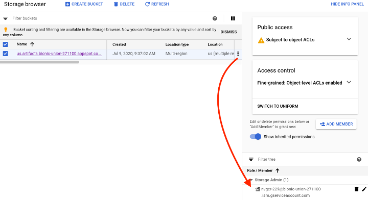

### Google GCR - REST API Authentication/Scanning with GCP Service Accounts


It is a best practice to not depend on user attributed accounts for integrations.  GCP supports using a service account to access GCR.  Here are the steps to enable a service account for GCR and use it to trigger repository scans from NeuVector.The NeuVector REST API must be used to authenticate using the service account.

<strong>Requirements & References</strong>
+ gcloud cli – part of the Google Cloud SDK - https://cloud.google.com/sdk/gcloud
+ Authentication Methods - https://cloud.google.com/container-registry/docs/advanced-authentication#methods
+ Configuring access control - https://cloud.google.com/container-registry/docs/access-control#permissions_and_roles

#### Create a service account from IAM & Admin
 
Select JSON as the key type and activate the account.  For example, “gcloud auth activate-service-account [USERNAME]@[PROJECT-ID].iam.gserviceaccount.com --key-file=KEY-FILE".  See https://cloud.google.com/container-registry/docs/advanced-authentication#token for detailed instructions.


#### Grant permission to the service account to GCR storage bucket
 
In the example below, the service account is granted Storage Admin permission which allows for the Push (Read and Write) actions.



#### Obtain the Access Token

The below example uses gcloud to obtain the access token.  The username is “oauth2accesstoken”.

```
$ gcloud auth print-access-token
ya29.a0AfH6SMAvyZ2zkD3MZD_K8Lqr7qkIsRkGNqhAGthJ_A7lp8OGRe7xh5KmuQY-VJfqu83C9e1gi7A_m1InNm8QIoTGf9WHXnOeAr1gT_O6b6K667NUz1_YDunjdW09jt0XvcBGQaxjJ3c4aHlxdehBFiE_9PMk13JDt_T6f0_6vzS7
```

#### Use the Token with NeuVector Repository Scanning

The below example script incorporates the access token to trigger GCR repository scan.

```
_curCase_=`echo $0 | awk -F"." '{print $(NF-1)}' | awk -F"/" '{print $NF}'`
_DESC_="able to scan ubuntu:16.04 image"
_ERRCODE_=0
_ERRTYPE_=1
_RESULT_="pass"

# please remember to specify the controller ip address here
_controllerIP_="10.1.24.252"
_controllerRESTAPIPort_="10443"
_neuvectorUsername_="admin"
_neuvectorPassword_="admin"
_registryURL_="https://us.gcr.io/"
_registryUsername_="oauth2accesstoken"
_registryPassword_=$(gcloud auth print-access-token)
_repository_="bionic-union-271100/alpine"
_tag_="latest"

curl -k -H "Content-Type: application/json" -d '{"password": {"username": "'$_neuvectorUsername_'", "password": "'$_neuvectorPassword_'"}}' "https://$_controllerIP_:$_controllerRESTAPIPort_/v1/auth" > /dev/null 2>&1 > token.json
_TOKEN_=`cat token.json | jq -r '.token.token'`
echo `date +%Y%m%d_%H%M%S` scanning an image ...
curl -k -H "Content-Type: application/json" -H "X-Auth-Token: $_TOKEN_" -d '{"request": {"registry": "'$_registryURL_'", "username": "'$_registryUsername_'", "password": "'$_registryPassword_'", "repository": "'$_repository_'", "tag": "'$_tag_'"}}' "https://$_controllerIP_:$_controllerRESTAPIPort_/v1/scan/repository" > /dev/null 2>&1 > scan_repository.json

while [ `wc -c < scan_repository.json` = "0" ]; do
 echo `date +%Y%m%d_%H%M%S` scanning is still in progress ...
    sleep 5
    curl -k -H "Content-Type: application/json" -H "X-Auth-Token: $_TOKEN_" -d '{"request": {"registry": "'$_registryURL_'", "username": "'$_registryUsername_'", "password": "'$_registryPassword_'", "repository": "'$_repository_'", "tag": "'$_tag_'"}}' "https://$_controllerIP_:$_controllerRESTAPIPort_/v1/scan/repository" > /dev/null 2>&1 > scan_repository.json
done
echo `date +%Y%m%d_%H%M%S` log out
curl -k -X 'DELETE' -H "Content-Type: application/json" -H "X-Auth-Token: $_TOKEN_" "https://$_controllerIP_:$_controllerRESTAPIPort_/v1/auth" > /dev/null 2>&1
cat scan_repository.json | jq .

rm *.json
echo `date +%Y%m%d_%H%M%S` [$_curCase_] $_DESC_: $_RESULT_-$_ERRCODE_
```
