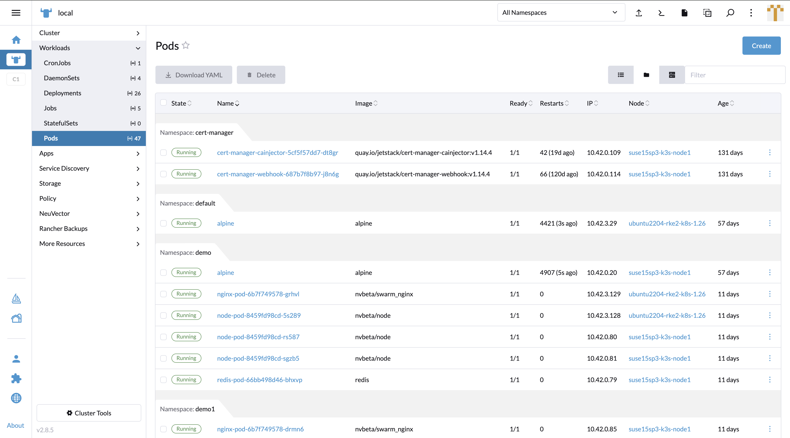

## Assets Security Scan Result

As Rancher Manager has its own **Nodes** and **Workloads** tab to manage and monitor the assets statuses, NeuVector injects components to display its runtime scan result.

### Nodes

In the **Nodes** tab table view, the **Vulnerabilities** column is injected to show each node's detected vulnerabilities amount by high / medium severity.

Clicking on the **Vulnerabilities** cell will pop up a new display page to show the scan result details. The database version of the scanner is shown as well as a filterable vulnerability list.

Clicking on the **Name** cell on the **Nodes** table redirects to the node detail page. NeuVector injects a **Vulnerabilities** tab to display a table with listed vulnerabilities.

Clicking on the CVE link in the **Name** cell in the **Vulnerabilities** table opens a pop up to show CVE descriptions with an external link inn the header to SUSE's CVE information website.

A CSV file download button is provided above the **Vulnerabilities** table. The file data includes all the fields which are in the table.

### Workloads

Temporarily, the **Vulnerabilities** column will not be injected in the **Workloads** table in the v5.4 release due to potential performance concern. The NeuVector team will work with the Rancher team to integrate it soon.

Clicking on a **Name** in the **Pods** table redirects to the pod detail page. NeuVector injects a **Vulnerabilities** tab to display a table with listed vulnerabilities.

