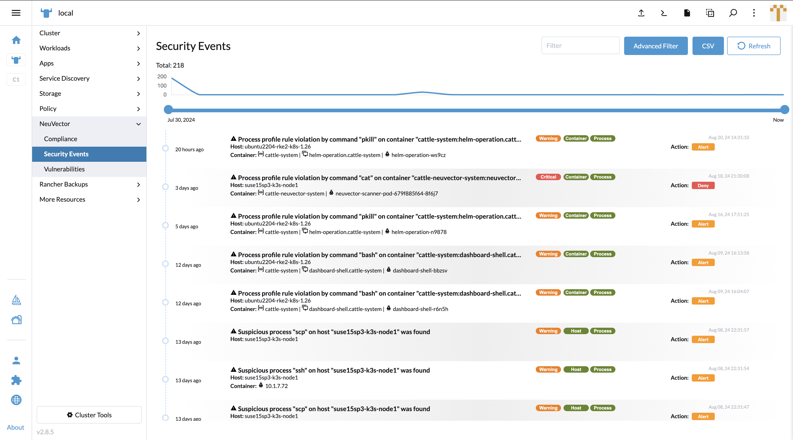
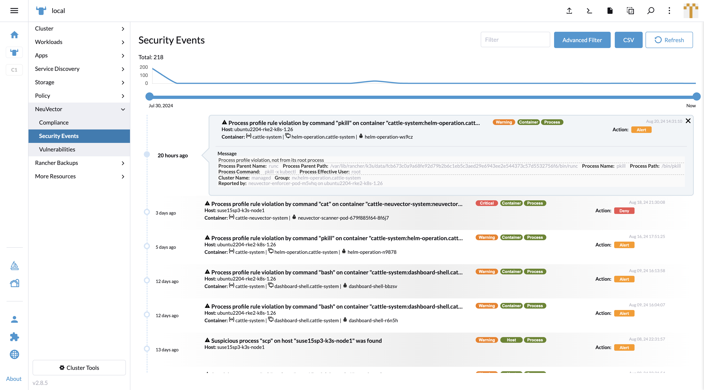

## Event Reporting

### Security Events

In the UI Extension on the Rancher portal, the **Security Events** tab works similarly to the NeuVector standalone page. The events can be triggered by several factors:

- Dangerous conversation or data transportation from somewhere to the endpoint (Node or pod).
- End-to-end violated connection against network policy.
- Violated operation against process profile rule.
- Violated operation against file access rule.

Slide the dot left or right on the time slider to filter events by date.

Type in keywords into the quick filter box to filter any event which includes the keyword.

Open the **Advanced Filter** side panel, and you will find multiple options supporting your search:

- Severity, Location and Category can be filtered according to the tags on the right side of the event title.
- The autocomplete list supports user entries for Host, Source, and Destination fields and supports a multiple tag-input box for Namespace.

Click on an event to expand the panel and display more details. In the message box you can view more information.

The **Host** name is clickable and opens the host detail popup. The **Vulnerabilities** and **Group** fields have an external link to redirect to the NeuVector SSO page.

The **Workload** name is clickable and opens the workload detail popup. The **Group** field has an external link to redirect to the NeuVector SSO page.

The **Reported by** field in the message box is clickable and opens the enforcer detail popup.

### Functions Not Included When Comparing with the NeuVector Standalone Page

- Review / Propose rule.
- PDF reports.
