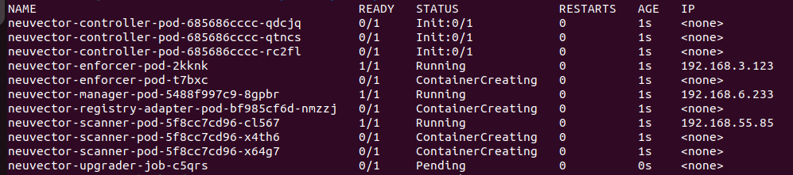
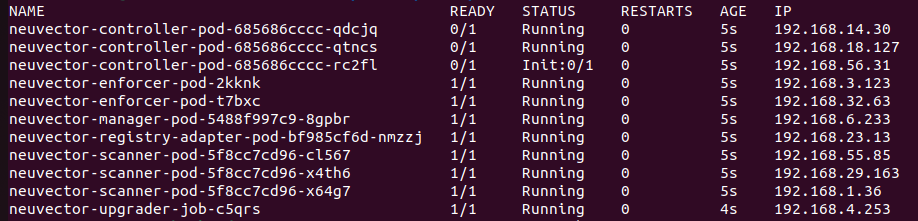
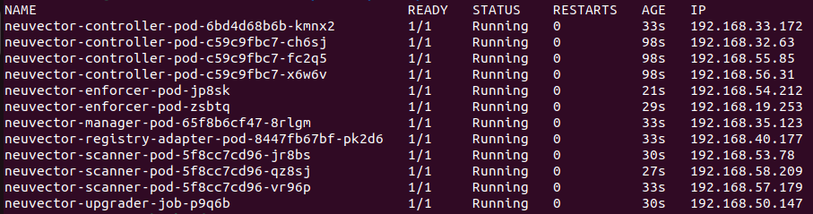
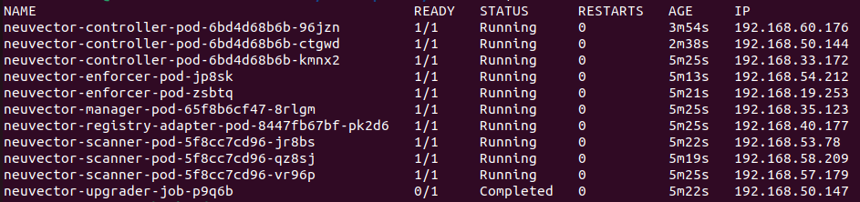

### Rotating Internal self signed certificate

This feature allows users to automatically update/rotate NeuVector internal certificates.

After enabled, a newly added init-container of controller pod will create a Kubernetes Job resource to perform internal certificate's rotation. The upgrader job can also be triggered via a CronJob object, so internal certificate will be rotated regularly.

To enable auto-rotation, ```internal.autoRotateCert``` has to be set to ```true```. (disabled by default).

#### Expected behavior when internal.autoRotateCert is enabled
##### Fresh install

1. When all containers start running, controller's init containers will run and create an upgrader job.
   
   

2. The upgrader will run and initialize new internal secret. In the mean time, components are waiting for the secret being initialized.
   
   

3. After internal secret is initialized, all components read the secret and go through the normal flow.
   
   

##### Upgrade

1. Old deployment is already running.
   
   
   
2. After running helm upgrade, rolling update will start. Controller's init container will create an upgrader job.
   
   
   
3. The upgrader job will wait until rolling update completes.
   
   
   
4. Then, upgrader will update internal certificates. Each component will read the updated certificate via k8s Secret
   
   


If ```internal.autoRotateCert``` is false, the upgrader job will still start but no actions will be performed. The original behavior will be followed, i.e., no init containers and the built-in certificates will still be used in all cases.

### New options in HELM chart
In helm charts, these options are added:
```
internal.autoGenerateCert (default true): Control whether to automatically generate internal certificate.
internal.autoRotateCert (default false): Control whether the auto rotation is on/off.
controller.upgrader.env (default []): Control upgrader's environment variables.
controller.upgrader.imagePullPolicy (default IfNotPresent): Upgrader's pull policy.
controller.upgrader.schedule (default "0 0 1 * *"): Upgrader's cronjob schedule.
```
