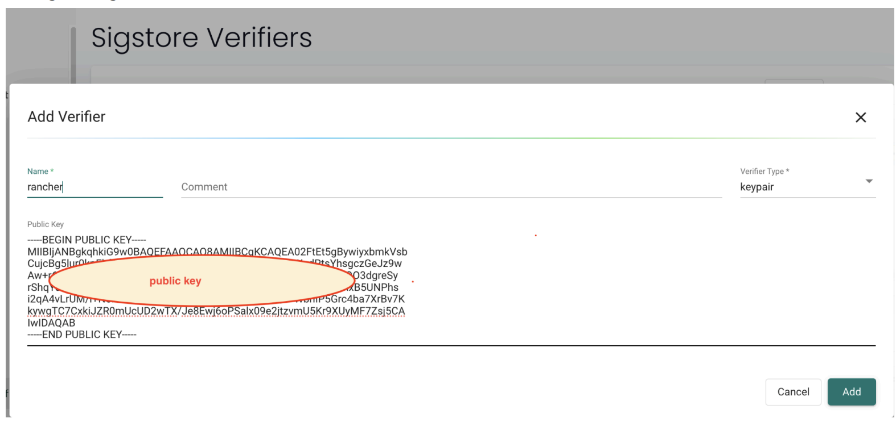
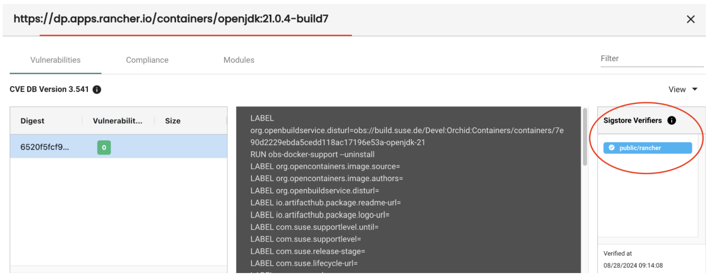

SUSE Rancher Application Collection uses an OCI-based registry where all applications are signed by Sigstore. Users can verify the apps in the Application Collection with Sigstore Verifiers in NeuVector.

You will need the cosign public key from SUSE Rancher Application Collection in advance, then the Sigstore Verifiers can be configured in NeuVector.

## Example Configuration

1. Create an access token by following this document: https://docs.apps.rancher.io/get-started/authentication/

2. Retrieve the cosign public key "ap-pubkey.pem" by following this document:
https://docs.apps.rancher.io/howto-guides/verify-signatures-with-cosign/

3. Create a public Sigstore root-of-trust in the Neuvector UI **Assets > Sigstore Verifiers** tab view, and add a key-pair verifier.

4. Create a registry in the NeuVector UI **Assets > Registries** view and start a scan.
    + Registry: https://dp.apps.rancher.io/
    + Filter: containers/openjdk:21.0.4-build7 (this is an OCI image, it is in https://apps.rancher.io/applications/openjdk)
    + Username: your-SUSE-username
    + Password: the token created in step 1

5. After step 4, the verifier information can be displayed in the scan result:

