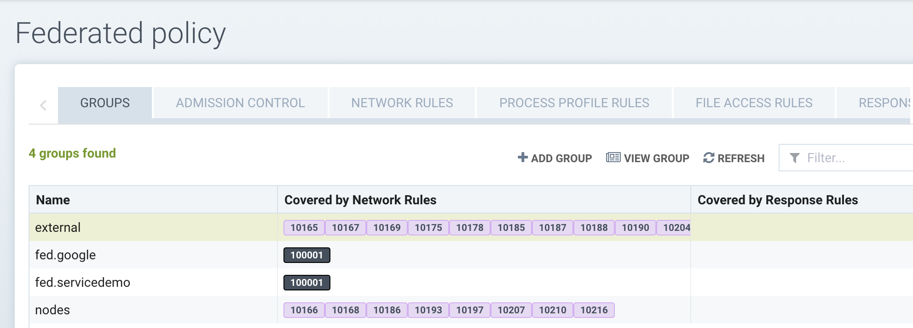
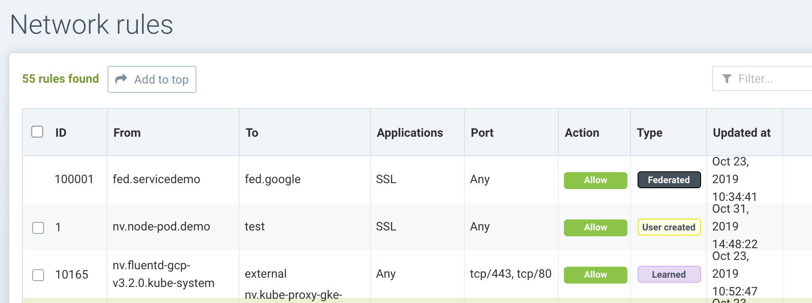
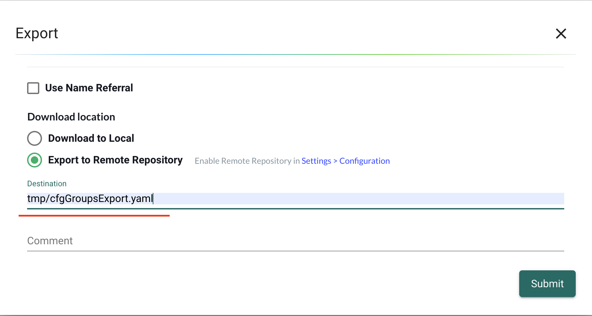
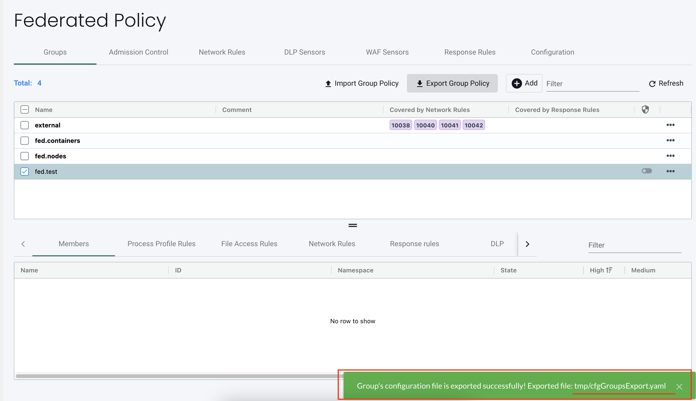

### Federated Policy

After a Master cluster has been created, Federated rules can be created in the Master which are automatically propagated to each cluster. This is useful to create global rules that should be applied to each cluster, such as global network rules. Federated rules will appear in every cluster as read-only and can NOT be deleted or edited by the local admin of the cluster. 

To configure Federated rules, click on Federated Policy in the upper right drop down menu. You will see tabs for Groups, Admission Control, Network Rules and other rules which can be federated. Select the tab and create a new Group or rule. In the sample below, two Federated groups have been created, which will be propagated to each cluster.

And the following Federated Network Rule has been created to allow access of SSL from the node demo pods to google.com.

After these rules and groups have been propagated to the remote cluster(s), they will appear as Federated rules and groups in the local cluster's console.

In the above example, the Federated rule is shown which is different than learned rules and 'user created' rules which were created in the local cluster. The user created rule 1 can be selected for editing or deletion while the Federated can not. In addition, Federated network rules will always show at the top of the list, thus taking precedence over other rules.

Other rules such as Admission Control, Response, Process and File will behave in the same way, except that the order of rules is only relevant for the Network rules.

Note that the configuration of Process and File rules requires the selection of a Federated Group, as these must be applied to a target group as defined in the Federated Group tab. After a new Group has been configured in Federated -> Groups, it will show as a selectable option when configuring a group in Process or File rules.

## Export/Import Federation policy

Federation policy(Groups/Admission Control/DLP Sensors/WAF Sensors/Response rules/Configuration) can be imported and exported. You can select one or more entries and click the **Export** button to download the yaml file to local, or export to remote repository. 

Federation policy can only be imported on primary cluster. After import, the primary cluster deploys the policies to all managed clusters.

Here is an example for export federated group:

Exporting a Federated Group
1. Select one or more federated groups and click **Export Group Policy** button.
    
2. Select **Download to Local** option and then click **Submit** button to download the YAML file.
    
3. Select **Export to Remote Repository** option, then click **Submit** to export the YAML file to the configured remote repository.

:::note
The Export to Remote Repository option is disabled until you configure a remote repository in Settings > Configuration.
:::
    
4. After a successful export, the path and file name appear in the response message.

If the Destination field is empty, NeuVector generates a default file name and displays it in the response.
    

If you provide a custom file name, the response message displays the name you specified.

* Define name for exported file:
    
* Response for customized destination:
    
